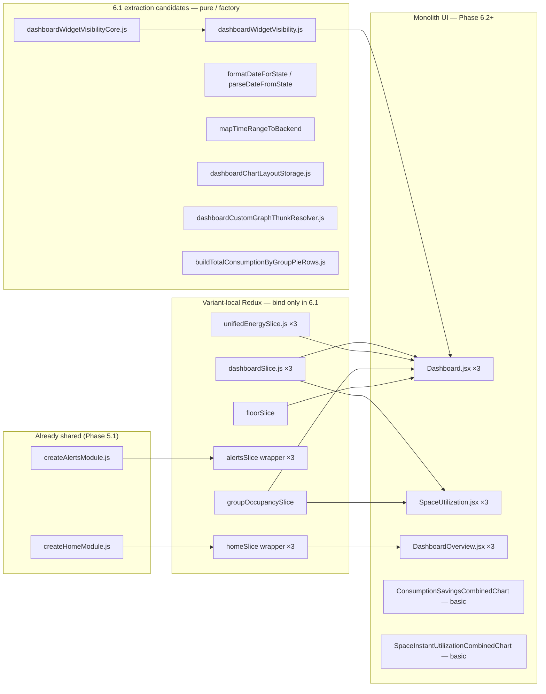

# Phase 6.1 Preflight — Built-in Dashboard Widget Analysis

**Date:** 2026-06-10  
**Scope:** 19 built-in widgets from `WIDGET_VISIBILITY_SECTION` (excludes variant-only `shades`)  
**Method:** Static trace through variant `Dashboard.jsx`, `SpaceUtilization.jsx`, `DashboardOverview.jsx`, Redux slices, and shared factories  
**No code modified.**

Canonical key source: `src/variants/basic/utils/dashboardWidgetVisibilityCore.js`

---

## Widget Catalog (19)

| # | Key | Section |
|---|-----|---------|
| 1 | `energy` | overview |
| 2 | `alerts` | overview |
| 3 | `schedules` | overview |
| 4 | `quick_controls` | overview |
| 5 | `floors` | overview |
| 6 | `space_utilization` | overview |
| 7 | `consumption` | energy |
| 8 | `savings` | energy |
| 9 | `consumption_saving` | energy |
| 10 | `savings_by_strategy` | energy |
| 11 | `total_consumption_by_group` | energy |
| 12 | `light_power_density` | energy |
| 13 | `peak_and_minimum_consumption` | energy |
| 14 | `utilization` | space |
| 15 | `utilization_by_area_group` | space |
| 16 | `utilization_by_area` | space |
| 17 | `peak_and_minimum_utilization` | space |
| 18 | `instant_occupancy_count` | space |
| 19 | `instant_utilization_combined` | space |

---

## Per-Widget Specification

### Overview widgets (6)

#### 1. `energy`

| Field | Value |
|-------|-------|
| **Component file** | `screens/dashboard/DashboardOverview.jsx` (Energy card) |
| **Redux selectors** | `selectDashboardOverview`, `selectDashboardOverviewLoading`, `selectDashboardOverviewError` |
| **Redux thunks** | `getDashboardOverview` |
| **API endpoints** | `GET /home/dashboard` (field: `data.energy`) |
| **Utility dependencies** | `CircularProgressLabel` (inline helper in Overview); basic: `useDashboardWidgetVisibility` |
| **Filters used** | None (summary endpoint; not scoped by dashboard area/duration) |
| **Variants** | basic (visibility-gated), advanced, customized |

#### 2. `alerts`

| Field | Value |
|-------|-------|
| **Component file** | Overview: `DashboardOverview.jsx` (Alerts card). Full tab: `screens/dashboard/Alerts.jsx` |
| **Redux selectors** | Overview: `selectDashboardOverview` (`data.alerts`). Tab: `selectAlerts`, `selectAlertTypes`, `selectAlertsLoading`, `selectAlertsError` |
| **Redux thunks** | Overview: `getDashboardOverview`. Tab: `fetchActiveAlerts`, `fetchAlertTypes`, `sendAlertsByEmail`, `downloadAlerts` |
| **API endpoints** | `GET /home/dashboard`; `GET /alert/active_alerts`; `GET /alert/alerts_types`; `POST /alert/active_alerts/send_by_email`; `GET /alert/active_alerts/download` |
| **Utility dependencies** | `formatAlertTime` (Overview); `fetchEmailConfigs`, `fetchProfile` (Alerts tab) |
| **Filters used** | Tab: alert type filter (`selectSelectedAlertType` / local state in Alerts.jsx) |
| **Variants** | all |

#### 3. `schedules`

| Field | Value |
|-------|-------|
| **Component file** | `DashboardOverview.jsx` (Schedules card) |
| **Redux selectors** | `selectDashboardOverview` |
| **Redux thunks** | `getDashboardOverview` |
| **API endpoints** | `GET /home/dashboard` (field: `data.schedule.next`) |
| **Utility dependencies** | Navigation callback `onNavigateToSchedule` |
| **Filters used** | None |
| **Variants** | all |

#### 4. `quick_controls`

| Field | Value |
|-------|-------|
| **Component file** | `DashboardOverview.jsx` (Quick Controls card) |
| **Redux selectors** | None |
| **Redux thunks** | None |
| **API endpoints** | None |
| **Utility dependencies** | `onNavigateToQuickControls` → route change only |
| **Filters used** | None |
| **Variants** | all |

#### 5. `floors`

| Field | Value |
|-------|-------|
| **Component file** | `DashboardOverview.jsx` (Floors card) |
| **Redux selectors** | `selectDashboardOverview` |
| **Redux thunks** | `getDashboardOverview` |
| **API endpoints** | `GET /home/dashboard` (field: `data.floors.count`) |
| **Utility dependencies** | `onNavigateToFloor` |
| **Filters used** | None |
| **Variants** | all |

#### 6. `space_utilization`

| Field | Value |
|-------|-------|
| **Component file** | `DashboardOverview.jsx` (Space Utilization card) |
| **Redux selectors** | `selectDashboardOverview` |
| **Redux thunks** | `getDashboardOverview` |
| **API endpoints** | `GET /home/dashboard` (field: `data.space_utilization.occupied_percent`) |
| **Utility dependencies** | `CircularProgressLabel`; `onNavigateToSpaceUtilization` |
| **Filters used** | None |
| **Variants** | all |

---

### Energy widgets (7)

#### 7. `consumption`

| Field | Value |
|-------|-------|
| **Component file** | Inline `EnergyLineChart` / render slot in `Dashboard.jsx` (`case 'consumption'`) |
| **Redux selectors** | `selectUnifiedEnergyConsumption`, `selectUnifiedEnergyConsumptionLoading` |
| **Redux thunks** | `fetchUnifiedEnergyConsumptionSavingsData` |
| **API endpoints** | `GET /dashboard/unified_energy_consumption_savings_data` (consumption branch); legacy standalone: `GET /dashboard/energy_consumption` (thunk exists, **not used** by current Dashboard fetch batch) |
| **Utility dependencies** | `transformDataForCharts`, `getWidgetTitle`, `handleExport` → `downloadEnergyConsumption` / `sendEnergyConsumptionEmail`; basic: `LongPressDraggable`, `isLightSurface` |
| **Filters used** | `apiParams`: `areaIds`, `floorIds`, `timeRange`, `startDate`, `endDate`, `isNavigating`; gated by `selectedDuration`, `allAreasLoaded`, custom date readiness |
| **Variants** | all (inline JSX; not a separate file) |

#### 8. `savings`

| Field | Value |
|-------|-------|
| **Component file** | Inline `EnergyLineChart` in `Dashboard.jsx` (`case 'savings'`) |
| **Redux selectors** | `selectUnifiedEnergySavings`, `selectUnifiedEnergySavingsLoading` |
| **Redux thunks** | `fetchUnifiedEnergyConsumptionSavingsData` |
| **API endpoints** | `GET /dashboard/unified_energy_consumption_savings_data` (savings branch); legacy: `GET /dashboard/energy_savings` |
| **Utility dependencies** | Same as `consumption` |
| **Filters used** | Same `apiParams` |
| **Variants** | all |

#### 9. `consumption_saving`

| Field | Value |
|-------|-------|
| **Component file** | basic: `ConsumptionSavingsCombinedChart.jsx`. advanced/customized: inline combined chart in `Dashboard.jsx` |
| **Redux selectors** | `selectUnifiedEnergyConsumption`, `selectUnifiedEnergySavings`, loading selectors for both |
| **Redux thunks** | `fetchUnifiedEnergyConsumptionSavingsData` |
| **API endpoints** | `GET /dashboard/unified_energy_consumption_savings_data` |
| **Utility dependencies** | basic: `summarizeMergedConsumptionSavings`, `computeCo2KgFromEnergySavings` (`shadesWidgetSettings.js`); `transformDataForCharts`; basic: `DashboardDurationFilterBar` when standalone energy tabs |
| **Filters used** | Same `apiParams` |
| **Variants** | all (implementation differs: dedicated component vs inline) |

#### 10. `savings_by_strategy`

| Field | Value |
|-------|-------|
| **Component file** | Inline pie chart in `Dashboard.jsx` |
| **Redux selectors** | `selectSavingsByStrategy` |
| **Redux thunks** | `fetchSavingsByStrategy` |
| **API endpoints** | `GET /dashboard/saving_by_stratergy`; export: `GET /dashboard/saving_by_stratergy/download`, `POST /dashboard/saving_by_stratergy/send_by_email` |
| **Utility dependencies** | `getColorForStrategy`, `transformDataForCharts` (pie branch); `handleExport` |
| **Filters used** | Same `apiParams` |
| **Variants** | all |

#### 11. `total_consumption_by_group`

| Field | Value |
|-------|-------|
| **Component file** | Inline pie in `Dashboard.jsx`; customized may route through `EnergyCustomGraphCard.jsx` when builtin override applies |
| **Redux selectors** | `selectTotalConsumptionByGroup`, `selectAreaGroups` (labels) |
| **Redux thunks** | `fetchTotalConsumptionByGroup`, `fetchAreaGroups` |
| **API endpoints** | `GET /dashboard/total_consumption/by_group`; `GET /area_group/list`; export: `GET /exports/total_consumption_by_group/download`, `POST /exports/total_consumption_by_group/email` |
| **Utility dependencies** | `getColorForStrategy` / pie palette; customized: `buildTotalConsumptionByGroupPieRows`, `normalizeTotalConsumptionByGroupPayload` |
| **Filters used** | Same `apiParams` |
| **Variants** | all |

#### 12. `light_power_density`

| Field | Value |
|-------|-------|
| **Component file** | Inline chart in `Dashboard.jsx` |
| **Redux selectors** | `selectLightPowerDensity` |
| **Redux thunks** | `fetchLightPowerDensity` |
| **API endpoints** | `GET /dashboard/light_power_density` |
| **Utility dependencies** | Local `lightingUnit` state (`Watt / Sq ft` toggle); `transformDataForCharts`; basic: `LongPressDraggable` |
| **Filters used** | Same `apiParams` |
| **Variants** | all |

#### 13. `peak_and_minimum_consumption`

| Field | Value |
|-------|-------|
| **Component file** | Inline chart in `Dashboard.jsx` |
| **Redux selectors** | `selectUnifiedPeakMinConsumption`, `selectUnifiedPeakMinConsumptionLoading` |
| **Redux thunks** | `fetchUnifiedEnergyConsumptionSavingsData` (peak branch); legacy standalone: `fetchPeakMinConsumption` → `GET /dashboard/peak_min_consumption` |
| **API endpoints** | Primary: unified endpoint; export: `GET /dashboard/peak_min_consumption/download`, `POST /dashboard/peak_min_consumption/send_by_email` |
| **Utility dependencies** | `transformDataForCharts`; dual-series peak/min rendering |
| **Filters used** | Same `apiParams` |
| **Variants** | all |

---

### Space widgets (6)

#### 14. `utilization`

| Field | Value |
|-------|-------|
| **Component file** | `SpaceUtilization.jsx` (passed `title`, `data`, `showOnlyInstantChart={false}`, `showChartsTab={false}` from `Dashboard.jsx`) |
| **Redux selectors** | `selectSpaceUtilizationPerArea` (+ loading via dashboard slice status) |
| **Redux thunks** | `fetchSpaceUtilizationPerArea` |
| **API endpoints** | `GET /dashboard/space_utilization_per`; export: `GET /exports/space_utilization_per/download`, `POST /exports/space_utilization_per/email` |
| **Utility dependencies** | Internal bar chart components; `getWidgetTitle`; `parseDashboardTimeAxisToMinutes`; basic: `useDashboardWidgetVisibility`, `LongPressDraggable` |
| **Filters used** | Same `apiParams` (inherited from Dashboard parent state) |
| **Variants** | all |

#### 15. `utilization_by_area_group`

| Field | Value |
|-------|-------|
| **Component file** | `SpaceUtilization.jsx` (charts tab / combined layouts) |
| **Redux selectors** | `showChartsTab ? selectOccupancyByGroupFromLogs : selectOccupancyByGroup` (+ loading selectors) |
| **Redux thunks** | `fetchOccupancyByGroup`, `fetchOccupancyByGroupFromLogs` (tab mode) |
| **API endpoints** | `GET /dashboard/occupancy_by_group`; `GET /dashboard/occupancy_by_group_from_logs`; exports for both |
| **Utility dependencies** | Tab mode switching (`showChartsTab`); pie/bar render helpers inside SpaceUtilization |
| **Filters used** | Same `apiParams` |
| **Variants** | all |

#### 16. `utilization_by_area`

| Field | Value |
|-------|-------|
| **Component file** | `SpaceUtilization.jsx` |
| **Redux selectors** | `selectOccupancyCount` (instant path) or logs-based sources when `showChartsTab` |
| **Redux thunks** | `fetchOccupancyCount` |
| **API endpoints** | `GET /dashboard/occupancy_count`; export: `GET /exports/occupancy_count/download`, `POST /exports/occupancy_count/email` |
| **Utility dependencies** | `InstantOccupancyChartComponent` / bar chart internals |
| **Filters used** | Same `apiParams` |
| **Variants** | all |

#### 17. `peak_and_minimum_utilization`

| Field | Value |
|-------|-------|
| **Component file** | `SpaceUtilization.jsx` (render slots exist) |
| **Redux selectors** | `selectPeakMinOccupancy` — **commented out / not wired** |
| **Redux thunks** | `fetchPeakMinOccupancy` — **commented out** in all variants |
| **API endpoints** | `GET /dashboard/peak_min_occupancy` — **disabled**; export endpoints commented |
| **Utility dependencies** | UI shell only; loading uses `anyLoading` not peak-specific selector |
| **Filters used** | Would use `apiParams` if API were enabled |
| **Variants** | all (UI present advanced/customized/basic; **no live data path**) |

> **Preflight flag:** Treat as **dormant widget** — extraction must not assume API contract.

#### 18. `instant_occupancy_count`

| Field | Value |
|-------|-------|
| **Component file** | `SpaceUtilization.jsx` (`showOnlyInstantChart={true}` mount from Dashboard) |
| **Redux selectors** | `selectInstantOccupancyCount`, `selectInstantOccupancyCountLoading`, `selectInstantOccupancyCountError` |
| **Redux thunks** | `fetchInstantOccupancyCount` |
| **API endpoints** | `GET /dashboard/instant_occupancy_count`; export: `GET /exports/instant_occupancy_count/download`, `POST /exports/instant_occupancy_count/email` |
| **Utility dependencies** | `InstantOccupancyChartComponent`; export dropdown |
| **Filters used** | Same `apiParams` |
| **Variants** | all |

#### 19. `instant_utilization_combined`

| Field | Value |
|-------|-------|
| **Component file** | basic: `SpaceInstantUtilizationCombinedChart.jsx` inside `SpaceUtilization.jsx`. advanced/customized: equivalent combined layout in `SpaceUtilization.jsx` |
| **Redux selectors** | `selectInstantOccupancyCount`, `selectOccupancyCount`, `selectOccupancyByGroupFromLogs`, `selectSpaceUtilizationPerFromLogs` (+ loadings) |
| **Redux thunks** | `fetchInstantOccupancyCount`, `fetchOccupancyByGroupFromLogs`, `fetchSpaceUtilizationPerFromLogs` |
| **API endpoints** | `GET /dashboard/instant_occupancy_count`; `GET /dashboard/occupancy_by_group_from_logs`; `GET /dashboard/space_utilization_per_from_logs` |
| **Utility dependencies** | `SpaceInstantUtilizationCombinedChart`; mutual-exclusion visibility rules with `instant_occupancy_count` (basic RenameWidget + visibility core) |
| **Filters used** | Same `apiParams`; `showChartsTab={true}` on SpaceUtilization |
| **Variants** | all (basic has richest visibility/order helpers) |

---

## Cross-Cutting Dependencies (All Chart Widgets)

### Global filters (`apiParams` in `Dashboard.jsx`)

| Filter state | Selector | Effect |
|--------------|----------|--------|
| Duration | `selectSelectedDuration` | `time_range` (mapped via `mapTimeRangeToBackend`) |
| Custom range | `selectCustomDateRange` | `start_date`, `end_date` when duration = `custom` |
| Navigation | `selectIsNavigating`, `selectCurrentDate`, `selectCurrentYear` | Custom range overrides for this-day/week/month/year |
| Area scope | `selectSelectedAreas` | `area_ids` (when no floors) |
| Floor scope | `selectSelectedFloorIds` | `floor_ids` (takes priority over areas) |
| Group selection | `selectSelectedGroupIds` | Contributes to area resolution before `apiParams` commit |
| Readiness gates | `allAreasLoaded`, custom date trim checks | Suppresses fetch until scope ready |

### Title / visibility (all 19 keys)

| Dependency | Scope |
|------------|-------|
| `getWidgetList` | `groupOccupancySlice` — `GET /widgets/widget_titles` |
| `getWidgetTitle(key, fallback)` | Inline in Dashboard / SpaceUtilization |
| `useDashboardWidgetVisibility` | **basic only** — `dashboardWidgetVisibility.js` + `GET /widgets/configuration` |
| `widgetVisibility` localStorage | **customized only** — grouped energy/space map |
| advanced | No visibility layer — all widgets rendered |

---

## 1. Widget Dependency Graph

```mermaid
flowchart TB
  subgraph overview["Overview tab — DashboardOverview.jsx"]
    W_energy[energy]
    W_alerts[alerts]
    W_sched[schedules]
    W_qc[quick_controls]
    W_floors[floors]
    W_su_ov[space_utilization]
  end

  subgraph energy["Energy tab — Dashboard.jsx"]
    W_cons[consumption]
    W_save[savings]
    W_combo[consumption_saving]
    W_sbs[savings_by_strategy]
    W_tcg[total_consumption_by_group]
    W_lpd[light_power_density]
    W_pmc[peak_and_minimum_consumption]
  end

  subgraph space["Space tab — SpaceUtilization.jsx"]
    W_util[utilization]
    W_uag[utilization_by_area_group]
    W_uaa[utilization_by_area]
    W_pm_u[peak_and_minimum_utilization]
    W_ioc[instant_occupancy_count]
    W_iuc[instant_utilization_combined]
  end

  subgraph homeSlice["homeSlice"]
    T_overview[getDashboardOverview]
    API_home["GET /home/dashboard"]
  end

  subgraph unified["unifiedEnergySlice"]
    T_unified[fetchUnifiedEnergyConsumptionSavingsData]
    API_uni["GET /dashboard/unified_energy_consumption_savings_data"]
  end

  subgraph dashSlice["dashboardSlice"]
    T_sbs[fetchSavingsByStrategy]
    T_tcg[fetchTotalConsumptionByGroup]
    T_lpd[fetchLightPowerDensity]
    T_occ[fetchOccupancyCount]
    T_ioc[fetchInstantOccupancyCount]
    T_uag[fetchOccupancyByGroup]
    T_supa[fetchSpaceUtilizationPerArea]
    T_logs_grp[fetchOccupancyByGroupFromLogs]
    T_logs_sup[fetchSpaceUtilizationPerFromLogs]
  end

  subgraph alertsSlice["alertsSlice"]
    T_alerts[fetchActiveAlerts]
    API_alerts["GET /alert/active_alerts"]
  end

  subgraph meta["groupOccupancySlice"]
    T_titles[fetchRenameWidgets]
    API_titles["GET /widgets/widget_titles"]
  end

  W_energy --> T_overview --> API_home
  W_alerts --> T_overview
  W_sched --> T_overview
  W_floors --> T_overview
  W_su_ov --> T_overview
  W_qc --> NAV[route navigate only]

  W_cons --> T_unified --> API_uni
  W_save --> T_unified
  W_combo --> T_unified
  W_pmc --> T_unified

  W_sbs --> T_sbs
  W_tcg --> T_tcg
  W_lpd --> T_lpd

  W_util --> T_supa
  W_uag --> T_uag
  W_uag --> T_logs_grp
  W_uaa --> T_occ
  W_ioc --> T_ioc
  W_iuc --> T_ioc
  W_iuc --> T_logs_grp
  W_iuc --> T_logs_sup
  W_pm_u -.->|disabled| X_NULL[no thunk]

  overview --> T_titles
  energy --> T_titles
  space --> T_titles
```



---

## 2. Shared Dependency Graph

What Phase 6.1 can move or already shares vs what remains variant-local:



### Shared dependency table

| Node | Location today | Shared? | Used by widgets |
|------|----------------|---------|-----------------|
| `createHomeModule` | `shared/redux/slices/` | ✅ Yes | overview ×6 |
| `createAlertsModule` | `shared/redux/slices/` | ✅ Yes | alerts tab |
| `dashboardWidgetVisibilityCore` | basic `utils/` | 🔶 Candidate | all keys (basic visibility) |
| `dashboardSlice` thunks | variant `redux/` | ❌ Triplicated | energy + space charts |
| `unifiedEnergySlice` | variant `redux/` | ❌ Triplicated | consumption, savings, combo, peak energy |
| `transformDataForCharts` | inside `Dashboard.jsx` | ❌ Monolith | consumption, savings, peak, pies |
| `getWidgetTitle` | inside Dashboard/Space | ❌ Monolith | all 19 |
| `apiParams` builder | inside `Dashboard.jsx` | ❌ Monolith | 13 chart widgets |
| `groupOccupancySlice` | variant `redux/` | ❌ Triplicated | titles, basic chart order/config |

---

## 3. Circular Dependency Report

**Analysis:** `scripts/phase61-preflight-deps.js` — DFS cycle detection from 27 dashboard seed files (all variant dashboard screens, slices, visibility utils, shared home/alerts factories).

| Metric | Result |
|--------|--------|
| Seed files | 27 |
| Import edges (resolved) | 677 |
| Unique nodes | 107 |
| **Circular import cycles** | **0** |

### Structural coupling (not import cycles, but logical)

| Coupling | Type | Risk for 6.1 |
|----------|------|--------------|
| `Dashboard.jsx` ↔ `SpaceUtilization.jsx` | Parent passes props; child reads same Redux | Extract hooks first, not components |
| `Dashboard.jsx` → `transformDataForCharts` → chart JSX | Monolithic closure | Must extract pure transform before widget components |
| `ConsumptionSavingsCombinedChart` → `shadesWidgetSettings` | Cross-feature util | Soft coupling; keep adapter |
| `instant_utilization_combined` ↔ `instant_occupancy_count` | Visibility mutual exclusion | Business rule in visibility core |
| `peak_and_minimum_utilization` UI ↔ disabled thunk | Dead code path | Document; do not wire shared thunk until product enables API |

**Conclusion:** No TypeScript/import cycles block 6.1. Risk is **logical monolith coupling**, not circular modules.

---

## 4. Extraction Order Ranked by Risk

Risk score: **1 (lowest)** → **10 (highest)**. Order is **extract first → extract last**.

| Rank | Widget key | Risk | Rationale |
|------|------------|-----:|-----------|
| 1 | `quick_controls` | 1 | No API; pure navigation card |
| 2 | `schedules` | 1 | Single overview field |
| 3 | `floors` | 1 | Single overview count |
| 4 | `energy` | 2 | Overview card; one thunk; basic visibility only |
| 5 | `space_utilization` (overview) | 2 | Overview card; same thunk as #4 |
| 6 | `alerts` (overview card) | 2 | Overview slice; tab is separate higher scope |
| 7 | `light_power_density` | 3 | Single thunk/selector; one chart type |
| 8 | `savings_by_strategy` | 3 | Single pie; isolated thunk |
| 9 | `total_consumption_by_group` | 4 | + `fetchAreaGroups` label dependency |
| 10 | `utilization` | 4 | SpaceUtilization sub-chart; one primary thunk |
| 11 | `instant_occupancy_count` | 4 | Dedicated mount path; clear selector |
| 12 | `savings` | 5 | Unified slice branch; transform coupling |
| 13 | `consumption` | 5 | Same unified dependency as savings |
| 14 | `peak_and_minimum_consumption` | 5 | Unified peak branch + export pair |
| 15 | `utilization_by_area` | 6 | SpaceUtilization internal; tab mode switching |
| 16 | `utilization_by_area_group` | 6 | Dual API (live vs logs) |
| 17 | `consumption_saving` | 7 | basic separate component vs adv/cust inline; CO₂ utils |
| 18 | `instant_utilization_combined` | 8 | Composite component; 3 thunks; visibility exclusivity |
| 19 | `peak_and_minimum_utilization` | 9 | UI without API — highest behavioral ambiguity |
| — | `alerts` (full tab) | 8 | Separate Alerts.jsx lifecycle — defer to 6.2 |
| — | `apiParams` + area tree | 10 | **Extract before widgets** — shared hook, not a widget |

### Recommended 6.1 extraction sequence (foundation first)

```
Phase 6.1a  dashboardWidgetVisibilityCore → shared/dashboard/state/
Phase 6.1b  dateHelpers + mapTimeRangeToBackend (pure) → shared/dashboard/filters/
Phase 6.1c  useDashboardTabRoute + useDashboardApiParams (hooks only, monolith stays)
Phase 6.1d  Widget registry JSON (key → thunk/selector/endpoint map) — no UI move
Phase 6.1e  Overview cards advanced+customized merge (6 widgets, ranks 1–6)
```

**Do not extract in 6.1:** `Dashboard.jsx` chart JSX, `SpaceUtilization.jsx` body, `transformDataForCharts`, `peak_and_minimum_utilization` data layer.

---

## Appendix A — API Endpoint Index (built-in widgets)

| Endpoint | Widgets |
|----------|---------|
| `GET /home/dashboard` | energy, alerts†, schedules, floors, space_utilization (overview) |
| `GET /dashboard/unified_energy_consumption_savings_data` | consumption, savings, consumption_saving, peak_and_minimum_consumption |
| `GET /dashboard/saving_by_stratergy` | savings_by_strategy |
| `GET /dashboard/total_consumption/by_group` | total_consumption_by_group |
| `GET /area_group/list` | total_consumption_by_group (labels) |
| `GET /dashboard/light_power_density` | light_power_density |
| `GET /dashboard/space_utilization_per` | utilization |
| `GET /dashboard/occupancy_by_group` | utilization_by_area_group |
| `GET /dashboard/occupancy_count` | utilization_by_area |
| `GET /dashboard/instant_occupancy_count` | instant_occupancy_count, instant_utilization_combined |
| `GET /dashboard/occupancy_by_group_from_logs` | utilization_by_area_group‡, instant_utilization_combined |
| `GET /dashboard/space_utilization_per_from_logs` | instant_utilization_combined |
| `GET /dashboard/peak_min_occupancy` | peak_and_minimum_utilization (**disabled**) |
| `GET /widgets/widget_titles` | all (titles) |
| `GET /widgets/configuration` | all keys (**basic** visibility) |

† Overview alerts card uses `/home/dashboard`, not `/alert/active_alerts`.  
‡ When `showChartsTab` is true.

---

## Appendix B — Variant Implementation Matrix

| Widget | basic | advanced | customized |
|--------|-------|----------|------------|
| Overview 6 | visibility-gated grid (1221 LOC) | static 6-card (376 LOC) | static 6-card + bg image (378 LOC) |
| Energy 7 | visibility + LongPressDraggable + CombinedChart file | inline charts + themeConstants | inline + EnergyCustomGraphCard overrides + dnd-kit |
| Space 6 | visibility + LongPressDraggable + SpaceInstantUtilizationCombinedChart | smaller SpaceUtilization | largest SpaceUtilization + custom filters |
| Widget titles | RenameWidget.jsx (1284 LOC) | RenameWidget.jsx (291 LOC) | Widgets.jsx (1708 LOC) |

---

## Appendix C — Tooling

| Artifact | Path |
|----------|------|
| Import graph / cycle script | `scripts/phase61-preflight-deps.js` |
| Graph JSON | `docs/PHASE_6_1_PREFLIGHT_GRAPH.json` |
| Phase 5.4 context | `docs/PHASE_5_4_DASHBOARD_DECOMPOSITION_AUDIT.md` |

---

*Phase 6.1 preflight complete. No application code was modified.*
