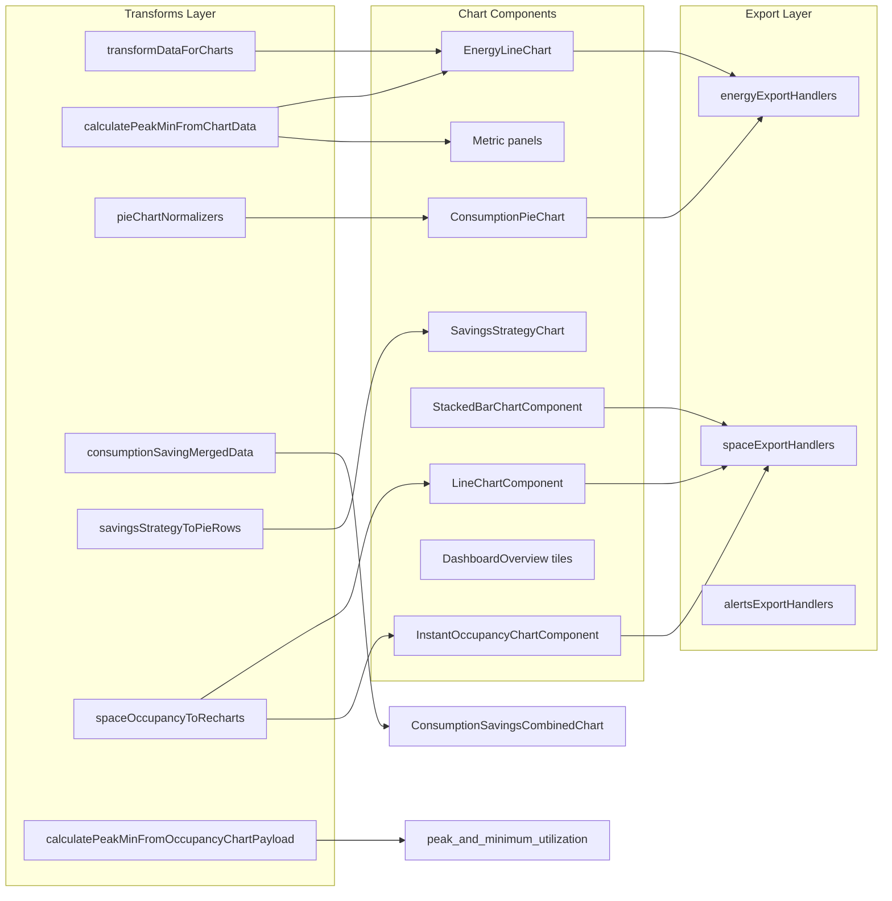

# Phase 6.2A — Shared Dashboard Foundation Report

**Date:** 2026-06-10  
**Scope:** Audit + migration plan only. **No code changes.**  
**Prerequisite:** Phase 6.1A (`src/shared/dashboard/hooks/`, `utils/`, `registry/`)  
**Goal:** Define the shared chart/data foundation required before any widget JSX extraction.

---

## Executive Summary

Dashboard rendering is blocked by **~15,000 LOC of triplicated chart infrastructure** embedded in variant monoliths. The two largest inline components are:

| Component | LOC per variant (measured) | ×3 variants | Role |
|-----------|---------------------------:|------------:|------|
| `EnergyLineChart` | basic 1,191 / advanced 867 / customized 840 | **~2,898** | Energy line widgets (`consumption`, `savings`) |
| `LineChartComponent` | basic 1,390 / advanced 1,389 / customized 1,396 | **~4,175** | Space line widgets (`utilization`, `utilization_by_area`) |

Neither can move to widget extraction until decomposed into **transforms → view primitives → export adapters**. Phase 6.2A establishes that layer; widget slots remain in `Dashboard.jsx` / `SpaceUtilization.jsx` until Phase 6.2B+.

**Estimated net LOC reduction after foundation extraction:** **8,000–10,500** (gross duplicate ~15k → shared ~4.5k + tests ~800).

---

## Task 1 — Audit: Location of Shared Logic (All Variants)

### 1.1 `transformDataForCharts`

| Variant | File | Lines | LOC | Notes |
|---------|------|-------|----:|-------|
| basic | `Dashboard.jsx` | 2977–3120 | 144 | 2-arg signature; `selectedAreas` + `areaTree` closure |
| advanced | `Dashboard.jsx` | 2617–2761 | 145 | Same as basic |
| customized | `Dashboard.jsx` | 4390–4595 | 206 | Extended 6-arg signature: `forceIndividualAreas`, `floorIds`, `areaIds`, `groupIds`; global-vs-widget scope priority |
| customized | `EnergyCustomGraphCard.jsx` | pass-through prop | — | Calls shared transform with widget-level IDs |

**Not present in:** `SpaceUtilization.jsx` (space charts use inline x/y mapping, not this function).

### 1.2 `calculatePeakMinFromChartData` (energy / Recharts row format)

| Variant | File | Lines | LOC | Input shape |
|---------|------|-------|----:|-------------|
| basic | `Dashboard.jsx` | 3122–3196 | 75 | `[{ date, series… }]` rows |
| advanced | `Dashboard.jsx` | 2762–2837 | 76 | Same |
| customized | `Dashboard.jsx` | 4596–4671 | 76 | Same |
| basic | `Dashboard.jsx` (in `EnergyLineChart`) | embedded | — | Also called inside chart memo |
| customized | `SpaceUtilization.jsx` | 4487+ | wrapper | Delegates to occupancy payload variant |

### 1.3 `calculatePeakMinFromOccupancyChartPayload` (space / API x-y format)

| Variant | File | Lines | LOC |
|---------|------|-------|----:|
| customized | `SpaceUtilization.jsx` (module) | 260–318 | 59 |
| customized | `EnergyCustomGraphCard.jsx` | via `peakMinForOccupancyCustomGraph` | 107 |
| basic/advanced | `SpaceUtilization.jsx` | `calculatePeakMinFromChartData()` wrapper | ~60 |

**Near-duplicate:** Energy peak-min scans Recharts rows; space peak-min scans raw `{ 'x-axis', 'y-axis' }` payloads. Algorithm is parallel, not identical.

### 1.4 `formatPeakMinDisplay` / `formatPeakMinTime`

| Variant | File | LOC |
|---------|------|----:|
| basic/advanced/customized | `Dashboard.jsx` | ~70 each |
| basic | `SpaceUtilization.jsx` `formatPeakMinTime` | ~45 |
| customized | `SpaceUtilization.jsx` `formatPeakMinTimeLabel` (module) | ~80 |

### 1.5 Pie chart normalization

| Logic | basic | advanced | customized |
|-------|-------|----------|------------|
| `normalizeTotalConsumptionByGroupPayload` | **inline** in `ConsumptionPieChart` | **inline** | **shared** via `pieChartNormalizers.js` (6.1A) |
| `buildTotalConsumptionByGroupPieRows` | **inline** in `ConsumptionPieChart` | **inline** | **shared** via re-export shim |
| `savings_by_strategy` pie prep | **inline** in `SavingsStrategyChart` | **inline** | **inline** |
| Space `StackedBarChartComponent` | inline % calc | inline | inline + shared rows in customized custom graphs |

**Already shared (6.1A):** `src/shared/dashboard/utils/pieChartNormalizers.js` (303 LOC) — **only customized wired**.

### 1.6 Chart export helpers

#### Energy (`Dashboard.jsx`)

| Handler block | basic | advanced | customized |
|---------------|------:|-----------:|-------------:|
| `handleConsumptionEmail/Download` | 267 LOC block | 270 | 427 (incl. `handleEnergyCustomGraphExport`) |
| `handleSavingsEmail/Download` | (same block) | (same) | (same) |
| `handleConsumptionByGroupEmail/Download` | ~100 | ~100 | ~100 |
| Peak-min export | imported, **UI disabled** | same | same |
| Savings-by-strategy export | thunk exists, **no UI** | same | same |

**Pattern:** Each handler rebuilds `apiParams` from Redux selectors (floor-priority rule) then `dispatch(downloadX / sendXEmail)`. Customized adds `handleEnergyCustomGraphExport` mapping custom graph API paths → same thunks.

#### Space (`SpaceUtilization.jsx`)

| Handler | LOC (basic) | Variants |
|---------|------------:|----------|
| `handleEmailDialogOpen` | 38 | ×3 (email config gate + profile email) |
| `handleExport` | 145 | ×3 — routes by `chartTitle` + `dropdownKey` to 8+ thunks |
| `ExportDropdown` component | ~70 | ×3 |

**Duplicate:** `apiParams` construction mirrors `useDashboardApiParams` shape but is hand-rolled in export handlers.

#### Alerts (`Alerts.jsx`)

| Handler | LOC | Variants |
|---------|----:|----------|
| `downloadAlerts` / `sendAlertsByEmail` | ~695/file | ×3 isolated pages |

### 1.7 Inline chart components (not yet shared)

| Component | basic | advanced | customized | Host file |
|-----------|------:|-----------:|-------------:|-----------|
| `EnergyLineChart` | 1,191 | 867 | 840 | `Dashboard.jsx` |
| `ConsumptionPieChart` | 479 | 409 | 460 | `Dashboard.jsx` |
| `SavingsStrategyChart` | 529 | 700 | 679 | `Dashboard.jsx` |
| `LineChartComponent` | 1,390 | 1,389 | 1,396 | `SpaceUtilization.jsx` |
| `StackedBarChartComponent` | 474 | ~470 | ~480 | `SpaceUtilization.jsx` |
| `InstantOccupancyChartComponent` | 1,289 | ~1,280 | ~1,300 | `SpaceUtilization.jsx` |
| `consumptionSavingMergedData` | 55 | — | — | `Dashboard.jsx` (basic only) |

### 1.8 Variant-specific hosts (out of scope for transforms, in scope for deps)

| File | LOC | Role |
|------|----:|------|
| `EnergyCustomGraphCard.jsx` | 1,838 | Customized energy overrides; consumes `transformDataForCharts` + pie normalizers |
| `Widgets.jsx` | 1,601 | Customized widget settings; API path registry |
| `DashboardOverview.jsx` | 359–1,173 | Overview tiles — no chart transforms |

### 1.9 Stale duplicates (migration debt from 6.1A)

| Logic | Location | Should use |
|-------|----------|------------|
| `mapTimeRangeToBackend` | `SpaceUtilization.jsx` basic (1009), advanced (333) | `shared/dashboard/utils/mapTimeRangeToBackend.js` |

---

## Task 2 — Dependency Graph (19 Built-in Widgets)

Legend: `—` = none; `†` = overview tile only (no chart transform); `‡` = basic-only widget key.



### Per-widget chains

| # | Widget | Transform | Chart component | Export logic | Email logic |
|---|--------|-----------|-----------------|--------------|-------------|
| 1 | `energy` | — | `DashboardOverview` tile | — | — |
| 2 | `alerts` | — | Overview tile / `Alerts.jsx` table | `downloadAlerts` | `sendAlertsByEmail` |
| 3 | `schedules` | — | Overview tile | — | — |
| 4 | `quick_controls` | — | Overview tile | — | — |
| 5 | `floors` | — | Overview tile | — | — |
| 6 | `space_utilization` | — † | Overview tile | — | — |
| 7 | `consumption` | `transformDataForCharts('consumption')` | `EnergyLineChart` | `downloadEnergyConsumption` | `sendEnergyConsumptionEmail` |
| 8 | `savings` | `transformDataForCharts('other')` | `EnergyLineChart` | `downloadEnergySavings` | `sendEnergySavingsEmail` |
| 9 | `consumption_saving` ‡ | `transformDataForCharts` ×2 → `consumptionSavingMergedData` | `ConsumptionSavingsCombinedChart.jsx` | `downloadEnergyConsumption` | `sendEnergyConsumptionEmail` |
| 10 | `savings_by_strategy` | `savingsStrategyToPieRows` (inline) | `SavingsStrategyChart` | `downloadSavingsByStrategy` (unwired) | `sendSavingsByStrategyEmail` (unwired) |
| 11 | `total_consumption_by_group` | `normalizeTotalConsumptionByGroupPayload` + `buildTotalConsumptionByGroupPieRows` | `ConsumptionPieChart` | `downloadTotalConsumptionByGroup` | `sendTotalConsumptionByGroupEmail` |
| 12 | `light_power_density` | — | Metric panel (`renderLightingPowerDensity`) | — | — |
| 13 | `peak_and_minimum_consumption` | `calculatePeakMinFromChartData` on consumption series | Metric panel (no chart) | `downloadPeakMinConsumption` (disabled) | `sendPeakMinConsumptionEmail` (disabled) |
| 14 | `utilization` | `spaceOccupancyToRecharts` (inline in `LineChartComponent`) | `LineChartComponent` | `downloadOccupancyCount` / `downloadSpaceUtilizationPer*` | `sendOccupancyCountEmail` / `sendSpaceUtilizationPer*` |
| 15 | `utilization_by_area_group` | inline % / stacked mapping | `StackedBarChartComponent` | `downloadOccupancyByGroup*` | `sendOccupancyByGroup*Email` |
| 16 | `utilization_by_area` | `spaceOccupancyToRecharts` (branch in `LineChartComponent`) | `LineChartComponent` | `downloadSpaceUtilizationPer*` | `sendSpaceUtilizationPer*Email` |
| 17 | `peak_and_minimum_utilization` | `calculatePeakMinFromOccupancyChartPayload` | `renderSpacePeakMinOccupancyCards` | disabled | disabled |
| 18 | `instant_occupancy_count` | inline instant x/y mapping | `InstantOccupancyChartComponent` | `downloadInstantOccupancyCount` / `downloadOccupancyCount` | `sendInstantOccupancyCountEmail` / `sendOccupancyCountEmail` |
| 19 | `instant_utilization_combined` ‡ | combines instant + logs transforms | `SpaceInstantUtilizationCombinedChart` shell + `LineChartComponent`/`StackedBarChartComponent` | inherits space export router | inherits space export router |

**Critical path:** Widgets 7–11 and 14–19 all fan into **two mega-components** (`EnergyLineChart`, `LineChartComponent`). Foundation work must split those before per-widget extraction.

---

## Task 3 — Proposal: `src/shared/dashboard/charts/transforms/`

### Directory layout

```
src/shared/dashboard/
├── charts/
│   ├── transforms/
│   │   ├── transformDataForCharts.js          # pure fn + options bag
│   │   ├── transformDataForCharts.test.js
│   │   ├── calculatePeakMinFromChartData.js   # Recharts row input
│   │   ├── calculatePeakMinFromOccupancyPayload.js  # API x/y input
│   │   ├── formatPeakMinDisplay.js
│   │   ├── formatPeakMinTimeLabel.js
│   │   ├── consumptionSavingMergedData.js     # basic combined chart
│   │   ├── savingsStrategyToPieRows.js        # extract from SavingsStrategyChart
│   │   ├── spaceOccupancyToRecharts.js        # extract from LineChartComponent
│   │   ├── spaceInstantOccupancyToRecharts.js # extract from InstantOccupancyChartComponent
│   │   ├── axisLabelFormatters/
│   │   │   ├── formatEnergyXAxisLabel.js
│   │   │   └── formatSpaceXAxisLabel.js
│   │   └── index.js
│   ├── themes/
│   │   ├── energyChartTheme.js                # light/dark token maps from EnergyLineChart
│   │   └── spaceChartTheme.js
│   ├── components/                            # Phase 6.2B (not 6.2A)
│   │   ├── EnergyLineChart/
│   │   ├── ConsumptionPieChart/
│   │   ├── SavingsStrategyDonut/
│   │   ├── SpaceAreaLineChart/
│   │   ├── SpaceStackedBarChart/
│   │   └── InstantOccupancyLineChart/
│   └── export/
│       ├── buildChartApiParams.js             # single apiParams builder (replaces hand-rolled)
│       ├── energyExportActionMap.js           # widgetKey → thunk
│       ├── spaceExportActionMap.js            # chartTitle/dropdownKey → thunk
│       ├── createChartExportHandlers.js       # factory returning onEmail/onDownload
│       └── index.js
└── utils/
    └── pieChartNormalizers.js                 # EXISTS (6.1A) — re-export from transforms/index or move here
```

### `transformDataForCharts` — unified signature (preserves all contracts)

```javascript
transformDataForCharts(data, chartType, options?)
// options: {
//   selectedDuration,
//   selectedAreas, selectedFloorIds, selectedGroupIds,
//   areaTree, areaGroups, floors,
//   forceIndividualAreas,   // customized widget override
//   widgetFloorIds, widgetAreaIds, widgetGroupIds,  // customized per-graph scope
//   globalScopeWins,        // customized dashboard-dropdown priority
// }
```

**Migration adapter in each variant:** thin `useCallback` wrapper passing closure values into `options` — **zero API/Redux shape change**.

### Relationship to 6.1A `pieChartNormalizers`

Keep at `utils/pieChartNormalizers.js` (already tested). `charts/transforms/index.js` re-exports for discoverability. Phase 6.2A wires **basic/advanced** `ConsumptionPieChart` to shared normalizers (currently only customized uses them).

---

## Task 4 — Duplicate Analysis

### Exact duplicates (byte-level equivalent logic)

| Symbol | Copies | LOC each | Action |
|--------|--------|----------|--------|
| `transformDataForCharts` core (week/month x-axis fix, row mapping) | basic = advanced | 145 | Extract core; 1 copy |
| `calculatePeakMinFromChartData` | ×3 Dashboard | 75 | Extract; 1 copy |
| `mapTimeRangeToBackend` in SpaceUtil | basic, advanced | 8 | Delete; import 6.1A util |
| Energy `apiParams` in export handlers | ×3 | ~15 repeated | `buildChartApiParams` factory |
| `handleEmailDialogOpen` | ×3 SpaceUtil | 38 | Shared `openChartEmailDialog(dispatch, userProfile)` |

**Subtotal exact duplicate:** ~**700 LOC** removable immediately.

### Near duplicates (same algorithm, different inputs/context)

| Symbol | Diff | Resolution |
|--------|------|------------|
| `transformDataForCharts` customized | +62 LOC scope/floor/group splitting | `options` bag + `resolveEffectiveScope()` helper |
| `EnergyLineChart` | basic: `chartSurface`, `showDurationControls`; customized: `legendSeriesName` | Shared base + thin variant wrapper props |
| `ConsumptionPieChart` | basic/advanced inline pie vs customized shared normalizers | Wire all to `pieChartNormalizers` |
| `SavingsStrategyChart` | 529–700 LOC; color maps differ by `embedded` flag | Extract `savingsStrategyToPieRows` + shared donut view |
| `formatPeakMinTime` vs `formatPeakMinTimeLabel` | duration-key formatting | Single `formatPeakMinTimeLabel(duration, currentDate)` |
| `calculatePeakMinFromChartData` vs `calculatePeakMinFromOccupancyChartPayload` | row vs x/y input | Two fns in same module, shared reduce helper |
| Space `handleExport` routing | `_from_logs` vs regular by tab | `spaceExportActionMap(showChartsTab, dropdownKey)` |

**Subtotal near duplicate:** ~**8,500 LOC** collapsible to ~**3,200 LOC** shared.

### Variant-specific logic (must remain parameterized, not copied)

| Logic | Variant | Keep as option |
|-------|---------|----------------|
| Global-vs-widget scope priority | customized | `globalScopeWins: true` in `transformDataForCharts` |
| `forceIndividualAreas` | customized `EnergyCustomGraphCard` | per-call option |
| `chartSurface` light/dark | basic | theme prop |
| `SHOW_OVERVIEW_TAB` | advanced | route/tab shell — not transform |
| `handleEnergyCustomGraphExport` | customized | export action map extension |
| `SHOW_SPACE_UTILIZATION_LINE_CHART` | customized | widget visibility — not transform |
| Slot mutex (`consumption_saving`, `instant_utilization_combined`) | basic | container shell — Phase 6.2C |
| `expandedFloorIds` Set | customized Dashboard | area-tree — not chart |
| Custom graph floor buckets | customized `Widgets.jsx` / `EnergyCustomGraphCard` | separate adapter layer |
| `mapTimeRangeToBackendForSavings` | all slices | already shared 6.1A |

---

## Task 5 — Decomposition Plan: `EnergyLineChart` (~1,460 LOC)

Current monolith responsibilities (basic variant, lines 3466–4656):

| Slice | LOC | Extract to |
|-------|----:|------------|
| Theme tokens (`ec` useMemo) | 55 | `charts/themes/energyChartTheme.js` |
| `chartData` memo → `transformDataForCharts` | 15 | Parent hook or `useEnergyChartSeries` |
| `formatXAxisLabel` | 120 | `charts/transforms/axisLabelFormatters/formatEnergyXAxisLabel.js` |
| `getChartConfig` (tick intervals) | 80 | `charts/transforms/energyChartConfig.js` |
| Peak/min overlay (consumption only) | 40 | Props from `calculatePeakMinFromChartData` |
| Recharts `LineChart` render | 350 | `charts/components/EnergyLineChart/EnergyLineChartView.jsx` |
| Export dropdown UI | 120 | `charts/components/ChartExportMenu.jsx` |
| Loading / empty / error states | 200 | `charts/components/ChartStateShell.jsx` |
| `React.memo` comparator | 30 | Co-located with view |
| Legend / tooltip formatters | 180 | `charts/components/EnergyLineChart/tooltipFormatters.js` |

**Decomposition sequence:**

1. Extract **transforms** + **axis formatters** (no JSX moves) — variants call shared fns
2. Extract **theme** + **ChartStateShell** + **ChartExportMenu** (presentational)
3. Extract **EnergyLineChartView** (props-only Recharts)
4. Variant `Dashboard.jsx` retains a **10-line adapter** wiring selectors → props

**Result:** `Dashboard.jsx` loses ~1,100 LOC per variant; shared package gains ~1,400 LOC (written once).

---

## Decomposition Plan: `LineChartComponent` (~1,390 LOC)

Current monolith responsibilities (basic variant, lines 2212–3601):

| Slice | LOC | Extract to |
|-------|----:|------------|
| Loading/error shells | 120 | Reuse `ChartStateShell` |
| Raw payload → Recharts rows | 280 | `charts/transforms/spaceOccupancyToRecharts.js` |
| `formatXAxisLabel` (duration-aware) | 200 | `formatSpaceXAxisLabel.js` |
| `getChartConfig` (intervals) | 90 | `spaceChartConfig.js` |
| Hourly marker logic (this-day) | 150 | `spaceOccupancyToRecharts.js` |
| `AreaChart` + gradient fill render | 350 | `charts/components/SpaceAreaLineChart/SpaceAreaLineChartView.jsx` |
| Footer utilization summary | 80 | Optional slot prop |
| Dot/activeDot customization | 70 | View props |

**Additional space components to decompose in same pass:**

| Component | LOC ×3 | Shared target |
|-----------|-------:|---------------|
| `StackedBarChartComponent` | ~1,420 | `SpaceStackedBarChartView` + `occupancyGroupToBarRows` |
| `InstantOccupancyChartComponent` | ~3,870 | `InstantOccupancyLineChartView` + `spaceInstantOccupancyToRecharts` |

**Result:** `SpaceUtilization.jsx` loses ~4,500 LOC per variant after foundation; shared package gains ~2,800 LOC.

---

## Task 6 — Migration Plan (Phased, No Widget Extraction)

### Phase 6.2A.1 — Pure transforms (lowest risk)

| Step | Action | Variants touched | Verification |
|------|--------|------------------|--------------|
| A1.1 | Create `charts/transforms/transformDataForCharts.js` with options bag | — | Port 6.1A-style tests from basic+advanced+customized fixtures |
| A1.2 | Replace inline fn in `Dashboard.jsx` ×3 with adapter wrapper | basic, advanced, customized | `apiParams` / chart series unchanged |
| A1.3 | Extract `calculatePeakMinFromChartData`, `formatPeakMinDisplay` | ×3 Dashboard | Peak/min metric panels unchanged |
| A1.4 | Extract `calculatePeakMinFromOccupancyChartPayload` | customized SpaceUtil module + basic/advanced wrapper | Space peak-min cards unchanged |
| A1.5 | Wire basic/advanced `ConsumptionPieChart` to `pieChartNormalizers` | basic, advanced | Pie slices unchanged |
| A1.6 | Extract `consumptionSavingMergedData` | basic | Combined chart data unchanged |
| A1.7 | Extract `savingsStrategyToPieRows` | ×3 Dashboard | Donut segments unchanged |
| A1.8 | Remove inline `mapTimeRangeToBackend` from SpaceUtil | basic, advanced | Query params unchanged |

**Estimated LOC removed:** ~900 (gross); shared added ~550; tests ~200.

### Phase 6.2A.2 — Export foundation

| Step | Action | Verification |
|------|--------|--------------|
| A2.1 | `buildChartApiParams(selection)` — mirrors `useDashboardApiParams` output | Export thunks receive identical params |
| A2.2 | `energyExportActionMap` + `createEnergyExportHandlers` | consumption/savings/group download+email |
| A2.3 | `spaceExportActionMap` + `createSpaceExportHandlers` | all space chart export routes |
| A2.4 | Customized `handleEnergyCustomGraphExport` → extends action map | Custom graphs export unchanged |

**Estimated LOC removed:** ~1,400 (gross).

### Phase 6.2A.3 — Chart view primitives (no widget slot moves)

| Step | Action | Verification |
|------|--------|--------------|
| A3.1 | `ChartStateShell`, `ChartExportMenu`, theme modules | Story/fixture render |
| A3.2 | `EnergyLineChartView` — props-only | Drop into `Dashboard.jsx` replacing inline JSX |
| A3.3 | `ConsumptionPieChartView`, `SavingsStrategyDonutView` | Pie/donut visual parity |
| A3.4 | `spaceOccupancyToRecharts` + `SpaceAreaLineChartView` | Line chart parity |
| A3.5 | `SpaceStackedBarChartView` | Bar chart parity |
| A3.6 | `InstantOccupancyLineChartView` | Instant chart parity |

**Estimated LOC removed:** ~8,500 (gross across variants).

### Phase 6.2A.4 — Consumer rewiring

| Step | Action |
|------|--------|
| A4.1 | `EnergyCustomGraphCard` imports from `shared/dashboard/charts/*` |
| A4.2 | Variant `Dashboard.jsx` — replace inline components with shared imports |
| A4.3 | Variant `SpaceUtilization.jsx` — replace inline components with shared imports |
| A4.4 | Leave **slot order**, **drag/drop**, **visibility**, **tabs** in monoliths |

### Phase 6.2B (out of scope) — Widget extraction

Only after 6.2A.4: extract widget shells using `widgetRegistry.js` keys.

---

## Risk Analysis

| Risk | Severity | Mitigation |
|------|----------|------------|
| `transformDataForCharts` scope regression (customized global vs widget IDs) | **High** | Options-bag tests with matrix: global floor / global area / widget override / empty |
| X-axis label formatting differs by `selectedDuration` | **High** | Golden-file tests per duration key (`this-day`, `this-week`, `this-month`, `this-year`, `custom`) |
| Export routes to wrong thunk (space `_from_logs` vs regular) | **High** | `spaceExportActionMap` unit tests for every `dropdownKey` + tab combo |
| `EnergyLineChart` memo comparator too strict | Medium | Preserve comparator tests; visual snapshot optional |
| Basic pie inline logic ≠ shared normalizers edge case | Medium | Run both paths in parallel behind flag for one release |
| `EnergyCustomGraphCard` 1,838 LOC coupling | Medium | Migrate transforms first; card becomes thin composer in 6.2A.4 |
| Peak-min disabled UI accidentally re-enabled | Low | Keep UI flags in monolith; only move calculation fns |
| Redux thunk signatures change | **Blocked** | Export handlers call existing thunks — no slice edits |

---

## Estimated LOC Reduction

| Layer | Gross duplicate (×3 variants) | Shared (once) | Net reduction |
|-------|-----------------------------:|--------------:|--------------:|
| `transformDataForCharts` + peak-min fns | 900 | 350 | 550 |
| `pieChartNormalizers` wiring (basic/advanced inline) | 600 | 0 (exists) | 600 |
| Energy export handlers | 1,400 | 400 | 1,000 |
| Space export handlers | 450 | 200 | 250 |
| `EnergyLineChart` | 2,898 | 1,400 | 1,498 |
| `ConsumptionPieChart` + `SavingsStrategyChart` | 3,256 | 1,100 | 2,156 |
| `LineChartComponent` + stacked + instant | 9,465 | 2,800 | 6,665 |
| Themes + shared shells | 600 | 250 | 350 |
| Tests | 0 | 800 | −800 |
| **Total** | **~19,569** | **~7,300** | **~12,269** |

**Conservative estimate (partial overlap, adapters retained):** **8,000–10,500 LOC net reduction**.

### Per-file projected size after 6.2A

| File | Current | After 6.2A (est.) |
|------|--------:|------------------:|
| basic `Dashboard.jsx` | 7,624 | ~5,800 |
| advanced `Dashboard.jsx` | 6,776 | ~5,200 |
| customized `Dashboard.jsx` | 8,884 | ~6,900 |
| basic `SpaceUtilization.jsx` | 6,714 | ~4,500 |
| advanced `SpaceUtilization.jsx` | 5,503 | ~3,600 |
| customized `SpaceUtilization.jsx` | 9,429 | ~6,200 |

---

## Recommended Implementation Order

1. **`charts/transforms/transformDataForCharts`** + tests (basic/advanced/customized fixture matrix)
2. **Peak-min transform module** (`calculatePeakMinFromChartData`, occupancy payload variant, formatters)
3. **Wire `pieChartNormalizers`** into basic/advanced `ConsumptionPieChart`
4. **`buildChartApiParams`** + export action maps (energy, then space)
5. **Axis label formatters** + chart config helpers (energy, then space)
6. **Presentational shells** (`ChartStateShell`, `ChartExportMenu`, themes)
7. **`EnergyLineChartView`** — decompose and replace inline component ×3
8. **`ConsumptionPieChartView`** + **`SavingsStrategyDonutView`**
9. **`spaceOccupancyToRecharts`** + **`SpaceAreaLineChartView`**
10. **`SpaceStackedBarChartView`** + **`InstantOccupancyLineChartView`**
11. **Rewire `EnergyCustomGraphCard`** to shared transforms/views
12. **Delete stale inline copies** + SpaceUtil `mapTimeRangeToBackend`
13. **Phase 6.2B** — widget slot extraction (separate phase)

---

## Success Criteria Mapping

| Criterion | How this report addresses it |
|-----------|------------------------------|
| No widget extraction yet | Plan stops at view primitives; slots stay in monoliths |
| No visual behavior change | Adapter pattern preserves props/thunk dispatch paths |
| No API/Redux/route changes | `buildChartApiParams` mirrors `useDashboardApiParams`; existing thunks |
| `EnergyLineChart` decomposable | Section above splits 1,191 LOC into 10 slices → ~1,400 LOC shared once |
| `LineChartComponent` decomposable | Section above splits 1,390 LOC + stacked/instant siblings |
| 19-widget dependency graph | Per-widget Transform → Chart → Export → Email chains |
| Clear extraction candidates | Transforms first (700 LOC exact dupes), then export (1,850), then views (8,500) |

---

## Related Documents

| Document | Path |
|----------|------|
| Phase 6.1A infrastructure | `docs/PHASE_6_1A_REPORT.md` |
| Widget classification matrix | `docs/PHASE_6_2_WIDGET_EXTRACTION_MATRIX.md` |
| Widget registry | `src/shared/dashboard/registry/widgetRegistry.js` |
| Existing shared normalizers | `src/shared/dashboard/utils/pieChartNormalizers.js` |
