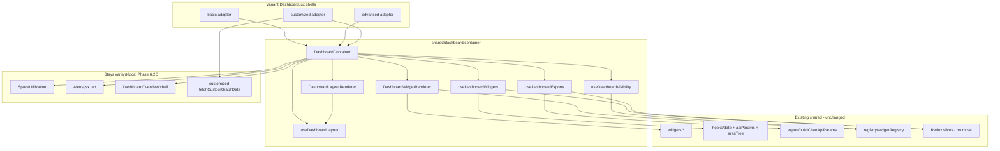

# Phase 6.2C.1 — Dashboard Container Decomposition Audit

**Status:** AUDIT COMPLETE (no code changes)  
**Date:** 2026-06-10  
**Scope:** Remaining duplication in `Dashboard.jsx` after Phase 6.2B.7  
**Explicitly out of scope:** `SpaceUtilization`, `Alerts.jsx`, widget re-extraction, any code modification

---

## Executive Summary

Phase 6.2B (widgets + overview alerts) removed **~3,800 LOC** of chart/widget duplication across the three variant monoliths. What remains is predominantly **container orchestration**: filters, date navigation, export wiring, fetch batching, and variant-specific layout shells.

| Variant | Current `Dashboard.jsx` LOC | Est. extractable duplicate | Est. post-decomposition LOC |
|---------|----------------------------:|---------------------------:|----------------------------:|
| basic | **4,959** | 1,400–1,700 | **3,200–3,500** |
| advanced | **4,203** | 1,100–1,350 | **2,750–3,050** |
| customized | **6,307** | 900–1,200 (+ 1,325 custom-graph stays) | **4,800–5,200** |
| **Total** | **15,469** | **~3,400–4,250** | **~10,750–11,750** |

**Key finding:** ~55–65% of remaining cross-variant duplication is concentrated in four blocks: area-tree filter UI, date prev/next handlers, export handler suite, and `fetchDataForActiveTab` energy batching. Customized additionally carries **~1,325 LOC** of custom-graph logic that is variant-unique and should not be forced into the shared container in early phases.

---

## 1. Remaining LOC Breakdown

Estimates use non-blank line counts (`Measure-Object -Line`). Categories overlap slightly at JSX boundaries; totals reconcile to file LOC ±5%.

### basic — 4,959 LOC

| Category | LOC | % | Primary anchors |
|----------|----:|--:|-----------------|
| **Widget orchestration** | 620 | 12.5% | `fetchDataForActiveTab` (~2102–2281, ~180 LOC); `chartLoading` / `allEnergyChartsReady`; memoized energy selectors; `renderEnergyDraggableSlot` (~4121–4377, ~256 LOC) |
| **Export/email handlers** | 715 | 14.4% | `handleConsumptionEmail`/`handleSavingsEmail` (~3395–3546); group export handlers; `consumptionExportControl`/`savingsExportControl` useMemos (~3825–4006); `buildChartApiParams` |
| **Filter state** | 1,000 | 20.2% | `handleFloorCheckboxClick`, `handleAreaCheckboxChange`, `handleGroupCheckboxChange`; `renderTreeNode` (~1491–1611); area-tree dropdown JSX (~4645–4900) |
| **Date state** | 685 | 13.8% | `handlePrevious` (~2446–2637, ~192 LOC); `handleNext` (~2638–2835, ~197 LOC); `getCurrentPeriodText` (~4380–4440); duration filter bar integration |
| **Visibility/layout logic** | 585 | 11.8% | Energy chart order helpers (~246–395); `useDashboardWidgetVisibility`; `LongPressDraggable`; `buildEnergyDashboardRows`; slot grid rows |
| **Custom graph logic** | 0 | 0% | — |
| **Variant-only sections** | 530 | 10.7% | `consumption_saving` + `ConsumptionSavingsCombinedChart`; blank `LineChart` preview; `DashboardDurationFilterBar`; `consumptionSavingMergedData` |
| **Remainder** | 824 | 16.6% | Tab routing, `DashboardOverview`/`Alerts` refs, snackbar, `ChartLoader`, `getAreaSelectionText`, operator gates |

### advanced — 4,203 LOC

| Category | LOC | % | Primary anchors |
|----------|----:|--:|-----------------|
| **Widget orchestration** | 530 | 12.6% | `fetchDataForActiveTab` energy branch (~1720–1906); fixed MUI `Grid` energy layout (~4317–4560); memoized selectors |
| **Export/email handlers** | 570 | 13.6% | Same handler trio as basic; `ChartExportDropdown` + `advancedSurface` memos (~3117–3250) |
| **Filter state** | 940 | 22.4% | Same handler pattern as basic (~1151–1268 `renderTreeNode`); area dropdown (~3397–3650) |
| **Date state** | 650 | 15.5% | `handlePrevious`/`handleNext` (~2080–2480, near copy of basic) |
| **Visibility/layout logic** | 205 | 4.9% | Static 2-column grids; no drag/reorder |
| **Custom graph logic** | 0 | 0% | — |
| **Variant-only sections** | 400 | 9.5% | `themeConstants` palette; gold tab indicator; `NativeDateInput`; `resolvePieChartLabelColors` |
| **Remainder** | 908 | 21.6% | Tabs, space/alerts JSX, theme button colors |

### customized — 6,307 LOC

| Category | LOC | % | Primary anchors |
|----------|----:|--:|-----------------|
| **Widget orchestration** | 595 | 9.4% | `fetchDataForActiveTab` + `areaGroupScopeSignature` guard (~3535–3682); `energyCards` / `buildEnergyBuiltinRender` (~6484–6790) |
| **Export/email handlers** | 760 | 12.0% | Inline export dropdowns (~5075–5379); `handleEnergyCustomGraphExport` (~4462–4558) |
| **Filter state** | 1,050 | 16.6% | Extended `getAreaSelectionText` with groups (~4847–4970); same tree handlers (~2903–3022) |
| **Date state** | 690 | 10.9% | `handlePrevious`/`handleNext` (~3858–4260) |
| **Visibility/layout logic** | 315 | 5.0% | `widgetVisibility` localStorage (~732–820); `@dnd-kit` `SortableDashboardItem` |
| **Custom graph logic** | 1,325 | 21.0% | `fetchCustomGraphData` (~1011–1963, **~950 LOC**); per-floor helpers; `EnergyCustomGraphCard` wiring |
| **Variant-only sections** | 575 | 9.1% | Builtin override virtual graphs; group-scoped API params; DnD reorder shell |
| **Remainder** | 997 | 15.8% | Merged space/charts tab branch, profile gates |

### Combined totals (all variants)

| Category | basic | advanced | customized | Cross-variant overlap |
|----------|------:|---------:|-----------:|----------------------|
| Widget orchestration | 620 | 530 | 595 | **~70%** |
| Export/email | 715 | 570 | 760 | **~85%** |
| Filter state | 1,000 | 940 | 1,050 | **~80%** |
| Date state | 685 | 650 | 690 | **~95%** |
| Visibility/layout | 585 | 205 | 315 | **~25%** |
| Custom graph | 0 | 0 | 1,325 | **0%** (customized only) |
| Variant-only | 530 | 400 | 575 | **0%** |
| Remainder | 824 | 908 | 997 | **~40%** |

---

## 2. Duplication Matrix

### Exact duplicates (≥95% match, 3 variants)

| Block | LOC × 3 | Notes |
|-------|--------:|-------|
| `handlePrevious` date navigation | ~585 | ~192–197 LOC each; byte-for-byte near match |
| `handleNext` date navigation | ~585 | Same structure as `handlePrevious` |
| `getCurrentPeriodText` | ~180 | ~60 LOC each |
| `handleConsumptionEmail` + `handleSavingsEmail` | ~270 | ~45 LOC per handler × 2 × 3 |
| `fetchDataForActiveTab` energy API batch | ~285 | Unified energy + donuts + `chartLoading` flags |
| `renderTreeNode` recursive tree | ~345 | ~115 LOC each |
| `handleFloorCheckboxClick` | ~270 | ~90 LOC each |
| Alert-type `handleTypeToggle` + dropdown JSX | ~270 | ~90 LOC each |
| Export click-outside + `exportDropdownRefs` | ~75 | ~25 LOC each |
| `renderLightingPowerDensity` thin wrapper | ~36 | ~12 LOC each; LPD chrome still in Dashboard |

### Near duplicates (60–94% match)

| Block | Variants | LOC each | Divergence |
|-------|----------|----------:|------------|
| Area-tree dropdown JSX | 3 | ~250 | Styling tokens; customized adds group scope hints |
| `getAreaSelectionText` | 3 | ~120–150 | Customized extends for area groups |
| `fetchDataForActiveTab` space branch | basic + advanced | ~80 | Customized merges charts into space tab |
| Export control useMemos (`consumptionExportControl`, etc.) | 3 | ~90–120 | basic/customized inline JSX; advanced `ChartExportDropdown` |
| Energy widget slot JSX (props wiring) | 3 | ~40–60 per widget | Shell variant + surface memos differ |
| `transformDataForCharts` useCallback wrapper | 3 | ~10 | Identical body |
| Memoized `memoizedEnergyConsumption` / `memoizedEnergySavings` | 3 | ~25 | Identical deep-compare pattern |

### Variant-specific code (not candidates for forced unification)

| Block | Variant | LOC | Reason |
|-------|---------|----:|--------|
| `fetchCustomGraphData` pipeline | customized | ~950 | Unique API paths, per-floor aggregation, thunk resolver |
| `LongPressDraggable` + energy chart order | basic | ~350 | Basic-only reorder persistence |
| `consumption_saving` combined chart | basic | ~120 | Hidden slot + `ConsumptionSavingsCombinedChart` |
| `buildEnergyBuiltinRender` + `energyCards` DnD | customized | ~310 | Override virtual graphs + sortable shell |
| Gold/theme palette + tab pill indicator | advanced | ~200 | Advanced visual system |
| `DashboardDurationFilterBar` | basic | ~80 | Basic-only standalone duration UX |
| Blank `LineChart` preview | basic | ~35 | Basic custom-date placeholder |
| `handleEnergyCustomGraphExport` | customized | ~95 | Custom graph export routing |
| `widgetVisibility` localStorage map | customized | ~90 | Customized persistence model |

### Already extracted (Phase 6.2A–6.2B) — not re-audited

| Shared widget | Import path |
|---------------|-------------|
| `UnifiedEnergyWidget` | `shared/dashboard/widgets/energy` |
| `PeakMinConsumptionWidget` | `shared/dashboard/widgets/peakmin` |
| `SavingsByStrategyWidget` | `shared/dashboard/widgets/SavingsByStrategyWidget` |
| `TotalConsumptionByGroupWidget` | `shared/dashboard/widgets/TotalConsumptionByGroupWidget` |
| `LightPowerDensityWidget` | `shared/dashboard/widgets/LightPowerDensityWidget` |
| `OverviewMetricTile` + `AlertsWidget` | `shared/dashboard/widgets/overview`, `alerts` |

### Shared foundation already in use

| Module | Path |
|--------|------|
| `useDashboardDateRange` | `shared/dashboard/hooks/` |
| `useDashboardApiParams` | `shared/dashboard/hooks/` |
| `useAreaTreeSelection` | `shared/dashboard/hooks/` |
| `buildChartApiParams` | `shared/dashboard/export/` |
| `resolveEnergyExportByApiPath` | `shared/dashboard/export/` |
| `transformDataForCharts` | `shared/dashboard/charts/transforms/` |
| `dashboardWidgetVisibilityCore` | `shared/dashboard/utils/` (basic uses via `useDashboardWidgetVisibility`) |
| `BUILTIN_WIDGET_REGISTRY` | `shared/dashboard/registry/widgetRegistry.js` |

---

## 3. Proposed Shared Structure

```
src/shared/dashboard/container/
├── DashboardContainer.jsx          # Top-level orchestrator: tabs, loading gates, child routes
├── DashboardWidgetRenderer.jsx     # Registry-driven built-in widget dispatch (energy/space keys)
├── DashboardLayoutRenderer.jsx     # Grid / drag / sortable shells per variant adapter
├── hooks/
│   ├── useDashboardWidgets.js      # chartLoading, allEnergyChartsReady, fetchDataForActiveTab energy batch
│   ├── useDashboardExports.js      # Email/download handlers, export dropdown state, exportControl memos
│   ├── useDashboardVisibility.js   # Wraps dashboardWidgetVisibilityCore + variant persistence adapters
│   └── useDashboardLayout.js       # Energy slot order, grid spans, DnD context (variant flags)
└── adapters/
    ├── basicDashboardAdapter.js    # LongPressDraggable, consumption_saving, duration filter bar
    ├── advancedDashboardAdapter.js # Theme palette, ChartExportDropdown, NativeDateInput
    └── customizedDashboardAdapter.js # energyCards, custom graph hooks (fetch stays variant-local initially)
```

### Responsibility split

| Layer | Owns | Does not own |
|-------|------|--------------|
| **DashboardContainer** | Tab state, overview vs detail routing, global loading/error, dispatching fetch on tab/filter change | Widget chart rendering, SpaceUtilization internals |
| **DashboardWidgetRenderer** | Maps `widgetKey` → shared widget + prop bundle from orchestration hooks | Export UI chrome styling (adapter) |
| **DashboardLayoutRenderer** | Grid item placement, drag wrappers, visibility gates | Widget data fetching |
| **useDashboardWidgets** | `fetchDataForActiveTab` energy/space batching, `chartLoading`, memoized selector stabilization | Redux slice definitions |
| **useDashboardExports** | `handleConsumptionEmail`, `handleSavingsEmail`, group handlers, `showExportDropdown`/`exportLoading` | API implementations |
| **useDashboardVisibility** | `isWidgetVisible`, overview tile gates, energy slot visibility | Widget ordering persistence (layout hook) |
| **useDashboardLayout** | Slot order, grid span resolution, DnD sensors | Custom graph card composition |
| **adapters/** | Variant-specific chrome tokens, export dropdown component choice, combined-chart slot | Shared widget internals |

### Dependency graph



---

## 4. Candidate Extraction Order

### LOW risk (pure helpers / thin wrappers / dead code)

| # | Target | Est. savings | Rationale |
|---|--------|-------------:|-----------|
| L1 | `getCurrentPeriodText` → `shared/dashboard/utils/dashboardPeriodText.js` | ~180 LOC | Pure function, no React |
| L2 | Export click-outside handler + `exportDropdownRefs` pattern | ~75 LOC | Isolated effect |
| L3 | Memoized energy payload stabilizers (`memoizedEnergyConsumption`) | ~75 LOC | Identical 3× |
| L4 | `transformDataForCharts` useCallback wrapper → hook returns bound fn | ~30 LOC | Trivial |
| L5 | Remove unused `recharts` imports (advanced/customized) | ~15 LOC | Cleanup only |
| L6 | `renderLightingPowerDensity` wrapper → extend `LightPowerDensityWidget` chrome prop | ~36 LOC | Small widget API addition |
| L7 | Alert-type filter state + `handleTypeToggle` | ~90 LOC | Self-contained |

**Subtotal LOW:** ~500 LOC across variants

### MEDIUM risk (hooks with Redux dispatch, UI still variant-styled)

| # | Target | Est. savings | Rationale |
|---|--------|-------------:|-----------|
| M1 | `useDashboardExports` — email/download handlers + dropdown state | ~600 LOC | Heavy duplication; `buildChartApiParams` already shared |
| M2 | Date navigation — `handlePrevious`/`handleNext` → extend `useDashboardDateRange` or `useDashboardDateNavigation` | ~1,170 LOC | Near exact 3×; must preserve navigation edge cases |
| M3 | `useDashboardWidgets` — energy `fetchDataForActiveTab` batch + `chartLoading` orchestration | ~400 LOC | Centralized but touches many thunks |
| M4 | `DashboardWidgetRenderer` — registry-driven energy widget prop wiring | ~350 LOC | Six widgets already shared; reduces slot JSX |
| M5 | Export control useMemos → adapter-fed `exportControl` factory | ~300 LOC | Chrome differs per variant |
| M6 | `useDashboardVisibility` — unify basic hook + customized localStorage | ~200 LOC | `dashboardWidgetVisibilityCore` exists |

**Subtotal MEDIUM:** ~3,020 LOC across variants

### HIGH risk (layout / variant identity / large customized-only)

| # | Target | Est. savings | Rationale |
|---|--------|-------------:|-----------|
| H1 | Area-tree filter UI + all checkbox handlers | ~2,400 LOC | Largest block; intertwined with floor/area Redux; `useAreaTreeSelection` partial |
| H2 | `DashboardLayoutRenderer` + `useDashboardLayout` (basic drag + customized DnD) | ~600 LOC | Behavior diverges significantly |
| H3 | `fetchCustomGraphData` extraction (customized) | ~950 LOC | Unique; high regression risk; keep in customized adapter initially |
| H4 | Full `DashboardContainer` replacing variant orchestration spine | ~800 LOC | Requires all hooks stable first |
| H5 | Basic `consumption_saving` combined slot | ~120 LOC | Product-specific; basic-only |
| H6 | Filter dropdown JSX (area tree panel) | ~750 LOC | Large MUI tree; styling per variant |
| H7 | Space tab fetch branch unification | ~160 LOC | **Deferred** — SpaceUtilization out of scope |

**Subtotal HIGH:** ~4,780 LOC (much stays variant-local in early phases)

### Recommended phase sequence (6.2C.2+)

```
6.2C.2  L1–L7   Pure helpers + small hook extractions
6.2C.3  M1      useDashboardExports
6.2C.4  M2      Date navigation hook
6.2C.5  M3+M4   useDashboardWidgets + DashboardWidgetRenderer
6.2C.6  M5+M6   Export chrome adapters + visibility hook
6.2C.7  H1      Area filter handlers (logic first, UI second)
6.2C.8  H2      DashboardLayoutRenderer (per-variant adapters)
6.2C.9  H4      DashboardContainer integration
6.2C.10 H3      Custom graph adapter (customized only, optional)
```

---

## 5. Estimated Post-Decomposition `Dashboard.jsx` Sizes

Assumes phases 6.2C.2–6.2C.9 complete; customized custom-graph block remains variant-local through 6.2C.9.

| Variant | Current | After LOW | After MEDIUM | After HIGH (layout+filters) | Final est. |
|---------|--------:|----------:|-------------:|----------------------------:|-----------:|
| basic | 4,959 | 4,750 | 3,900 | **3,300** | **3,200–3,500** |
| advanced | 4,203 | 4,050 | 3,350 | **2,850** | **2,750–3,050** |
| customized | 6,307 | 6,120 | 5,400 | **5,000** | **4,800–5,200** |
| **Total** | **15,469** | **14,920** | **12,650** | **11,150** | **~10,750–11,750** |

**Net reduction:** ~3,700–4,700 LOC (~24–30% of current monolith total)  
**New shared container LOC (est.):** ~1,800–2,200 production + ~400 tests  
**Net codebase delta:** ~−1,500 to −2,500 LOC after shared layer added

### What remains in variant shells (by design)

| Variant | Residual LOC drivers |
|---------|---------------------|
| basic | `consumption_saving`, `LongPressDraggable`, energy order persistence, `DashboardDurationFilterBar`, blank preview |
| advanced | Theme palette constants, gold tab chrome, `ChartExportDropdown` wiring |
| customized | `fetchCustomGraphData`, `energyCards` DnD, builtin overrides, group-scoped API extensions |
| all | `SpaceUtilization`, `Alerts`, `DashboardOverview` composition, operator/floor gates, tab shells |

---

## 6. Risk Assessment

| Risk | Severity | Mitigation |
|------|----------|------------|
| Date navigation regression | **High** | Extract only after parity tests on `dashboardDateState`; snapshot period text per duration |
| Export email/download behavior drift | **High** | `useDashboardExports` parity tests against existing handler outcomes; reuse `buildChartApiParams` |
| Area filter selection bugs | **High** | Extract handlers before JSX; keep `useAreaTreeSelection`; do not touch floor permission logic |
| Layout/drag regression (basic) | **Medium** | `useDashboardLayout` behind feature flag; keep `LongPressDraggable` in basic adapter |
| Customized custom graphs break | **High** | Defer `fetchCustomGraphData` to Phase 6.2C.10; never merge into generic widget renderer |
| Redux coupling | **Medium** | Hooks accept `dispatch` + selectors as params; no slice moves |
| SpaceUtilization scope creep | **High** | Explicit stop boundary in every 6.2C sub-phase |
| Over-abstraction of variant chrome | **Medium** | Adapter pattern per variant; avoid single mega-theme |

---

## 7. Rollback / Governance

- Each 6.2C sub-phase modifies **one hook or renderer** at a time with parity tests.
- Variant `Dashboard.jsx` remains the integration shell until Phase 6.2C.9; no big-bang swap.
- `widgetRegistry.js` metadata already documents widget keys — extend for `DashboardWidgetRenderer` mapping.
- No changes to `SpaceUtilization.jsx`, `Alerts.jsx`, or Redux slices during container extraction.

---

## 8. Stop Boundary (Phase 6.2C.1)

| Item | Status |
|------|--------|
| Code modifications | **None** (audit only) |
| Widget extraction | **None** |
| SpaceUtilization work | **None** |
| Container implementation | **Deferred** to 6.2C.2+ |

---

## Appendix: File Inventory Reference

| File | LOC (non-blank) |
|------|----------------:|
| `basic/Dashboard.jsx` | 4,959 |
| `advanced/Dashboard.jsx` | 4,203 |
| `customized/Dashboard.jsx` | 6,307 |
| `basic/DashboardOverview.jsx` | 713 |
| `advanced/DashboardOverview.jsx` | 120 |
| `customized/DashboardOverview.jsx` | 123 |
| **Dashboard monolith total** | **15,469** |
