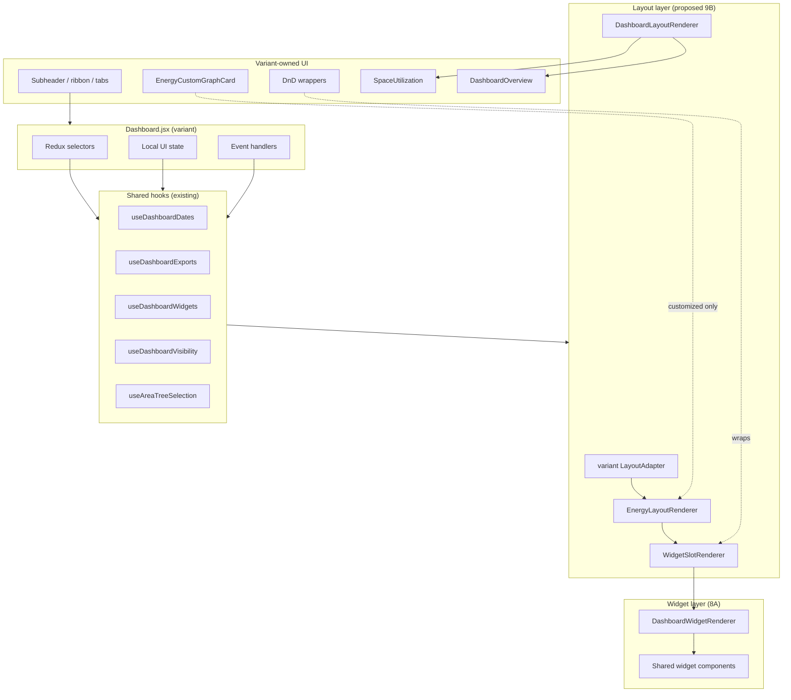

# Phase 6.2C.9A — Dashboard Layout Renderer Audit

**Date:** 2026-06-10  
**Status:** Audit only — no code modifications  
**Baseline:** Phases through 6.2C.8A (`DashboardWidgetRenderer`, `useDashboardVisibility`, `dashboardLayoutResolvers`)

**Decision context:** Phase 6.2C.8B (override builders) is **not approved** — projected net reduction (~40–140 LOC) does not justify added abstraction. Layout/container architecture is the next target.

---

## 1. Executive Summary

| Question | Answer |
|----------|--------|
| Can layout rendering be centralized **before** `DashboardContainer`? | **Yes — partially.** Energy-tab slot placement and metric card shells are the safest first extraction. |
| Is full layout unification across variants feasible? | **No** in one step. Three incompatible placement systems exist (dynamic flex rows, fixed MUI grids, sortable CSS grid). |
| Recommended path | `EnergyLayoutRenderer` + variant adapters (9B) → tab section shell (9C) → `DashboardContainer` (10) |
| Estimated recoverable LOC (energy layout only) | **200–350** from Dashboard monoliths |
| Estimated recoverable LOC (full container, eventual) | **800–1,200** — high complexity |

**Key finding:** Widget **routing** is centralized (8A). Remaining duplication is **where** widgets are placed, **how** rows/grids are built, and **which DnD/shell wrapper** surrounds each slot — not **what** widget renders.

---

## 2. Layout Inventory by Variant

### 2.1 basic (`Dashboard.jsx` — 3,906 LOC)

| System | Entry point | Pipeline | Ordering source | Visibility source | DnD ownership |
|--------|-------------|----------|-----------------|---------------------|---------------|
| **Tab shell** | `return (...)` ~3003 | `activeTab` → fixed subheader + scrollable content | URL / `handleTabChange` | N/A | None |
| **Overview** | `activeTab === 'overview'` ~3678 | `<DashboardOverview />` (754 LOC variant file) | Fixed tile grid in `DashboardOverview` | `useDashboardWidgetVisibility` in overview file | None |
| **Energy** | `activeTab === 'energy'` ~3691 | `energyDashboardRows` → `pair.map` → `renderEnergyDraggableSlot` | `energyVisibleSlotOrder` via `useDashboardVisibility` + localStorage + API order | `visibilityMap` / `isWidgetVisible` | **`LongPressDraggable`** per slot |
| **Charts (space)** | `activeTab === 'charts'` ~3806 | `<SpaceUtilization showChartsTab />` | SpaceUtilization-owned | Widget visibility in SpaceUtilization | SpaceUtilization DnD |
| **Alerts** | `activeTab === 'alerts'` ~3818 | `<Alerts />` | N/A | Alert type filter | None |

**Energy layout detail:**
- Rows: `buildEnergyDashboardRows(energyVisibleSlotOrder)` — pairs slots 2-up; `consumption_saving` always full row
- Slot renderer: `renderEnergyDraggableSlot(slotId)` — switch maps slot → `LongPressDraggable` + widget/shell
- Metric shells: LPD + peak built **inside** switch (~90 LOC) — not in `DashboardWidgetRenderer`
- Empty state: "No Energy widgets are visible" when `energyVisibleSlotOrder.length === 0`
- Duration filter: optional standalone bar above rows when `showEnergyStandaloneDurationFilter`

**Shared hooks already used:**
- `useDashboardVisibility({ variant: 'basic' })` → `energyVisibleSlotOrder`, `energyDashboardRows`, `showEnergyStandaloneDurationFilter`
- `dashboardLayoutResolvers.buildEnergyDashboardRows`, `resolveEnergyVisibleSlotOrder`

---

### 2.2 advanced (`Dashboard.jsx` — 3,408 LOC)

| System | Entry point | Pipeline | Ordering source | Visibility source | DnD ownership |
|--------|-------------|----------|-----------------|---------------------|---------------|
| **Tab shell** | `return (...)` ~2093 | Fixed header (60px/85px top) + tab pills + content | URL / `handleTabChange` | N/A | None |
| **Overview** | `activeTab === 'overview'` ~3078 | `<DashboardOverview />` (131 LOC) | Fixed MUI `Grid` 3×2 | None (all tiles shown) | None |
| **Energy** | `activeTab === 'energy'` ~3091 | **3 hardcoded `Grid` containers** with fixed widget positions | **Static** — not user-reorderable | `useAdvancedDashboardVisibility` — always visible | **None** |
| **Charts** | `activeTab === 'charts'` ~3308 | `<SpaceUtilization showChartsTab />` | SpaceUtilization-owned | SpaceUtilization | SpaceUtilization DnD |
| **Alerts** | `activeTab === 'alerts'` ~3320 | `<Alerts />` | N/A | Alert filter | None |

**Energy layout detail (fixed 3-row grid):**
1. Row 1: `savings_by_strategy` + `total_consumption_by_group` (pie charts)
2. Row 2: `consumption` + `savings` (line charts)
3. Row 3: LPD metric panel + peak metric panel (chrome inline, ~90 LOC)

**No** `energyDashboardRows`, **no** `LongPressDraggable`, **no** order persistence.

---

### 2.3 customized (`Dashboard.jsx` — 5,239 LOC)

| System | Entry point | Pipeline | Ordering source | Visibility source | DnD ownership |
|--------|-------------|----------|-----------------|---------------------|---------------|
| **Tab shell** | `return (...)` ~3944 | Fixed header + pill tabs + content box | URL + `useEffect` on pathname | N/A | None |
| **Overview** | `activeTab === 'overview'` ~4851 | `<DashboardOverview />` (134 LOC) | Fixed MUI `Grid` | None | None |
| **Energy** | `activeTab === 'energy'` ~4875 | IIFE: `energyCards[]` + `energyCustomCards[]` → filter → `resolveEnergyCardLayout` → `DndContext` grid | `energyCardOrder` localStorage (`dashboardOrder.energy`) | `shouldShowEnergyWidget` | **`@dnd-kit`** `SortableDashboardItem` |
| **Space utilization** | `activeTab === 'space-utilization'` ~5130 | Full `<SpaceUtilization />` page | SpaceUtilization | SpaceUtilization + custom graphs | SpaceUtilization DnD |
| **Alerts** | `isAlertsTab` ~5141 | `<Alerts />` in shell class | N/A | Alert filter | None |

**Energy layout detail:**
- `energyCards[]`: 6 builtins with `render` functions; 4 wrapped in `buildEnergyBuiltinRender` (custom-graph override fallback)
- `energyCustomCards[]`: `custom_graph:*` → `EnergyCustomGraphCard` (**out of scope**)
- Layout: CSS `display: grid` with `energyGridColumnTemplate(visibleCount)`, span toggle (6/12 cols), fullscreen overlay
- `SortableDashboardItem`: **~150 LOC** inline component (lines 402–550) — drag handle, span/fullscreen controls
- Metric shells: LPD/peak use `BUILTIN_COMPACT_PANEL` inside card `render` (~50 LOC)

**Shared hooks already used:**
- `useDashboardVisibility({ variant: 'customized' })` → `resolveEnergyCardLayout`, `energyGridColumnTemplate`, `getEnergyCardCol`
- `dashboardLayoutResolvers.resolveOrderedVisibleDashboardCards`, `resolveEnergyGridColumnTemplate`

---

## 3. Layout Duplication Matrix

### 3.1 Cross-variant comparison

| Concern | basic ↔ advanced | basic ↔ customized | advanced ↔ customized | Classification |
|---------|------------------|--------------------|-----------------------|----------------|
| Tab content routing (`activeTab === ...`) | NEAR | NEAR | NEAR | **NEAR** — same 4–5 tabs, different styling |
| `<DashboardOverview />` mount + nav callbacks | NEAR | NEAR | **EXACT** (adv ≈ cust) | **NEAR** / adv-cust **EXACT** |
| `DashboardOverview` implementation | — | — | — | **VARIANT-ONLY** (basic 754 LOC vs ~130 LOC) |
| `<SpaceUtilization />` mount | NEAR | DIFF | NEAR | **NEAR** (tab key differs: `charts` vs `space-utilization`) |
| Energy 2-column concept | NEAR | NEAR | NEAR | **NEAR** — intent same, implementation diverges |
| Energy row/slot iteration | DIFF | DIFF | DIFF | **VARIANT-ONLY** — 3 different systems |
| Metric panel shell (LPD/peak) | NEAR | NEAR | NEAR | **NEAR** — ~80–90 LOC × 3, same structure |
| Widget renderer call | EXACT | EXACT | EXACT | **EXACT** — `<DashboardWidgetRenderer widgetKey context variant />` |
| Visibility → visible set | NEAR | DIFF | DIFF | **NEAR** basic/cust both filter; advanced shows all |
| Order persistence | basic localStorage+API | — | customized localStorage | **VARIANT-ONLY** |
| DnD wrapper | basic only | — | customized only | **VARIANT-ONLY** |
| Custom graph cards | — | — | ✓ | **VARIANT-ONLY** |
| Empty energy state UI | ✓ | — | — | **Basic-only** |
| `consumption_saving` full-width row | ✓ | — | — | **Basic-only** |

### 3.2 Duplication classification summary

| Class | Items |
|-------|-------|
| **EXACT** | `DashboardWidgetRenderer` integration; advanced ≈ customized `DashboardOverview` grid; shared `dashboardLayoutResolvers` row-pairing algorithm (basic only uses it) |
| **NEAR** | Tab section switch; metric panel chrome (LPD/peak); 2-column energy layout intent; SpaceUtilization delegation; visibility-filter-then-render pattern |
| **VARIANT-ONLY** | basic `LongPressDraggable` + `renderEnergyDraggableSlot` switch; advanced fixed 3×Grid; customized `DndContext` + `SortableDashboardItem` + `energyCards[]`; basic `DashboardOverview` rich layout; custom graphs; `buildEnergyBuiltinRender` |

### 3.3 LOC estimates (layout-only regions)

| Region | basic | advanced | customized | Overlap est. |
|--------|-------|----------|------------|--------------|
| Fixed subheader / filters / tabs | ~550 | ~480 | ~620 | ~120 NEAR |
| Energy tab layout + shells | ~320 | ~230 | ~400 | ~150 NEAR |
| `renderEnergyDraggableSlot` / slot switch | ~200 | — | — | basic only |
| `SortableDashboardItem` + DnD grid | — | — | ~250 | customized only |
| Tab content routing block | ~150 | ~120 | ~180 | ~80 NEAR |
| Overview mount (in Dashboard) | ~15 | ~15 | ~20 | ~15 EXACT |
| **Total layout-adjacent** | **~1,235** | **~845** | **~1,470** | **~365 extractable NEAR** |

**Realistic extraction target (9B energy only):** 200–350 LOC by centralizing row/slot iteration + metric shells, leaving DnD wrappers in adapters.

---

## 4. DnD Boundary Audit

### 4.1 Inventory

| Mechanism | Variant | Scope | Persistence | Safe to move? |
|-----------|---------|-------|-------------|---------------|
| `LongPressDraggable` | basic | Energy slots (7 storage keys) | `localStorage` + `saveDashboardChartOrder` API + `liftedFullOrderFromVisibleReorder` | **NO** — variant utility, reflow coupling, role lock (`energyReflowLocked`) |
| `energyDraggableReflow` | basic | Group `dashboard-energy`, `translateStorageKeys` | Same as above | **NO** |
| `@dnd-kit` `DndContext` | customized | Energy grid only | `writeEnergyCardOrder` / `dashboardOrder.energy` | **NO** — sensors, span toggle, fullscreen overlay co-located |
| `SortableDashboardItem` | customized | Per-card wrapper | Span map `dashboardOrder.energySpan` | **NO** — 150 LOC inline, hover controls |
| SpaceUtilization DnD | all (via child) | Charts tab widgets | SpaceUtilization-owned | **NO** — separate monolith |
| Advanced energy DnD | — | None | — | N/A |

### 4.2 Shared vs variant-owned candidates

| Candidate | Move to shared? | Rationale |
|-----------|-----------------|-----------|
| `buildEnergyDashboardRows` | ✅ Already shared | `dashboardLayoutResolvers.js` |
| `resolveEnergyCardLayout` / grid template | ✅ Already shared | `dashboardLayoutResolvers.js` + `useDashboardVisibility` |
| Slot → widget key mapping | ✅ Shared | `widgetRenderMap.js` (8A) |
| **Row/column layout JSX** | ✅ **Candidate** | `EnergyLayoutRenderer` — pure placement |
| **Metric panel shell JSX** | ✅ **Candidate** | `WidgetSlotRenderer` or adapter shell component |
| `LongPressDraggable` wrapper | ❌ Variant adapter | Injects DnD around slot output |
| `SortableDashboardItem` wrapper | ❌ Variant adapter | Injects DnD + span/fullscreen |
| Order persistence writes | ❌ Variant-owned | Redux dispatch, localStorage keys differ |
| `buildEnergyBuiltinRender` | ❌ Variant-owned | Custom graph override routing |
| `energyCards[]` definition | ⚠️ Partial | Card list metadata could be adapter config; `render` fns stay variant |

**DnD rule for layout renderer:** Layout renderer outputs **slot boundaries** (position + optional shell). Variant adapter wraps with DnD **outside** the renderer — never inside shared layout code.

---

## 5. Proposed Architecture

```
src/shared/dashboard/container/layout/
├── DashboardLayoutRenderer.jsx    # Tab-section orchestration (overview/energy/charts/alerts)
├── EnergyLayoutRenderer.jsx       # Energy section: rows/grid + slot iteration
├── WidgetSlotRenderer.jsx         # Single slot: optional metric shell + DashboardWidgetRenderer
├── layoutTypes.js                 # SlotDescriptor, RowDescriptor, LayoutPreset types
└── adapters/
    ├── basicLayoutAdapter.js      # flex rows, LongPressDraggable injection point, basic metric shell
    ├── advancedLayoutAdapter.js   # fixed 3-grid structure, advanced metric shell
    └── customizedLayoutAdapter.js # card list + grid template, Sortable injection point
```

### 5.1 Responsibilities

**`DashboardLayoutRenderer`**
- Input: `activeTab`, section descriptors from adapter, children render fns
- Output: correct tab panel (overview / energy / charts / alerts)
- Does **not** own: subheader ribbon, area tree, date filters, exports

**`EnergyLayoutRenderer`**
- Input: `variant`, `visibleSlots[]`, `layoutMode` (`dynamic-rows` | `fixed-grid` | `sortable-grid`), adapter config
- Output: positioned slots (calls `WidgetSlotRenderer` per slot)
- Does **not** own: DnD, order persistence, visibility resolution (receives pre-filtered list)

**`WidgetSlotRenderer`**
- Input: `widgetKey`, `variant`, `context`, `shellType` (`none` | `metric-panel` | `compact-panel`), shell props
- Output: shell wrapper (if any) + `<DashboardWidgetRenderer />`
- Bridges layout layer to 8A widget layer

**Adapters**
- Provide: row structure metadata, shell theme tokens, DnD wrapper component ref, slot ordering hooks
- basic: `{ layoutMode: 'dynamic-rows', getRowWidths(slotId), DndWrapper: LongPressDraggable, ... }`
- advanced: `{ layoutMode: 'fixed-grid', rows: [['savings_by_strategy','total_consumption_by_group'], ...] }`
- customized: `{ layoutMode: 'sortable-grid', DndWrapper: SortableDashboardItem, cardDescriptors: [...] }`

### 5.2 Data flow (energy tab)

```
useDashboardVisibility (existing)
        ↓ visible slot keys + order
variant adapter (metadata only)
        ↓ rows / grid template
EnergyLayoutRenderer
        ↓ per slot
WidgetSlotRenderer → DashboardWidgetRenderer (8A)
        ↑
variant DnD wrapper (outside renderer)
```

---

## 6. DashboardContainer Feasibility

### 6.1 Can `DashboardContainer` follow layout extraction?

**Yes**, with layout renderer as a prerequisite. Container should compose existing orchestration hooks, not reimplement them.

### 6.2 Proposed `DashboardContainer` I/O

**Inputs (already extracted across 6.2C.2–8A):**

| Domain | Source today | Container input |
|--------|--------------|-----------------|
| Dates | `useDashboardDates` | `dateState`, `onDurationChange`, ... |
| Exports | `useDashboardExports` | `exportActions`, `exportLoading`, ... |
| Widgets | `useDashboardWidgets` | `energyWidgetRenderContext`, titles, chart data |
| Visibility | `useDashboardVisibility` | `visibleSlots`, `energyDashboardRows`, `shouldShowEnergyWidget` |
| AreaTree | `useAreaTreeSelection` + filters | `areaTreeState`, selection handlers |
| Layout | **NEW** `EnergyLayoutRenderer` + adapter | `layoutAdapter`, `activeTab` |
| Overview | variant `DashboardOverview` | `overviewData`, nav callbacks |
| Space | variant `SpaceUtilization` | props passthrough |

**Outputs:**
- Rendered tab sections (no new data outputs)
- Event callbacks bubble to variant route container (or Redux)

### 6.3 Dependency graph



**Hard dependencies (container cannot absorb without risk):**
- Subheader ribbon + area dropdown JSX (basic 550+ LOC, heavily themed)
- `buildEnergyBuiltinRender` + `EnergyCustomGraphCard` pipeline (customized)
- `consumption_saving` combined chart slot (basic)
- `SortableDashboardItem` fullscreen/span UX (customized)

---

## 7. Risk Matrix

| Item | Risk | Rationale |
|------|------|-----------|
| `EnergyLayoutRenderer` | **LOW** | Placement only; widget rendering already centralized; adapters isolate variant differences |
| `WidgetSlotRenderer` (metric shells) | **LOW–MEDIUM** | ~90 LOC × 3 near-duplicate shells; theme tokens differ (basic light/dark metric, advanced card, customized `BUILTIN_*`) |
| `DashboardLayoutRenderer` (tab sections) | **MEDIUM** | Tab routing is NEAR duplicate but subheader coupling is tight |
| DnD integration | **HIGH** | Must remain outside shared layout; easy to break reorder persistence or `energyReflowLocked` |
| Customized energy cards + `buildEnergyBuiltinRender` | **HIGH** | Builtin→custom-graph override path is entangled with card `render` fns |
| Custom graph sections | **HIGH** | `energyCustomCards`, `EnergyCustomGraphCard` — explicitly out of scope; any layout move must preserve IIFE |
| `DashboardContainer` | **HIGH** | Composes 6+ hook domains + variant subheader; regression surface is full dashboard |
| SpaceUtilization references | **MEDIUM** | Delegated render, but tab key differs (`charts` vs `space-utilization`); props differ |
| Overview layout unification | **MEDIUM** | basic `DashboardOverview` (754 LOC) is a separate product surface; adv/cust are ~130 LOC |
| Advanced fixed grid → dynamic | **HIGH** | Changing advanced to row-based would alter UX (no DnD today by design) |

---

## 8. Migration Roadmap

### Phase 6.2C.9B — Energy layout renderer (recommended next)

**Scope:**
- Create `layout/EnergyLayoutRenderer`, `WidgetSlotRenderer`, three adapters
- Extract metric panel shells (LPD/peak) into `WidgetSlotRenderer`
- Wire basic `energyDashboardRows` loop + advanced 3-grid + customized sortable grid **placement only**
- DnD wrappers stay in Dashboard, injected via adapter `wrapSlot(children, slotMeta)`

**Est. LOC reduction:** 200–350 (dashboard monoliths)  
**Complexity:** Medium  
**Rollback:** Revert adapter wiring; restore inline grid/row JSX  
**Tests:** Layout parity tests per variant (slot order, shell presence, widget key mapping)

### Phase 6.2C.9C — Tab section layout shell

**Scope:**
- `DashboardLayoutRenderer` for `activeTab` panel routing (overview/energy/charts/alerts)
- Unify NEAR duplicate tab content blocks (~80 LOC × 3)
- **Do not** move subheader ribbon, area tree, or date controls

**Est. LOC reduction:** 100–180  
**Complexity:** Medium  
**Rollback:** Easy — thin switch wrapper  
**Prerequisite:** 9B complete

### Phase 6.2C.10 — DashboardContainer

**Scope:**
- Compose hooks + `DashboardLayoutRenderer` + variant adapter + subheader slot (`children` / render props)
- Dashboard.jsx becomes thin route shell (~500–800 LOC target per variant)
- Variant retains: subheader, DnD, custom graphs, `consumption_saving`, AreaTree dropdown UI

**Est. LOC reduction:** 600–1,000 cumulative  
**Complexity:** High  
**Rollback:** Difficult — keep variant Dashboard as fallback wrapper around container  
**Prerequisite:** 9B + 9C + stable parity tests

### Not recommended

| Phase | Reason |
|-------|--------|
| 6.2C.8B override builders | Not approved — low net LOC |
| Unified `DashboardOverview` | basic is 6× larger; different product requirements |
| Moving DnD to shared | HIGH risk, low reuse (2 of 3 variants) |
| Moving subheader/ribbon first | Most variant-specific LOC; blocks container anyway |

---

## 9. Estimated LOC Savings Summary

| Phase | Dashboard LOC removed | Shared LOC added | Net |
|-------|----------------------|------------------|-----|
| 9B Energy layout | 200–350 | 180–280 | **−20 to −170** |
| 9C Tab shell | 100–180 | 60–100 | **−40 to −120** |
| 10 Container | 600–1,000 | 300–450 | **−150 to −700** cumulative |
| **Total path** | **900–1,530** | **540–830** | **−210 to −990** |

Net savings only materialize at **9C/10**. Phase 9B alone is primarily **structural** (enables container), not large LOC win.

---

## 10. Safe Extraction Boundaries

### ✅ Safe to centralize (9B/9C)

- Energy slot iteration (rows / grid / sortable list)
- Metric panel shell markup (LPD header + unit control slot, peak header)
- Tab panel conditional rendering (`activeTab` → section component)
- Slot width / column span calculation (already in `dashboardLayoutResolvers`)
- `DashboardWidgetRenderer` bridge per slot

### ⚠️ Adapter boundary only (variant injects)

- `LongPressDraggable` / `SortableDashboardItem` wrappers
- Order persistence side effects (`onReorder`, `setEnergyCardOrder`)
- `buildEnergyBuiltinRender` fallback to `EnergyCustomGraphCard`
- `consumption_saving` slot (basic combined chart)

### ❌ Do not move (stop boundary)

- `DashboardContainer` (this phase — audit only)
- Subheader ribbon, area tree dropdown, date navigation UI
- Custom graph card pipeline (`energyCustomCards`, `EnergyCustomGraphCard`)
- `SpaceUtilization` monolith
- Widget implementations
- Export / date / visibility hooks (already shared — don't relocate)
- `DashboardOverview` basic rich layout (754 LOC)

---

## 11. Conclusion

1. **Layout centralization is viable before `DashboardContainer`**, starting with energy-tab placement (9B).
2. **Three incompatible energy layout engines** require adapter pattern — a single layout component without adapters will fail parity.
3. **DnD must remain variant-owned**, injected as wrappers around `WidgetSlotRenderer` output.
4. **`DashboardContainer` is feasible after 9B+9C`** as a composition root over existing hooks — not a rewrite.
5. **Largest LOC wins come at 9C/10**; 9B is the architectural unlock, not the main LOC reduction.
6. **6.2C.8B correctly deferred** — override objects are small relative to layout shells and tab chrome.

---

## 12. Sign-off

| Step | Status |
|------|--------|
| STEP 1 — Layout inventory | ✅ Complete |
| STEP 2 — Duplication matrix | ✅ Complete |
| STEP 3 — DnD boundary audit | ✅ Complete |
| STEP 4 — Proposed architecture | ✅ Complete |
| STEP 5 — Container feasibility | ✅ Complete |
| STEP 6 — Risk matrix | ✅ Complete |
| STEP 7 — Migration roadmap | ✅ Complete |
| Code modifications | ❌ None (per stop boundary) |
