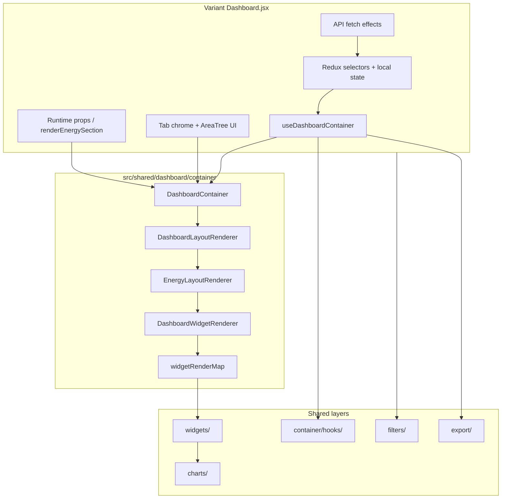

# Phase 6.2D — Dashboard Consolidation Audit

**Date:** 2026-06-10  
**Status:** Audit complete — **no code modifications**  
**Baseline:** Phases 6.2A (charts) → 6.2B (widgets) → 6.2C (container) → 6.2C.10A (customized wiring)  
**Scope:** Read-only validation of `src/shared/dashboard/` and variant `Dashboard.jsx` files

---

## 1. Executive Summary

| Question | Answer |
|----------|--------|
| Is the planned decomposition complete? | **Yes** — all three variants use `useDashboardContainer` → `DashboardContainer` → shared render stack |
| Shared dashboard package | **221 files**, **~27,540 LOC** (~19,725 production + ~7,815 test) |
| Variant `Dashboard.jsx` LOC (now) | **12,218** total (basic 3,727 · advanced 3,281 · customized 5,210) |
| Variant `Dashboard.jsx` LOC (Phase 5.4) | **24,250** total (basic 7,926 · advanced 7,077 · customized 9,247) |
| `Dashboard.jsx` reduction | **−12,032 LOC (−49.6%)** |
| Circular import issues | **1 benign cycle** (widget ↔ memo-compare resolver co-location); no container/widget render cycles |
| Dead code found | **3 SAFE REMOVE** candidates (orphan barrels + stale import); **0 blocking issues** |
| **Final recommendation** | **Dashboard decomposition COMPLETE** for Phases 6.2A–6.2C scope. Further work is **optional consolidation**, not required to close decomposition. |

---

## 2. Architecture Diagram

### 2.1 Target render stack (achieved)



### 2.2 Ownership boundaries

| Layer | Shared | Variant-owned (intentional) |
|-------|--------|------------------------------|
| Hook orchestration | `useDashboardContainer`, visibility/widgets/dates/exports | Area-tree UI JSX, `fetchDataForActiveTab` effects |
| Tab routing | `DashboardLayoutRenderer` + layout adapters | Tab pills / ribbon / topbar bridge |
| Energy placement | `EnergyLayoutRenderer` + layout adapters | Basic DnD (`LongPressDraggable`); customized `renderEnergySection` + `@dnd-kit` |
| Widget bodies | `DashboardWidgetRenderer` → shared widgets/charts | Basic `ConsumptionSavingsCombinedChart`; customized builtin overrides |
| Custom graphs | Transforms/helpers only | `EnergyCustomGraphCard`, `fetchCustomGraphData` (~1,280 LOC customized) |
| Space tab | Shared space chart views (partial) | `SpaceUtilization.jsx` monoliths (12,248 LOC total) |
| Overview / Alerts | Shared overview tiles + alerts widget | `DashboardOverview.jsx`, `Alerts.jsx` per variant |

---

## 3. Shared Dashboard Inventory

**Path:** `src/shared/dashboard/`  
**Files:** 221 · **LOC:** ~27,540 (~71.6% production · ~28.4% test)

### 3.1 Module map

| Module | Files | Prod LOC | Test LOC | Total LOC | Role |
|--------|------:|---------:|---------:|----------:|------|
| **charts** | 81 | ~7,200 | ~2,284 | ~9,484 | Transforms, views, adapters, shells, space/energy/savings chart stack |
| **container** | 55 | ~5,100 | ~1,746 | ~6,846 | `DashboardContainer`, layout renderers, hooks, adapters, helpers |
| **widgets** | 47 | ~3,500 | ~1,221 | ~4,721 | Energy, peak/min, overview tiles, alerts, light power density |
| **filters** | 15 | ~1,700 | ~522 | ~2,222 | Area-tree traversal, selection, bulk actions, resolvers |
| **utils** | 10 | ~900 | ~183 | ~1,083 | API params, date state, pie normalizers, visibility core |
| **export** | 8 | ~280 | ~119 | ~399 | Chart API params, energy export action map |
| **registry** | 2 | ~180 | ~47 | ~227 | Built-in widget metadata catalog (19 keys) |
| **hooks** (top-level) | 3 | ~90 | ~29 | ~119 | `useDashboardApiParams`, `useAreaTreeSelection`, date helpers |

### 3.2 Submodule highlights

**charts/** (largest area)

| Subdir | Files | ~LOC | Notes |
|--------|------:|-----:|-------|
| `space/` | 27 | 3,773 | Line, stacked bar, instant occupancy — extracted in 6.2A.3D–3F |
| `transforms/` | 17 | 2,070 | `transformDataForCharts`, axis formatters, peak/min (6.2A.1) |
| `views/` | 9 | 1,019 | `EnergyLineChart*`, `ConsumptionPieChart*` adapters/views |
| `savings/` | 8 | 727 | Savings strategy donut stack |
| `shells/` | 4 | 663 | `EnergyChartCardShell`, `PieChartCardShell` |
| `consumption/` | 1 | 13 | **Orphan re-export barrel only** (see §4) |
| `energy/` | 1 | 7 | **Orphan re-export barrel only** (see §4) |

**container/**

| Subdir | Files | ~LOC | Notes |
|--------|------:|-----:|-------|
| `hooks/` | 12 | 2,357 | `useDashboardWidgets`, `useDashboardExports`, visibility, export resolvers |
| `helpers/` | 7 | 915 | Date navigation, period text, export menu utils, memo stabilizers |
| `layout/` | 17 | 1,059 | `DashboardLayoutRenderer`, `EnergyLayoutRenderer`, layout adapters |
| `adapters/` | 3 | 511 | basic / advanced / customized container adapters |
| `tests/` | 1 | 107 | `dashboardContainerParity.test.jsx` |

**widgets/**

| Subdir | Files | ~LOC | Notes |
|--------|------:|-----:|-------|
| (root) | 17 | 1,797 | LPD, savings by strategy, total consumption by group |
| `overview/` | 9 | 1,074 | Metric tiles (6.2B.2) |
| `energy/` | 7 | 718 | Unified energy widget (6.2B.5) |
| `peakmin/` | 7 | 590 | Peak/min consumption (6.2B.6) |
| `alerts/` | 7 | 542 | Alerts widget shell (6.2B.7) |

### 3.3 Public entry points

| Symbol | Path |
|--------|------|
| `DashboardContainer` | `container/DashboardContainer.jsx` |
| `useDashboardContainer` | `container/useDashboardContainer.js` |
| `DashboardLayoutRenderer` | `container/layout/DashboardLayoutRenderer.jsx` |
| `EnergyLayoutRenderer` | `container/layout/EnergyLayoutRenderer.jsx` |
| `DashboardWidgetRenderer` | `container/DashboardWidgetRenderer.jsx` |
| Barrel API | `container/index.js` (primary import surface for variants) |

**16 nested `index.js` barrels** — no root `shared/dashboard/index.js`.

---

## 4. Dead Code Audit

Classification: **SAFE REMOVE** · **KEEP** · **UNKNOWN**  
*(Audit only — nothing deleted.)*

### 4.1 SAFE REMOVE

| Item | Location | Evidence | Risk |
|------|----------|----------|------|
| Orphan consumption barrel | `charts/consumption/index.js` | Zero imports from `charts/consumption` in codebase; re-exports `./ConsumptionPieChartView` paths that **do not exist** in that directory (implementations live in `charts/views/`) | Low — barrel is broken if imported |
| Orphan energy barrel | `charts/energy/index.js` | Zero imports; consumers import `charts/views/EnergyLineChartAdapter` directly | Low |
| Stale import | `container/useDashboardContainer.js` L7 | Imports `useDashboardAreaTreeOrchestration` but **never uses it**; hook is used only from `basic/Dashboard.jsx` | Low — lint noise only |

### 4.2 KEEP (active / intentional)

| Item | Location | Evidence |
|------|----------|----------|
| Container adapters (×3) | `container/adapters/` | Wired by all variant `Dashboard.jsx` files |
| Layout adapters (×6) | `container/layout/adapters/` | Used by `EnergyLayoutRenderer`, `DashboardLayoutRenderer`, container adapters |
| Memo comparators | `*MemoCompare.js` (8 files) | Used by corresponding `memo()` wrappers on renderers/widgets/charts |
| `widgetRenderMap.js` | `container/` | `DashboardWidgetRenderer` routing table — runtime critical |
| `widgetRegistry.js` | `registry/` | Metadata catalog from Phase 6.1; documents 19 built-in widget keys |
| `legacyLightPowerDensityWidgetPropsAreEqual` | `widgets/lightPowerDensityMemoCompare.js` | Exported + covered by parity tests; legacy path guard |
| Transform modules | `charts/transforms/` | Used by all three variants via thin `createStandardTransformDataForCharts` / `buildCustomizedTransformChartOptions` wrappers |
| Top-level `hooks/` | `hooks/` | `useDashboardApiParams`, `useAreaTreeSelection` imported by variants |

### 4.3 UNKNOWN (review before removal)

| Item | Location | Notes |
|------|----------|-------|
| `registry/widgetRegistry.js` | `registry/` | **No production importers** — only `widgetRegistry.test.js`. Duplicates `WIDGET_SECTIONS` concept from `widgetRenderMap.js`. Valuable as documentation; candidate to merge with `widgetRenderMap` in a future cleanup pass. |
| Duplicate `WIDGET_SECTIONS` | `registry/widgetRegistry.js` vs `container/widgetRenderMap.js` | Same constant name, separate definitions — drift risk |
| `charts/consumptionPieChartParity.test.js` | `charts/` (root) | Imports from `charts/views/` directly, not orphan barrel — test is valid |
| Widget ↔ memo-compare cycle | `LightPowerDensityWidget.jsx` ↔ `lightPowerDensityMemoCompare.js` | Memo compare imports **resolver functions** from widget module — benign co-location pattern, not a render cycle |

### 4.4 Duplicate remnants (not dead, but consolidation targets)

| Duplication | Variants | ~LOC ×3 | Status |
|-------------|----------|--------:|--------|
| `fetchDataForActiveTab` pipeline | all | ~180 each | Still in each `Dashboard.jsx` |
| Area-tree dropdown JSX | all | ~250–380 each | Partially shared via `filters/`; UI not extracted |
| `renderTreeNode` + checkbox handlers | all | ~200 each | Shared resolvers exist; JSX duplicated |
| `applyAreaTreeClearAll` / `Set` | adv + cust inline; basic uses hook | ~70 each | `useDashboardAreaTreeOrchestration` only wired in basic |
| `ChartLoader` inline component | all | ~25 each | Trivial duplicate |
| Operator no-floors message | all | ~30 each | Identical JSX |
| Redux import preamble | all | ~150–200 each | Near-identical import blocks |
| `LineChartComponent` inline | `SpaceUtilization.jsx` | ~1,300 each | **Not migrated** — largest remaining chart duplication |
| `transformDataForCharts` thin wrappers | all | ~15 each | Acceptable — delegates to shared transforms |

---

## 5. Variant `Dashboard.jsx` Audit

### 5.1 LOC summary

| Variant | Total LOC | Δ vs Phase 5.4 | Container wired |
|---------|----------:|---------------:|:---------------:|
| basic | 3,727 | −4,199 (−53%) | ✓ |
| advanced | 3,281 | −3,796 (−54%) | ✓ |
| customized | 5,210 | −4,037 (−44%) | ✓ |
| **Total** | **12,218** | **−12,032 (−49.6%)** | **3 / 3** |

### 5.2 Remaining LOC by category (estimated)

| Category | basic | advanced | customized |
|----------|------:|---------:|-----------:|
| Hooks / orchestration | ~920 | ~880 | ~950 |
| AreaTree UI | ~620 | ~620 | ~580 |
| Tab chrome | ~380 | ~520 | ~720 |
| API effects | ~580 | ~560 | ~600 |
| DnD | ~140 | 0 | ~290 |
| Custom graphs | 0 | 0 | ~1,280 |
| Variant-specific other | ~1,087 | ~701 | ~790 |

### 5.3 Variant-specific retained bulk

| Variant | Unique retained concerns |
|---------|-------------------------|
| **basic** | `ConsumptionSavingsCombinedChart`, `LongPressDraggable` energy reorder, `useDashboardAreaTreeOrchestration`, ribbon sub-header / topbar bridge, chart-order persistence |
| **advanced** | Inline pill tabs, MUI duration controls in header, `SHOW_OVERVIEW_TAB` gating |
| **customized** | `renderEnergySection` + `@dnd-kit`, `fetchCustomGraphData` (~953 LOC), `EnergyCustomGraphCard`, builtin widget overrides, `SortableDashboardItem` component |

### 5.4 Cross-variant duplication (remaining)

**High-confidence near-duplicates (~2,400–2,700 LOC gross across 3 files):**

1. `fetchDataForActiveTab` + `apiParams` debounce + login reload effects  
2. Floor/area loading (`getAvailableFloors`, `loadAllAreas`, `getLeafByFloorID`)  
3. `renderTreeNode` + selection checkbox handlers  
4. Area dropdown panel JSX  
5. `handleDurationChange` / `handleTabChange`  
6. Alerts type multi-select filter  

**Already deduplicated (not counted as remaining duplication):**

- `useDashboardContainer` (visibility, widgets, dates, exports)  
- `DashboardContainer` section assembly  
- Shared chart transforms, widget renderers, export action maps  
- Area-tree **resolvers** in `filters/` (traversal, bulk actions, selection)  

---

## 6. Dependency Audit

### 6.1 Cross-layer import graph (production files only)

```
container  →  widgets     (10 edges)
container  →  utils       (5 edges)
container  →  export      (3 edges)
container  →  filters     (1 edge)
container  →  hooks       (1 edge)
widgets    →  charts      (10 edges)
widgets    →  export      (2 edges)
charts     →  utils       (10 edges)
hooks      →  utils       (2 edges)
```

**Direction is acyclic top-down:** `container → widgets → charts → utils`  
No `charts → widgets` or `widgets → container` production imports detected.

### 6.2 Cycle analysis

| Cycle | Severity | Assessment |
|-------|----------|------------|
| `LightPowerDensityWidget` → `lightPowerDensityMemoCompare` → `LightPowerDensityWidget` | Low | Resolver functions exported from widget module for co-location; **not a render/import cycle** at runtime |
| Container ↔ widget ↔ chart | None | Clean layering |

### 6.3 Verification checklist

| Check | Result |
|-------|--------|
| No circular imports breaking build | ✓ `npm run build` passes |
| No container → variant imports | ✓ Shared layer is variant-agnostic |
| No chart → widget upward imports | ✓ |
| Variants import shared via `container/index.js` + `filters/` + top-level `hooks/` | ✓ |

---

## 7. Architecture Validation

### 7.1 Renderer ownership

| Component | Owns | Does not own |
|-----------|------|--------------|
| **DashboardContainer** | `adapter.buildSections()`, memoized sections prop, delegates to layout adapter | Tab chrome, Redux, API fetching |
| **DashboardLayoutRenderer** | Active-tab → section key routing via layout adapter | Section content construction |
| **EnergyLayoutRenderer** | Grid/slot placement, sortable wrap hooks via layout adapter | Widget data, DnD sensors (passed via adapter runtime) |
| **DashboardWidgetRenderer** | `widgetKey` → component lookup, prop resolution | Chart implementations (delegates to widgets/) |

### 7.2 Adapter matrix (final state)

| Adapter | Visibility | Widgets | Dates | Exports | `buildSections` | Variant runtime |
|---------|:----------:|:-------:|:-----:|:-------:|:---------------:|-----------------|
| `basicDashboardContainerAdapter` | ✓ | ✓ | ✓ | ✓ | Full + `EnergyLayoutRenderer` | `energyLayoutRuntime`, export controls, combined chart |
| `advancedDashboardContainerAdapter` | ✓ | ✓ | ✓ | ✓ | Full + `EnergyLayoutRenderer` | `widgetContextOverrides`, metric shells |
| `customizedDashboardContainerAdapter` | ✓ | ✓ | ✓ | ✓ | overview/charts/alerts + delegate | **`renderEnergySection(orchestration)`** |

### 7.3 Container wiring confirmation

| Variant | `useDashboardContainer` | `DashboardContainer` | Adapter |
|---------|-------------------------|----------------------|---------|
| basic | line ~630 | line ~3591 | `basicDashboardContainerAdapter` |
| advanced | line ~656 | line ~3140 | `advancedDashboardContainerAdapter` |
| customized | line ~2173 | line ~5105 | `customizedDashboardContainerAdapter` |

---

## 8. Future Extraction Candidates

Ranked by **value vs effort**. None are required to close Phase 6.2.

### 8.1 HIGH VALUE

| Candidate | ~LOC impact | Effort | Reward | Notes |
|-----------|------------:|--------|--------|-------|
| **`fetchDataForActiveTab` shared hook** | −180 × 3 | Medium | High | Same dispatch batching, loading guards, dedup refs in all variants |
| **Area-tree dropdown component** | −250–380 × 3 | High | High | Resolvers already in `filters/`; JSX is the remaining bulk |
| **`SpaceUtilization.jsx` line chart extraction** | −1,300 × 3 | High | High | Inline `LineChartComponent` still triplicated; shared space views exist but not wired |
| **Unify area-tree orchestration** | −70 × 2 | Low | Medium | Wire advanced/customized to `useDashboardAreaTreeOrchestration` (basic already uses it) |

### 8.2 MEDIUM VALUE

| Candidate | ~LOC impact | Effort | Reward | Notes |
|-----------|------------:|--------|--------|-------|
| **Tab chrome / duration header** | −300–500 × 3 | Medium | Medium | Styling diverges (ribbon vs pills) — needs adapter props |
| **`EnergyCustomGraphCard` + fetch pipeline** | −1,280 customized | High | Medium | Customized-only; high coupling to scope merge utils |
| **`DashboardOverview.jsx` consolidation** | −800 basic vs adv/cust | Medium | Medium | Basic is 3× larger (1,221 vs ~378 LOC) — visibility/shades tiles |
| **Merge `widgetRegistry` → `widgetRenderMap`** | −227 registry | Low | Low–Med | Eliminates duplicate `WIDGET_SECTIONS` metadata |

### 8.3 LOW VALUE

| Candidate | ~LOC impact | Effort | Reward | Notes |
|-----------|------------:|--------|--------|-------|
| **`ChartLoader` inline component** | −25 × 3 | Trivial | Low | |
| **Operator no-floors message** | −30 × 3 | Trivial | Low | |
| **Orphan chart barrels cleanup** | −20 | Trivial | Low | §4.1 SAFE REMOVE items |
| **`Widgets.jsx` (customized settings)** | 1,708 | High | Low | Settings surface, not dashboard render path |
| **Stale import cleanup** | 1 line | Trivial | Low | `useDashboardContainer.js` |

---

## 9. Final Metrics

### 9.1 Before decomposition (Phase 5.4 baseline)

| Surface | basic | advanced | customized | Total |
|---------|------:|---------:|-----------:|------:|
| `Dashboard.jsx` | 7,926 | 7,077 | 9,247 | **24,250** |
| `SpaceUtilization.jsx` | 6,759 | 5,548 | 9,474 | **21,781** |
| `DashboardOverview.jsx` | 1,221 | 376 | 378 | 1,975 |
| Customized-only (`Widgets.jsx`, `EnergyCustomGraphCard.jsx`) | — | — | 3,637 | 3,637 |
| **Audited dashboard surface** | **16,906** | **13,001** | **22,736** | **~52,643** |

**Pre-6.2 duplication highlights:**

- ~15,000 LOC triplicated chart infrastructure (`EnergyLineChart`, `LineChartComponent`, transforms)  
- ~700 LOC byte-for-byte duplicate export/date helpers (since extracted in 6.2C.2–6.2C.4)  
- No `src/shared/dashboard/` tree  

### 9.2 After decomposition (Phase 6.2D)

| Surface | basic | advanced | customized | Total |
|---------|------:|---------:|-----------:|------:|
| `Dashboard.jsx` | 3,727 | 3,281 | 5,210 | **12,218** |
| `SpaceUtilization.jsx` | 3,436 | 2,469 | 6,343 | **12,248** |
| `src/shared/dashboard/` (prod) | — | — | — | **~19,725** |
| `src/shared/dashboard/` (tests) | — | — | — | **~7,815** |

### 9.3 Reduction summary

| Metric | Before | After | Change |
|--------|-------:|------:|-------:|
| `Dashboard.jsx` (3 variants) | 24,250 | 12,218 | **−49.6%** |
| `SpaceUtilization.jsx` (3 variants) | 21,781 | 12,248 | **−43.8%** |
| Shared dashboard package | 0 | ~19,725 prod | +19,725 (new layer) |
| Chart transform duplication | ~2,070 × 3 gross | 2,070 shared once | **~−4,140 gross** |
| Energy widgets in monolith | Inline per variant | `DashboardWidgetRenderer` + shared widgets | Extracted |
| Container hook duplication | ~400 LOC × 3 | `useDashboardContainer` once | Extracted |

**Net codebase:** Variant monoliths shrank substantially; shared layer added ~19,725 production LOC (including layout, hooks, tests' subject code). The shared layer replaces ~12,000+ LOC of removed variant duplication and provides single-source chart/widget implementations going forward.

### 9.4 Test coverage

```
npm run build                          → PASS
npm test -- --testPathPattern=shared/dashboard
  → 52 suites, 546 tests PASS
```

---

## 10. Dead Code Inventory (summary table)

| ID | Item | Class | Action (future) |
|----|------|-------|-----------------|
| D1 | `charts/consumption/index.js` | SAFE REMOVE | Delete barrel or fix paths to `charts/views/` |
| D2 | `charts/energy/index.js` | SAFE REMOVE | Delete unused barrel |
| D3 | Stale import in `useDashboardContainer.js` | SAFE REMOVE | Remove unused import |
| D4 | `registry/widgetRegistry.js` | UNKNOWN | Keep as docs or merge into `widgetRenderMap` |
| D5 | Duplicate `WIDGET_SECTIONS` | UNKNOWN | Consolidate metadata |
| D6 | `LineChartComponent` in `SpaceUtilization.jsx` | KEEP (duplicate) | Future extraction — §8.1 |
| D7 | `fetchDataForActiveTab` × 3 | KEEP (duplicate) | Future extraction — §8.1 |

---

## 11. Future Roadmap (post-6.2)

| Phase | Focus | Priority | Blocking? |
|-------|-------|----------|-----------|
| 6.3A | Shared `useDashboardTabFetch` hook | High | No |
| 6.3B | Area-tree dropdown component | High | No |
| 6.3C | `SpaceUtilization` line chart wiring to shared views | High | No |
| 6.3D | Advanced/customized → `useDashboardAreaTreeOrchestration` | Medium | No |
| 6.3E | Custom graph module extraction (customized) | Medium | No |
| 6.4 | Dead code cleanup (§4.1 items) | Low | No |

---

## 12. Final Dashboard Status

### Decomposition checklist (Phases 6.2A–6.2C.10A)

| Phase | Deliverable | Status |
|-------|-------------|--------|
| 6.2A | Chart transforms + shared chart views | ✓ Complete |
| 6.2B | Widget extraction (energy, overview, alerts, peak/min, LPD) | ✓ Complete |
| 6.2C.1–6.2C.7 | Container hooks (dates, exports, widgets, visibility, area-tree) | ✓ Complete |
| 6.2C.8 | `DashboardWidgetRenderer` | ✓ Complete |
| 6.2C.9B | `EnergyLayoutRenderer` | ✓ Complete |
| 6.2C.9C | `DashboardLayoutRenderer` | ✓ Complete |
| 6.2C.10 | `DashboardContainer` + basic/advanced wiring | ✓ Complete |
| 6.2C.10A | Customized `DashboardContainer` wiring | ✓ Complete |

### Recommendation

> ## **Dashboard decomposition COMPLETE**
>
> The planned architecture is fully wired:
>
> `Dashboard.jsx` → `useDashboardContainer` → `DashboardContainer` → `DashboardLayoutRenderer` → `EnergyLayoutRenderer` → `DashboardWidgetRenderer` → shared widgets/charts
>
> All three variants (basic, advanced, customized) use the same container architecture.
>
> **Remaining duplication** is concentrated in variant-owned chrome (AreaTree UI, tab headers, API orchestration) and customized-only custom-graph infrastructure — explicitly outside the 6.2C stop boundary.
>
> **Optional follow-on work** (§8, §11) would further shrink monoliths but is not required to declare decomposition complete.

---

## 13. Rollback / Reference

- Phase 5.4 baseline: `docs/PHASE_5_4_DASHBOARD_DECOMPOSITION_AUDIT.md`  
- Container wiring: `docs/PHASE_6_2C_10_DASHBOARD_CONTAINER_REPORT.md`, `docs/PHASE_6_2C_10A_CUSTOMIZED_CONTAINER_WIRING_REPORT.md`  
- Widget matrix: `docs/PHASE_6_2_WIDGET_EXTRACTION_MATRIX.md`  
- Chart foundation: `docs/PHASE_6_2A_SHARED_DASHBOARD_FOUNDATION.md`
