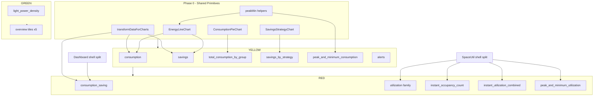

# Phase 6.2 — Widget Extraction Matrix

**Date:** 2026-06-10  
**Source:** `src/shared/dashboard/registry/widgetRegistry.js`  
**Scope:** All 19 built-in widgets across basic / advanced / customized  
**No code modified.**

---

## Classification Key

| Class | Meaning |
|-------|---------|
| **GREEN** | Extract immediately — prop-driven or metric-only; no shared chart layer dependency |
| **YELLOW** | Extract after shared transforms / chart primitives land in `src/shared/dashboard/` |
| **RED** | Extract only after container decomposition (`Dashboard.jsx` / `SpaceUtilization.jsx` slot shells) |

---

## Host File Scale (context)

| File | LOC |
|------|----:|
| `basic/.../Dashboard.jsx` | 7,624 |
| `advanced/.../Dashboard.jsx` | 6,776 |
| `customized/.../Dashboard.jsx` | 8,884 |
| `basic/.../SpaceUtilization.jsx` | 6,714 |
| `advanced/.../SpaceUtilization.jsx` | 5,503 |
| `customized/.../SpaceUtilization.jsx` | 9,429 |
| `basic/.../DashboardOverview.jsx` | 1,173 |
| `advanced/.../DashboardOverview.jsx` | 359 |
| `customized/.../DashboardOverview.jsx` | 361 |

**Shared blocks inside `Dashboard.jsx` (triplicated, block YELLOW widgets):**

| Block | ~LOC (basic) | Used by widgets |
|-------|-------------:|-----------------|
| `transformDataForCharts` | 145 | `consumption`, `savings`, `consumption_saving`, peak-min fallback |
| `calculatePeakMinFromChartData` + `formatPeakMinDisplay` | 145 | `peak_and_minimum_consumption`, embedded in `EnergyLineChart` |
| `EnergyLineChart` | 1,460 | `consumption`, `savings` |
| `ConsumptionPieChart` | 479 | `total_consumption_by_group` |
| `SavingsStrategyChart` (inline) | 530 | `savings_by_strategy` |
| Export handler cluster | ~300 | Energy + pie widgets |

**Shared blocks inside `SpaceUtilization.jsx` (block RED widgets):**

| Block | ~LOC (basic) | Used by widgets |
|-------|-------------:|-----------------|
| `LineChartComponent` | 1,868 | `utilization`, partially `utilization_by_area` / `utilization_by_area_group` |
| `InstantOccupancyChartComponent` | 1,466 | `instant_occupancy_count`, `instant_utilization_combined` |
| `renderSpacePeakMinOccupancyCards` | 150 | `peak_and_minimum_utilization` |
| `handleEmailDialogOpen` + export router | ~200 | All space chart widgets |

---

## Variant Notes

| Variant | Overview tab | Energy host | Space host | Visibility |
|---------|-------------|-------------|------------|------------|
| **basic** | Shown | Draggable energy slots in `Dashboard.jsx` | Charts tab in `SpaceUtilization.jsx` | `useDashboardWidgetVisibility` / `isWidgetVisible` |
| **advanced** | Hidden (`SHOW_OVERVIEW_TAB=false`) — code still present | Fixed energy grid in `Dashboard.jsx` | Charts tab in `SpaceUtilization.jsx` | All widgets shown |
| **customized** | Shown | Draggable grid + `EnergyCustomGraphCard` overrides | Dedicated Space Utilization tab | `shouldShowEnergyWidget` / `shouldShowWidget` |

**Basic-only widget keys:** `consumption_saving`, `instant_utilization_combined` (registry variants list all three, but render/slot wiring exists only in basic).

---

## Widget Matrix (19)

### Overview section (6)

#### 1. `energy` — GREEN

| Field | Detail |
|-------|--------|
| **Component location** | `DashboardOverview.jsx` — Energy savings donut tile; parent `Dashboard.jsx` mounts overview + dispatches data fetch |
| **LOC** | ~70/tile; host file 359–1,173 (basic includes shades + custom overview widgets) |
| **Variants** | basic, advanced†, customized |
| **Selectors** | `selectDashboardOverview`, `selectDashboardOverviewLoading`, `selectDashboardOverviewError` (parent) |
| **Thunks** | `getDashboardOverview` (`homeSlice`) |
| **Export / download** | None |
| **Email** | None |
| **Chart transforms** | None — reads `data.energy.savings_percent` directly; `CarbonFootprintTeardrop` gauge |
| **Class** | **GREEN** — props-only tile, no Redux inside overview component |

†advanced: overview tab hidden; `DashboardOverview.jsx` still ships.

---

#### 2. `alerts` — YELLOW

| Field | Detail |
|-------|--------|
| **Component location** | Overview tile: `DashboardOverview.jsx` (~80 LOC); full tab: `Alerts.jsx` (695 / 653 / 667 LOC per variant) |
| **LOC** | Tile ~80; tab ~700 |
| **Variants** | basic, advanced, customized |
| **Selectors** | Tile: via parent overview props; Tab: `selectAlerts`, `selectAlertsLoading`, `selectAlertsError`, `selectAlertTypes`, `selectDownloadLoading`, `selectDownloadSuccess`, `selectEmailLoading`, `selectEmailSuccess` |
| **Thunks** | Tile: `getDashboardOverview`; Tab: `fetchActiveAlerts`, `fetchAlertTypes`, `fetchProfile`, `fetchEmailConfigs` |
| **Export / download** | Tab: `downloadAlerts` (CSV) |
| **Email** | Tab: `sendAlertsByEmail` |
| **Chart transforms** | None |
| **Class** | **YELLOW** — overview tile is GREEN in isolation, but widget key spans tile + self-contained tab page; extract tile with overview bundle, tab as separate pass |

---

#### 3. `schedules` — GREEN

| Field | Detail |
|-------|--------|
| **Component location** | `DashboardOverview.jsx` — Schedules card |
| **LOC** | ~45 |
| **Variants** | basic, advanced†, customized |
| **Selectors** | Via parent overview props |
| **Thunks** | `getDashboardOverview` |
| **Export / download** | None |
| **Email** | None |
| **Chart transforms** | None — displays `data.schedule.next` |
| **Class** | **GREEN** |

---

#### 4. `quick_controls` — GREEN

| Field | Detail |
|-------|--------|
| **Component location** | `DashboardOverview.jsx` — Quick Controls card |
| **LOC** | ~35 |
| **Variants** | basic, advanced†, customized |
| **Selectors** | None |
| **Thunks** | None |
| **Export / download** | None |
| **Email** | None |
| **Chart transforms** | None — navigation callback only |
| **Class** | **GREEN** |

---

#### 5. `floors` — GREEN

| Field | Detail |
|-------|--------|
| **Component location** | `DashboardOverview.jsx` — Floors count card |
| **LOC** | ~30 |
| **Variants** | basic, advanced†, customized |
| **Selectors** | Via parent overview props |
| **Thunks** | `getDashboardOverview` |
| **Export / download** | None |
| **Email** | None |
| **Chart transforms** | None — `data.floors.count` |
| **Class** | **GREEN** |

---

#### 6. `space_utilization` — GREEN

| Field | Detail |
|-------|--------|
| **Component location** | `DashboardOverview.jsx` — Space utilization summary tile (not the space chart tab widgets) |
| **LOC** | ~40 |
| **Variants** | basic, advanced†, customized |
| **Selectors** | Via parent overview props |
| **Thunks** | `getDashboardOverview` |
| **Export / download** | None (tile); see `utilization*` keys for chart export |
| **Email** | None |
| **Chart transforms** | None — `data.space_utilization` occupancy % |
| **Class** | **GREEN** — distinct from space chart widgets (`utilization`, etc.) |

---

### Energy section (7)

#### 7. `consumption` — YELLOW

| Field | Detail |
|-------|--------|
| **Component location** | `Dashboard.jsx` — `renderEnergyDraggableSlot` case + `IsolatedLineChart` → `EnergyLineChart` |
| **LOC** | ~15 slot wiring + 1,460 shared `EnergyLineChart` |
| **Variants** | basic (visibility + draggable), advanced (fixed grid), customized (`shouldShowEnergyWidget` + custom graph override via `EnergyCustomGraphCard`) |
| **Selectors** | `selectUnifiedEnergyConsumption`, `selectUnifiedEnergyConsumptionLoading` |
| **Thunks** | `fetchUnifiedEnergyConsumptionSavingsData` (`unifiedEnergySlice`) |
| **Export / download** | `downloadEnergyConsumption` — UI wired |
| **Email** | `sendEnergyConsumptionEmail` — UI wired |
| **Chart transforms** | `transformDataForCharts(data, 'consumption')`; `calculatePeakMinFromChartData` embedded in chart |
| **Class** | **YELLOW** — requires shared `transformDataForCharts` + `EnergyLineChart` extraction first |

---

#### 8. `savings` — YELLOW

| Field | Detail |
|-------|--------|
| **Component location** | `Dashboard.jsx` — same slot/chart system as consumption |
| **LOC** | ~15 slot + shared `EnergyLineChart` |
| **Variants** | basic, advanced, customized |
| **Selectors** | `selectUnifiedEnergySavings`, `selectUnifiedEnergySavingsLoading` |
| **Thunks** | `fetchUnifiedEnergyConsumptionSavingsData` |
| **Export / download** | `downloadEnergySavings` — UI wired |
| **Email** | `sendEnergySavingsEmail` — UI wired |
| **Chart transforms** | `transformDataForCharts(data, 'other')` |
| **Class** | **YELLOW** |

---

#### 9. `consumption_saving` — RED

| Field | Detail |
|-------|--------|
| **Component location** | **basic only:** `ConsumptionSavingsCombinedChart.jsx` (744 LOC) + slot/mutex logic in `Dashboard.jsx` |
| **LOC** | 744 component + ~110 slot/merge logic |
| **Variants** | **basic only** (advanced/customized show separate consumption + savings) |
| **Selectors** | `selectUnifiedEnergyConsumption`, `selectUnifiedEnergySavings`, loading selectors |
| **Thunks** | `fetchUnifiedEnergyConsumptionSavingsData` |
| **Export / download** | `downloadEnergyConsumption` (combined handlers); component also has client CSV export |
| **Email** | `sendEnergyConsumptionEmail` |
| **Chart transforms** | `consumptionSavingMergedData` — merges two `transformDataForCharts` series; Recharts `ComposedChart` in dedicated file |
| **Class** | **RED** — partially extracted file still bound to basic slot mutex, visibility mutex with individual charts, and merge transform in `Dashboard.jsx` |

---

#### 10. `savings_by_strategy` — YELLOW

| Field | Detail |
|-------|--------|
| **Component location** | `Dashboard.jsx` — inline `SavingsStrategyChart` (~530 LOC) |
| **LOC** | ~530 inline + ~20 slot |
| **Variants** | basic, advanced, customized |
| **Selectors** | `selectSavingsByStrategy` |
| **Thunks** | `fetchSavingsByStrategy` |
| **Export / download** | `downloadSavingsByStrategy` exists in slice — **UI not wired** |
| **Email** | `sendSavingsByStrategyEmail` exists in slice — **UI not wired** |
| **Chart transforms** | Inline object-key → pie rows; no `transformDataForCharts` |
| **Class** | **YELLOW** — self-contained donut but embedded in monolith; extract after chart primitive layer |

---

#### 11. `total_consumption_by_group` — YELLOW

| Field | Detail |
|-------|--------|
| **Component location** | `Dashboard.jsx` — `ConsumptionPieChart` slot |
| **LOC** | ~479 shared pie + ~15 slot |
| **Variants** | basic, advanced, customized |
| **Selectors** | `selectTotalConsumptionByGroup`, `selectAreaGroups` |
| **Thunks** | `fetchTotalConsumptionByGroup` |
| **Export / download** | `downloadTotalConsumptionByGroup` — UI wired |
| **Email** | `sendTotalConsumptionByGroupEmail` — UI wired |
| **Chart transforms** | customized: `normalizeTotalConsumptionByGroupPayload` + `buildTotalConsumptionByGroupPieRows` (shared in 6.1A); basic/advanced: inline pie prep |
| **Class** | **YELLOW** — depends on shared `ConsumptionPieChart` + normalizers |

---

#### 12. `light_power_density` — GREEN

| Field | Detail |
|-------|--------|
| **Component location** | `Dashboard.jsx` — `renderLightingPowerDensity()` + slot wrapper |
| **LOC** | ~85 render + ~40 slot/ unit toggle |
| **Variants** | basic, advanced, customized |
| **Selectors** | `selectLightPowerDensity` |
| **Thunks** | `fetchLightPowerDensity` |
| **Export / download** | None |
| **Email** | None |
| **Chart transforms** | Unit toggle (`Watt / Sq ft` ↔ `Watt / Sq m`); no chart series transform |
| **Class** | **GREEN** — metric panel, minimal coupling |

---

#### 13. `peak_and_minimum_consumption` — YELLOW

| Field | Detail |
|-------|--------|
| **Component location** | `Dashboard.jsx` — metric panel slot (`case 'peak_and_minimum_consumption'`) |
| **LOC** | ~150 slot JSX + shared peak-min helpers (~145 LOC) |
| **Variants** | basic, advanced, customized |
| **Selectors** | `selectUnifiedPeakMinConsumption`, `selectUnifiedPeakMinConsumptionLoading`; fallback via `selectUnifiedEnergyConsumption` + chart transform |
| **Thunks** | `fetchUnifiedEnergyConsumptionSavingsData` (peak/min slice in unified response) |
| **Export / download** | `downloadPeakMinConsumption` — imported but **UI commented/disabled** |
| **Email** | `sendPeakMinConsumptionEmail` — imported but **UI commented/disabled** |
| **Chart transforms** | `calculatePeakMinFromChartData(energyConsumptionChartData)`; `formatPeakMinDisplay` |
| **Class** | **YELLOW** — metric-only surface but shares peak-min pipeline with `EnergyLineChart` |

---

### Space section (6)

#### 14. `utilization` — RED

| Field | Detail |
|-------|--------|
| **Component location** | `SpaceUtilization.jsx` — `LineChartComponent` + draggable/tab slots |
| **LOC** | ~400–600 widget blocks; shares 1,868 LOC `LineChartComponent` |
| **Variants** | basic, advanced, customized (customized: gated by `SHOW_SPACE_UTILIZATION_LINE_CHART`) |
| **Selectors** | `selectSpaceUtilizationPerArea`, `selectSpaceUtilizationPerAreaLoading` |
| **Thunks** | `fetchSpaceUtilizationPerArea`, `fetchSpaceUtilizationPerFromLogs` |
| **Export / download** | `downloadSpaceUtilizationPer`, `downloadSpaceUtilizationPerFromLogs` |
| **Email** | `sendSpaceUtilizationPerEmail`, `sendSpaceUtilizationPerFromLogsEmail` |
| **Chart transforms** | Inline x-axis / y-axis → Recharts inside `LineChartComponent` (not `transformDataForCharts`) |
| **Class** | **RED** — buried in 5.5k–9.4k LOC monolith + shared line chart component |

---

#### 15. `utilization_by_area_group` — RED

| Field | Detail |
|-------|--------|
| **Component location** | `SpaceUtilization.jsx` — occupancy-by-group chart blocks |
| **LOC** | ~300–450 per variant |
| **Variants** | basic, advanced, customized |
| **Selectors** | `selectOccupancyByGroup`, `selectOccupancyByGroupFromLogs` + loading |
| **Thunks** | `fetchOccupancyByGroup`, `fetchOccupancyByGroupFromLogs` |
| **Export / download** | `downloadOccupancyByGroup`, `downloadOccupancyByGroupFromLogs` |
| **Email** | `sendOccupancyByGroupEmail`, `sendOccupancyByGroupFromLogsEmail` |
| **Chart transforms** | Inline chart prep in `LineChartComponent` branches |
| **Class** | **RED** |

---

#### 16. `utilization_by_area` — RED

| Field | Detail |
|-------|--------|
| **Component location** | `SpaceUtilization.jsx` — occupancy count chart blocks |
| **LOC** | ~300–450 per variant |
| **Variants** | basic, advanced, customized |
| **Selectors** | `selectOccupancyCount`, `selectOccupancyCountLoading` |
| **Thunks** | `fetchOccupancyCount` |
| **Export / download** | `downloadOccupancyCount` |
| **Email** | `sendOccupancyCountEmail` |
| **Chart transforms** | Inline chart prep |
| **Class** | **RED** |

---

#### 17. `peak_and_minimum_utilization` — RED

| Field | Detail |
|-------|--------|
| **Component location** | `SpaceUtilization.jsx` — `renderSpacePeakMinOccupancyCards` |
| **LOC** | ~150 display + helpers |
| **Variants** | basic, advanced, customized |
| **Selectors** | None active (API disabled) |
| **Thunks** | `fetchPeakMinOccupancy` **commented out** in all variants |
| **Export / download** | `downloadPeakMinOccupancy` **commented out** |
| **Email** | `sendPeakMinOccupancyEmail` **commented out** |
| **Chart transforms** | Client-side `calculatePeakMinFromOccupancyChartPayload` from utilization chart data |
| **Class** | **RED** — dead API path + entangled with utilization chart payloads |

---

#### 18. `instant_occupancy_count` — RED

| Field | Detail |
|-------|--------|
| **Component location** | `SpaceUtilization.jsx` — `InstantOccupancyChartComponent` |
| **LOC** | ~350–500 widget blocks; shares 1,466 LOC component |
| **Variants** | basic, advanced, customized |
| **Selectors** | `selectInstantOccupancyCount`, `selectInstantOccupancyCountLoading` |
| **Thunks** | `fetchInstantOccupancyCount` |
| **Export / download** | `downloadOccupancyCount` (shared handler) |
| **Email** | `sendOccupancyCountEmail` |
| **Chart transforms** | Inline x-axis / y-axis mapping in `InstantOccupancyChartComponent` |
| **Class** | **RED** |

---

#### 19. `instant_utilization_combined` — RED

| Field | Detail |
|-------|--------|
| **Component location** | **basic only:** `SpaceInstantUtilizationCombinedChart.jsx` (132 LOC shell) + embedded sections in `SpaceUtilization.jsx` |
| **LOC** | 132 shell + ~400 embedded slot content |
| **Variants** | **basic only** |
| **Selectors** | `selectInstantOccupancyCount`, `selectOccupancyByGroupFromLogs`, `selectSpaceUtilizationPerFromLogs` + loading |
| **Thunks** | `fetchInstantOccupancyCount`, `fetchOccupancyByGroupFromLogs`, `fetchSpaceUtilizationPerFromLogs` |
| **Export / download** | Inherits instant / logs handlers |
| **Email** | Same |
| **Chart transforms** | Combines two inline chart transforms in one slot |
| **Class** | **RED** — shell file exists but content + mutex logic remain in monolith |

---

## Classification Summary

| Class | Count | Widgets |
|-------|------:|---------|
| **GREEN** | 6 | `energy`, `schedules`, `quick_controls`, `floors`, `space_utilization`, `light_power_density` |
| **YELLOW** | 6 | `alerts`, `consumption`, `savings`, `savings_by_strategy`, `total_consumption_by_group`, `peak_and_minimum_consumption` |
| **RED** | 7 | `consumption_saving`, `utilization`, `utilization_by_area_group`, `utilization_by_area`, `peak_and_minimum_utilization`, `instant_occupancy_count`, `instant_utilization_combined` |

---

## Export / Email Support Matrix

| Widget | Download UI | Email UI | Thunk-only (unwired) |
|--------|-------------|----------|----------------------|
| Overview tiles (6) | — | — | — |
| `alerts` tab | CSV | Yes | — |
| `consumption` | Yes | Yes | — |
| `savings` | Yes | Yes | — |
| `consumption_saving` | Yes | Yes | — |
| `savings_by_strategy` | — | — | Both thunks exist |
| `total_consumption_by_group` | Yes | Yes | — |
| `light_power_density` | — | — | — |
| `peak_and_minimum_consumption` | Disabled | Disabled | Thunks exist |
| Space charts (5) | Yes | Yes | — |
| `peak_and_minimum_utilization` | Disabled | Disabled | API disabled |

Customized only: `handleEnergyCustomGraphExport` routes custom graph API paths to the same energy download/email thunks.

---

## Recommended Extraction Order

### Phase 0 — Prerequisites (no widget JSX yet)

1. Extract **`transformDataForCharts`** → `shared/dashboard/charts/`
2. Extract **`calculatePeakMinFromChartData`** + **`formatPeakMinDisplay`** → `shared/dashboard/utils/`
3. Extract **`EnergyLineChart`**, **`ConsumptionPieChart`**, **`SavingsStrategyChart`** → `shared/dashboard/charts/`
4. Extract export/email handler factory → `shared/dashboard/export/`

### Phase 1 — GREEN widgets (immediate)

5. **`light_power_density`** — first energy widget out; validates slot adapter pattern  
6. **Overview tile bundle** — `energy`, `schedules`, `quick_controls`, `floors`, `space_utilization` from `DashboardOverview.jsx` as prop-driven components under `shared/dashboard/widgets/overview/`

### Phase 2 — YELLOW energy widgets

7. **`consumption`** + **`savings`** — pair extract; wire existing export/email  
8. **`total_consumption_by_group`** — pie widget + shared normalizers (already in 6.1A)  
9. **`savings_by_strategy`** — donut; wire dormant export thunks  
10. **`peak_and_minimum_consumption`** — metric panel; enable export UI  

### Phase 3 — YELLOW non-chart page

11. **`alerts`** — overview tile with Phase 1 bundle; then **`Alerts.jsx`** tab (~700 LOC, already isolated per variant)

### Phase 4 — Container decomposition (RED prerequisite)

12. Split **`Dashboard.jsx`** energy tab → shell + `WidgetSlotRenderer` using `widgetRegistry.js`  
13. Split **`SpaceUtilization.jsx`** → tab shell + per-widget slots (basic draggable / customized tab layouts)

### Phase 5 — RED space widgets (post shell)

14. **`instant_occupancy_count`** — first space chart (centralized export router helps)  
15. **`utilization_by_area`** → **`utilization_by_area_group`** → **`utilization`** (increasing complexity)  
16. **`instant_utilization_combined`** (basic) — promote shell + move embedded content  
17. **`consumption_saving`** (basic) — promote `ConsumptionSavingsCombinedChart.jsx` + merge transform  
18. **`peak_and_minimum_utilization`** — last; depends on stable chart pipeline; may need API re-enable decision

---

## Dependency Diagram

---

## Key Paths

| Purpose | Path |
|---------|------|
| Registry | `src/shared/dashboard/registry/widgetRegistry.js` |
| Energy host | `src/variants/{variant}/screens/dashboard/Dashboard.jsx` |
| Space host | `src/variants/{variant}/screens/dashboard/SpaceUtilization.jsx` |
| Overview | `src/variants/{variant}/screens/dashboard/DashboardOverview.jsx` |
| Alerts tab | `src/variants/{variant}/screens/dashboard/Alerts.jsx` |
| Combined charts (basic) | `ConsumptionSavingsCombinedChart.jsx`, `SpaceInstantUtilizationCombinedChart.jsx` |
| Redux | `src/variants/{variant}/redux/slice/dashboard/{dashboardSlice,unifiedEnergySlice}.js`, `homeSlice` (overview) |
| Custom energy override | `src/variants/customized/components/dashboard/EnergyCustomGraphCard.jsx` |
| Visibility (basic) | `src/variants/basic/utils/dashboardWidgetVisibility.js` → shared core |

---

## Risks by Class

| Class | Primary risk |
|-------|--------------|
| GREEN | Overview layout differs basic (1,173 LOC) vs adv/custom (~360 LOC) — extract tiles, not layout engine |
| YELLOW | `EnergyLineChart` is ~1,460 LOC × 3 variants — must diff basic/customized `forceIndividualAreas` params before sharing |
| RED | Slot mutex (`consumption_saving` ↔ consumption/savings; `instant_utilization_combined` ↔ space charts) must move with shell, not with individual widget |
