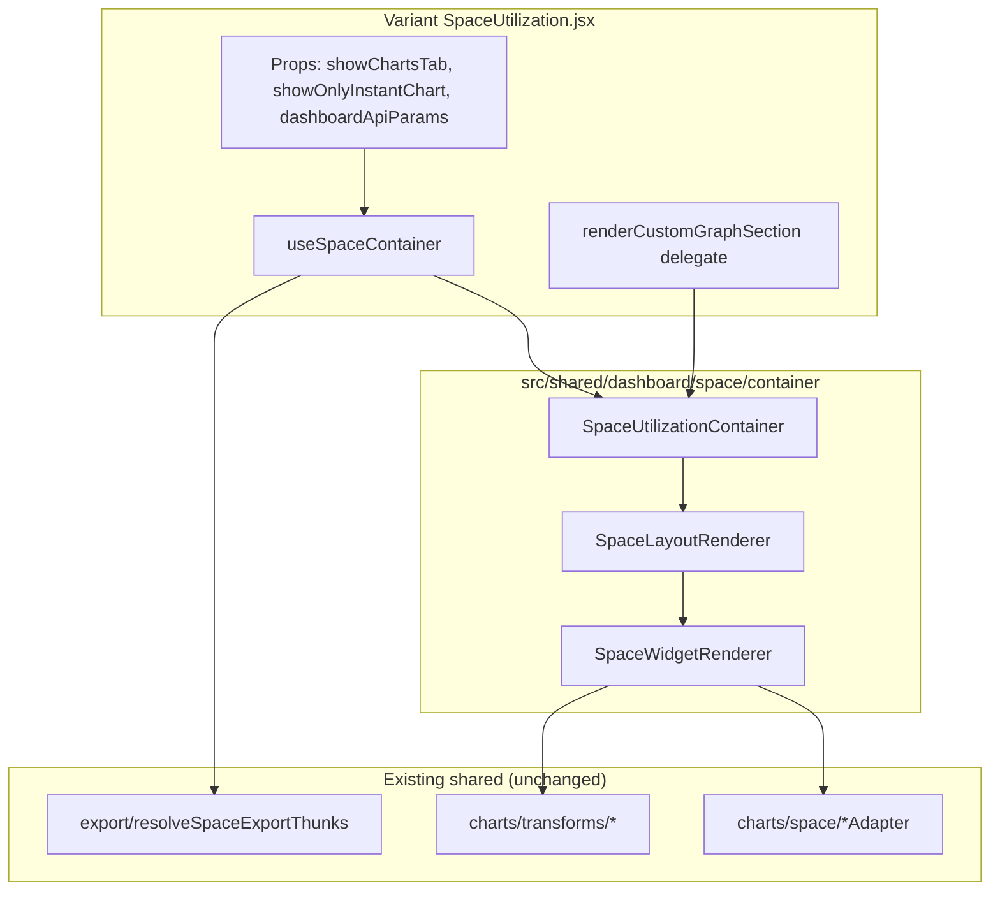
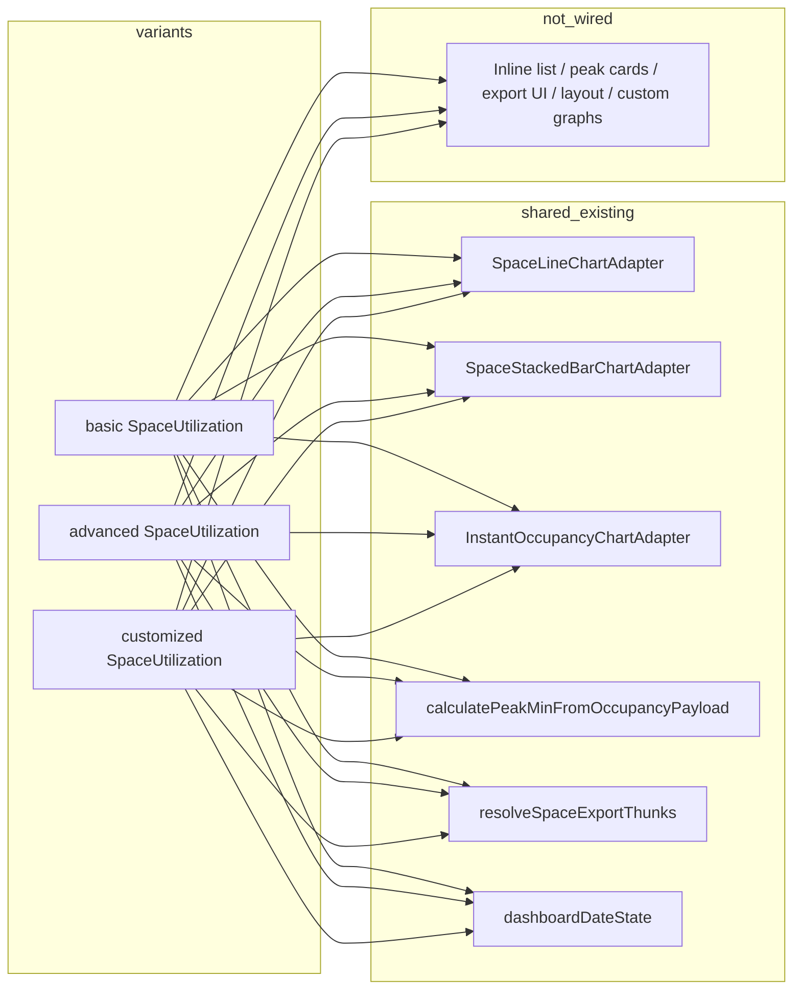

# Phase 6.3A — SpaceUtilization Consolidation Audit

**Date:** 2026-06-10  
**Status:** Audit complete — **no code modifications**  
**Baseline:** Phase 6.2D (dashboard decomposition complete); shared space chart adapters in `src/shared/dashboard/charts/space/`  
**Scope:** Read-only analysis of `SpaceUtilization.jsx` in basic, advanced, and customized variants

---

## 1. Executive Summary

| Question | Answer |
|----------|--------|
| Largest remaining duplicated surface? | **Yes** — ~12,248 LOC across three `SpaceUtilization.jsx` files |
| Shared chart adapters wired? | **Partial** — line, stacked bar, and instant occupancy use shared adapters; area list, peak/min cards, combined chart, exports UI remain inline |
| Customized outlier? | **6,343 LOC** (~50% customized-only: custom graphs, visibility, DnD, scope merge) |
| Gross triplicated builtin shell | **~4,500–5,500 LOC** (exports, area list, peak/min, dual-tab JSX, dead date helpers) |
| Extractable to shared layer | **~3,500–4,500 LOC** (hooks, widgets, layouts, export shell) |
| **Recommendation** | **Proceed with phased Space decomposition (6.3B+)** mirroring Dashboard 6.2 pattern; customized custom-graph pipeline is a **late-phase** boundary |

---

## 2. LOC Inventory

### 2.1 Totals

| Variant | LOC | Δ vs Phase 5.4 | Notes |
|---------|----:|---------------:|-------|
| basic | 3,436 | −3,323 (−49%) | DnD slot order, combined chart, widget visibility |
| advanced | 2,469 | −3,079 (−55%) | Static layout; smallest builtin shell |
| customized | 6,343 | −3,131 (−33%) | +~3,100 LOC customized-only layer |
| **Total** | **12,248** | **−9,533 (−44%)** | Still largest cross-variant monolith cluster |

### 2.2 Category breakdown (estimated LOC)

| Category | basic | advanced | customized | Notes |
|----------|------:|---------:|-----------:|-------|
| **Chart orchestration** | ~370 | ~380 | ~520 | Active data switching (`active*` selectors), adapter wrappers, loaders |
| **Exports / email** | ~430 | ~200 | ~490 | `handleExport`, `handleEmailDialogOpen`, inline `ExportDropdown`; customized adds `handleCustomGraphExport` |
| **Date logic** | ~410 active + ~230 dead | ~540 dead | ~496 mixed | Basic wires `DashboardDurationFilterBar`; advanced/customized retain unused `calculateDateParameters` / nav |
| **Area / floor filters** | ~40 | ~45 | ~80 | `selectedAreas` / `selectedFloorIds` in export params; customized scope merge |
| **Area tree logic** | ~30 | ~5 | ~50 | Mostly dead (`areaTree` unused); `getCurrentSelectionText` uncalled |
| **Widget rendering** | ~1,280 | ~1,180 | ~1,850 | Builtin slots + duplicated tab JSX; customized includes custom graph cards |
| **Tab routing** | ~45 | ~15 | ~60 | `showChartsTab` vs main tab; `showOnlyInstantChart` guard |
| **Layout / DnD** | ~270 | 0 | ~250 | Basic: `LongPressDraggable` + row builder; customized: `@dnd-kit` + `SortableDashboardItem` |
| **Custom / variant-only** | ~220 | ~100 | ~3,200 | Basic: `SpaceInstantUtilizationCombinedChart`; customized: fetch/render/export custom graphs |
| **Dead / legacy** | ~200 | ~150 | ~100 | Unused recharts imports (basic/advanced); commented peak-min API; undispatched fetch thunks |

### 2.3 Customized-only layer (~3,100–3,300 LOC)

| Block | ~LOC | Lines (approx.) |
|-------|-----:|-----------------|
| `renderCustomGraphCard` | 1,214 | 1223–2436 |
| `fetchCustomGraphData` | 677 | 2571–3247 |
| Module helpers (scope, palette, area-group filter) | 414 | 120–533 |
| `SortableDashboardItem` (inline) | 194 | 545–738 |
| Widget visibility + card order | 290 | 2438–2495, 3833–4063 |
| `handleCustomGraphExport` | 113 | 1109–1221 |
| `ColorPickerPortal` | 78 | 456–533 |
| Custom graph state / effects | 150 | 886–936, 3248–3320 |

---

## 3. Widget Matrix

Six canonical space widget keys (per `widgetRegistry.js`). **Variant presence differs.**

| Widget key | basic | advanced | customized | Purpose |
|------------|:-----:|:--------:|:----------:|---------|
| `utilization` | ✓ main tab | ✓ main tab | ✓ (gated off by default) | Occupancy line chart |
| `instant_occupancy_count` | ✓ charts tab | ✓ charts tab | ✓ charts tab | Instant occupancy line |
| `instant_utilization_combined` | ✓ charts tab | ✗ | ✗ | Combined instant + area list shell |
| `utilization_by_area_group` | ✓ both tabs | ✓ both tabs | ✓ both tabs | Stacked bar by group |
| `utilization_by_area` | ✓ both tabs | ✓ both tabs | ✓ both tabs | Scrollable % list (inline) |
| `peak_and_minimum_utilization` | ✓ both tabs | ✓ both tabs | ✓ both tabs | Derived peak/min metric cards |

**Customized additional keys:** `custom_graph:{id}`, virtual `builtin_{key}` when energy widget reassigned to space page.

### 3.1 Per-widget wiring

#### `utilization`

| Aspect | basic | advanced | customized |
|--------|-------|----------|------------|
| **Selectors** | `selectOccupancyCount`, `occupancyCountLoading` | Same | Same (+ override path) |
| **Fetch thunks** | `fetchOccupancyCount` — imported, **not dispatched** (parent `Dashboard.jsx` fetches) | Same | Same |
| **Export thunks** | `sendOccupancyCountEmail`, `downloadOccupancyCount` (`dropdownKey: "line"`) | Same | Same + builtin override export |
| **Transforms** | Inside `SpaceLineChartAdapter` → `spaceOccupancyToRecharts` | Same | Same; override uses custom graph pipeline |
| **Chart component** | **Shared** `SpaceLineChartAdapter` | **Shared** (`shellVariant="advanced"`) | **Shared** or `renderCustomGraphCard` if builtin override |
| **Variant diff** | `spaceShell`, `chartSurface`, utilization footer | Theme-aware line colors | `SHOW_SPACE_UTILIZATION_LINE_CHART = false`; builtin override virtual graph |

#### `instant_occupancy_count`

| Aspect | All variants |
|--------|--------------|
| **Selectors** | `selectInstantOccupancyCount`, `*Loading`, `*Error` (basic uses direct state access in places) |
| **Fetch thunks** | `fetchInstantOccupancyCount` — imported, not dispatched |
| **Export thunks** | Charts: `sendInstantOccupancyCountEmail`, `downloadInstantOccupancyCount` (`dropdownKey: "instant"`) |
| **Transforms** | `instantOccupancyToRecharts` (inside adapter) |
| **Chart component** | **Shared** `InstantOccupancyChartAdapter` |
| **Variant diff** | Basic may embed inside `instant_utilization_combined`; advanced/customized standalone only |

#### `instant_utilization_combined` (basic only)

| Aspect | Detail |
|--------|--------|
| **Selectors** | Composes instant + `activeSpaceUtilizationPerArea` |
| **Chart component** | **Variant-local** `SpaceInstantUtilizationCombinedChart.jsx` (132 LOC) hosting shared instant adapter + inline area list |
| **Export** | Instant tab → instant thunks; area tab → per-area thunks |
| **Transforms** | `processAreaData` for area tab |
| **Notes** | Replaces standalone `instant_occupancy_count` slot when visible in chart order |

#### `utilization_by_area_group`

| Aspect | All variants |
|--------|--------------|
| **Selectors** | `selectOccupancyByGroup` / `selectOccupancyByGroupFromLogs` via `activeOccupancyByGroup` |
| **Fetch thunks** | `fetchOccupancyByGroup` / `fetchOccupancyByGroupFromLogs` — not dispatched here |
| **Export thunks** | Charts: `*FromLogsEmail/Download`; Main: `sendOccupancyByGroupEmail`, `downloadOccupancyByGroup` (`dropdownKey: "pie"`) |
| **Transforms** | `occupancyByGroupToStackedBarRows` (inside `SpaceStackedBarChartAdapter`) |
| **Chart component** | **Shared** `SpaceStackedBarChartAdapter` |
| **Variant diff** | Title strings differ by tab; advanced passes theme-aware stacked colors |

#### `utilization_by_area`

| Aspect | All variants |
|--------|--------------|
| **Selectors** | `selectSpaceUtilizationPerArea` / `selectSpaceUtilizationPerFromLogs` |
| **Fetch thunks** | `fetchSpaceUtilizationPerArea` / `fetchSpaceUtilizationPerFromLogs` — not dispatched |
| **Export thunks** | Charts: `*FromLogs*`; Main: `sendSpaceUtilizationPerEmail`, `downloadSpaceUtilizationPer` (`dropdownKey: "table"`) |
| **Transforms** | **Local** `processAreaData()` (~30 LOC): caps %, sorts `utilized_area[]` |
| **Chart component** | **Inline** scrollable list — **not shared** (~80–130 LOC per render path) |
| **Variant diff** | Customized adds special area-group name filtering for builtin widget |

#### `peak_and_minimum_utilization`

| Aspect | All variants |
|--------|--------------|
| **Selectors** | Charts tab: `instantOccupancyCount`; Main: `occupancyCount` |
| **Fetch thunks** | `fetchPeakMinOccupancy` — **commented out / unused** in all variants |
| **Export thunks** | **None active** (main-tab export UI commented out) |
| **Transforms** | **Shared** `calculatePeakMinFromOccupancyPayload`, `formatPeakMinTimeLabel` |
| **Chart component** | **Inline** `renderSpacePeakMinOccupancyCards` (~70 LOC) — not Recharts |
| **Data source** | Client-side derivation from occupancy time-series |

### 3.2 Shared infrastructure already used (all variants)

| Module | Symbols |
|--------|---------|
| `charts/space/SpaceLineChartAdapter` | `utilization` |
| `charts/space/SpaceStackedBarChartAdapter` | `utilization_by_area_group` |
| `charts/space/InstantOccupancyChartAdapter` | `instant_occupancy_count` |
| `charts/transforms/calculatePeakMinFromOccupancyPayload` | peak/min derivation |
| `charts/transforms/formatPeakMinTimeLabel` | peak/min time label |
| `export/buildChartApiParams` | export API params |
| `export/resolveSpaceExportThunks` | thunk routing by tab + dropdown key |
| `utils/dashboardDateState` | `formatDateForState`, `parseDateFromState` |

**Not yet shared:** export dropdown UI, peak/min card shell, utilization-by-area list view, combined chart shell, slot layout / DnD, visibility hooks, custom graph pipeline.

---

## 4. Duplication Matrix

Classification: **GREEN** (safe extract) · **YELLOW** (extract with adapter) · **RED** (variant-owned / high coupling)

### 4.1 GREEN — pure helpers, exports, date logic

| Block | Est. duplicate LOC | Variants | Extraction target |
|-------|-----------------:|----------|-------------------|
| `processAreaData` | ~30 × 3 = **90** | all | `shared/dashboard/space/transforms/processUtilizationByAreaRows.js` |
| `resolveSpaceExportThunks` usage + `buildChartApiParams` | Already shared | all | Extend with `useSpaceExports` hook wrapping dispatch |
| `calculatePeakMinFromChartData` wrapper | ~15 × 3 = **45** | all | `shared/dashboard/space/transforms/resolveSpacePeakMinModel.js` |
| `getWidgetTitle` (rename widgets) | ~8 × 3 = **24** | all | Reuse `container/hooks` title resolvers |
| Dead `calculateDateParameters` | ~200 × 2 = **400** | basic, advanced | **SAFE REMOVE** (advanced); basic uses other date paths |
| Dead `getCurrentSelectionText`, `getNavigationButtonText` | ~50 × 2 = **100** | basic, advanced | **SAFE REMOVE** |
| Unused fetch thunk imports | ~6 lines × 3 | all | **SAFE REMOVE** after verification |
| Unused recharts imports | ~15 × 2 = **30** | basic, advanced | **SAFE REMOVE** |

**GREEN subtotal (extractable + removable):** ~**690 LOC** gross

### 4.2 YELLOW — widget orchestration, tab rendering, layout

| Block | Est. duplicate LOC | Variants | Extraction target |
|-------|-----------------:|----------|-------------------|
| `handleExport` + email gate | ~100 × 3 = **300** | all | `shared/dashboard/space/hooks/useSpaceExports.js` |
| Inline `ExportDropdown` | ~70 × 3 = **210** | all | `shared/dashboard/space/exports/SpaceChartExportDropdown.jsx` |
| Adapter wrappers (`LineChartComponent`, etc.) | ~50 × 3 = **150** | all | `SpaceWidgetRenderer` |
| `utilization_by_area` list JSX | ~130 × 2 tabs × 3 = **780** | all | `shared/dashboard/space/widgets/UtilizationByAreaList.jsx` |
| Peak/min card JSX | ~150 × 2 tabs × 3 = **900** | all | `shared/dashboard/space/widgets/SpacePeakMinCards.jsx` |
| Charts-tab vs main-tab slot duplication | ~600 × 2 variants min = **1,200** | basic, advanced | `SpaceLayoutRenderer` + slot registry |
| `ChartLoader` inline | ~25 × 3 = **75** | all | Shared loader shell (or reuse chart shells) |
| `SpaceInstantUtilizationCombinedChart` | 132 | basic only | `shared/dashboard/space/widgets/InstantUtilizationCombinedCard.jsx` |
| Basic DnD slot order helpers | ~200 | basic | `shared/dashboard/space/layout/basicSpaceLayoutAdapter.js` |
| Widget visibility (basic) | ~150 | basic | Align with `useDashboardVisibility` patterns |

**YELLOW subtotal:** ~**3,900 LOC** gross (net ~2,500–3,000 after shared module overhead)

### 4.3 RED — variant-owned / high-risk

| Block | Est. LOC | Owner | Reason |
|-------|--------:|-------|--------|
| `renderCustomGraphCard` | ~1,214 | customized | Full Recharts composer; mirrors `EnergyCustomGraphCard` coupling |
| `fetchCustomGraphData` | ~677 | customized | Scope merge, per-floor buckets, builtin thunk resolver |
| Widget visibility (`localStorage.widgetVisibility.space`) | ~230 | customized | Strict opt-in; energy→space page reassignment |
| `SortableDashboardItem` + `@dnd-kit` grid | ~250 | customized | Same pattern as customized energy tab |
| Builtin override virtual graphs | ~150 | customized | `readBuiltinWidgetOverrides` + `spaceOverrideGraph` |
| `ColorPickerPortal` + series colors | ~80 | customized | Custom graph UX |
| Basic `LongPressDraggable` reflow | ~270 | basic | Superadmin-only; different DnD library than customized |
| Advanced theme-aware color injection | ~100 | advanced | `getThemeAware*` palette props on adapters |
| Dual render mode JSX (charts + regular) | ~1,800 | customized | Heavy `shouldShowWidget` guards; last to collapse |

**RED subtotal:** ~**3,100+ LOC** (must stay variant-delegated or late-phase extract)

### 4.4 Duplication summary

| Class | Gross duplicate LOC | Net reduction potential |
|-------|--------------------:|------------------------:|
| GREEN | ~690 | ~600 (incl. dead code removal) |
| YELLOW | ~3,900 | ~2,500–3,000 |
| RED | ~3,100+ | ~500–800 (delegate only; full move deferred) |
| **Total addressable** | **~7,700** | **~3,100–4,400** on builtin shell |

---

## 5. Shared Extraction Opportunities

### 5.1 Proposed package layout

```
src/shared/dashboard/space/
├── hooks/
│   ├── useSpaceContainer.js          # compose visibility, exports, dates (from parent)
│   ├── useSpaceExports.js            # mirror useDashboardExports for space thunks
│   ├── useSpaceWidgetVisibility.js   # basic + customized visibility maps
│   └── useSpaceChartOrder.js         # basic session order + customized localStorage
├── widgets/
│   ├── SpaceWidgetRenderer.jsx       # widgetKey → adapter / inline view
│   ├── UtilizationByAreaList.jsx     # replaces duplicated list JSX
│   ├── SpacePeakMinCards.jsx         # peak/min metric panels
│   └── InstantUtilizationCombinedCard.jsx  # from basic SpaceInstantUtilizationCombinedChart
├── layouts/
│   ├── SpaceLayoutRenderer.jsx       # charts-tab vs main-tab routing
│   ├── SpaceSlotRenderer.jsx         # single slot wrap (export header, loader)
│   ├── adapters/
│   │   ├── basicSpaceLayoutAdapter.js    # LongPressDraggable rows
│   │   ├── advancedSpaceLayoutAdapter.js # static 2-column
│   │   └── customizedSpaceLayoutAdapter.js # DnD grid + renderSpaceSection delegate
│   └── layoutTypes.js
├── exports/
│   ├── SpaceChartExportDropdown.jsx
│   └── spaceExportMenuUtils.js
├── filters/
│   └── processUtilizationByAreaRows.js   # processAreaData extraction
├── container/
│   ├── SpaceUtilizationContainer.jsx
│   └── adapters/
│       ├── basicSpaceContainerAdapter.js
│       ├── advancedSpaceContainerAdapter.js
│       └── customizedSpaceContainerAdapter.js
└── tests/
    └── spaceContainerParity.test.jsx
```

### 5.2 Ownership boundaries

| Layer | Shared | Variant-owned |
|-------|--------|---------------|
| Chart drawing (line/bar/instant) | `charts/space/*Adapter` (existing) | Shell props (`shellVariant`, theme colors) |
| Widget bodies (list, peak/min, combined) | `space/widgets/*` (new) | Custom graph cards (customized) |
| Export routing | `export/resolveSpaceExportThunks` (existing) + `useSpaceExports` | Email profile gate UI |
| Tab / slot layout | `SpaceLayoutRenderer` + adapters | Customized DnD sensors, basic long-press |
| Data fetching | Parent `Dashboard.jsx` `fetchDataForActiveTab` | Customized `fetchCustomGraphData` |
| Visibility | `useSpaceWidgetVisibility` hook | Customized opt-in rules + energy page reassignment |
| Date navigation | Reuse `useDashboardDates` from parent orchestration | Basic in-component duration bar (or pass from Dashboard) |

---

## 6. Architecture Proposal

Mirror the dashboard container stack without modifying existing dashboard modules.

### 6.1 Target render stack



### 6.2 Component responsibilities

| Component | Owns | Does not own |
|-----------|------|--------------|
| **SpaceUtilizationContainer** | `adapter.buildSlots()`, memoized slot map, props to layout renderer | Redux selectors, fetch effects |
| **SpaceLayoutRenderer** | `showChartsTab` routing, row/column placement via layout adapter | Widget data resolution |
| **SpaceWidgetRenderer** | `widgetKey` → `UtilizationByAreaList` / adapters / peak-min cards | Custom graph rendering (delegates to `runtime.renderCustomGraphCard`) |
| **useSpaceContainer** | Export state, widget visibility options, chart order readers | API param construction (from parent) |

### 6.3 Adapter matrix (proposed)

| Adapter | Visibility | Exports | Layout | `buildSlots` | Variant runtime |
|---------|:----------:|:-------:|:------:|:------------:|-----------------|
| `basicSpaceContainerAdapter` | `useDashboardWidgetVisibility` map | space thunk set + `resolveSpaceExportThunks` | `basicSpaceLayoutAdapter` (DnD rows) | 6 keys incl. `instant_utilization_combined` | `InstantUtilizationCombinedCard`, `LongPressDraggable` |
| `advancedSpaceContainerAdapter` | all visible | same | static 2-column | 5 keys | theme-aware adapter props |
| `customizedSpaceContainerAdapter` | `localStorage` opt-in | + custom graph export | `customizedSpaceLayoutAdapter` (DnD) | builtins + `custom_graph:*` | **`renderCustomGraphSection`**, `fetchCustomGraphData` ref |

### 6.4 Dependency graph (proposed, acyclic)

```
variants/SpaceUtilization.jsx
  → shared/dashboard/space/container (SpaceUtilizationContainer, useSpaceContainer)
  → shared/dashboard/space/layouts (SpaceLayoutRenderer)
  → shared/dashboard/space/widgets (SpaceWidgetRenderer)
  → shared/dashboard/charts/space (adapters)      [existing — no changes]
  → shared/dashboard/export (resolveSpaceExportThunks) [existing]
  → shared/dashboard/charts/transforms             [existing]

No imports upward from charts → space/container
No imports from space/container → variants
Customized delegate pattern matches customizedDashboardContainerAdapter.renderEnergySection
```

---

## 7. Migration Roadmap

Ordered **low-risk → high-risk**. Prerequisites chain left-to-right.

### Phase 6.3B — Dead code removal + micro-extractions

| Item | Detail |
|------|--------|
| **Scope** | Remove dead date helpers (advanced), unused recharts/fetch imports; extract `processAreaData` → shared transform |
| **LOC removed** | ~**500–600** (mostly dead code in basic/advanced) |
| **Risk** | **Low** |
| **Blockers** | None |
| **Prerequisites** | None |
| **Verification** | `npm run build`; manual space tab smoke |

### Phase 6.3C — Shared view components (peak/min + area list)

| Item | Detail |
|------|--------|
| **Scope** | `SpacePeakMinCards.jsx`, `UtilizationByAreaList.jsx`; wire all three variants to import shared views |
| **LOC removed** | ~**900–1,000** gross from monoliths |
| **Risk** | **Low–Medium** |
| **Blockers** | None |
| **Prerequisites** | 6.3B |
| **Verification** | Parity tests for peak/min model + area row sorting |

### Phase 6.3D — Space export hook + export dropdown shell

| Item | Detail |
|------|--------|
| **Scope** | `useSpaceExports` (mirror `useDashboardExports` pattern); `SpaceChartExportDropdown.jsx`; replace inline `handleExport` / `ExportDropdown` |
| **LOC removed** | ~**400–500** × 3 |
| **Risk** | **Medium** |
| **Blockers** | Email config fetch on mount must preserve behavior |
| **Prerequisites** | 6.3C |
| **Verification** | Extend `export/spaceExportActionMap.test.js`; export smoke per widget |

### Phase 6.3E — `SpaceWidgetRenderer` + space widget registry

| Item | Detail |
|------|--------|
| **Scope** | `space/widgetRenderMap.js` for 6 keys; `SpaceWidgetRenderer` routes to adapters + shared views; collapse adapter wrappers |
| **LOC removed** | ~**400–600** |
| **Risk** | **Medium** |
| **Blockers** | Variant `shellVariant` / theme prop matrix |
| **Prerequisites** | 6.3C, 6.3D |
| **Verification** | `spaceWidgetRendererParity.test.jsx` (mirror dashboard 6.2C.8) |

### Phase 6.3F — `SpaceLayoutRenderer` + layout adapters

| Item | Detail |
|------|--------|
| **Scope** | Extract tab routing + slot iteration; `basicSpaceLayoutAdapter` (DnD), `advancedSpaceLayoutAdapter` (static), `customizedSpaceLayoutAdapter` (DnD grid) |
| **LOC removed** | ~**1,200–1,500** (largest single builtin win) |
| **Risk** | **Medium–High** |
| **Blockers** | Basic chart-order persistence; customized span/fullscreen |
| **Prerequisites** | 6.3E |
| **Verification** | `spaceLayoutRendererParity.test.jsx` |

### Phase 6.3G — `SpaceUtilizationContainer` + variant wiring

| Item | Detail |
|------|--------|
| **Scope** | `useSpaceContainer` + container adapters; replace inline orchestration in all three `SpaceUtilization.jsx` (mirrors 6.2C.10 / 10A) |
| **LOC removed** | ~**800–1,200** per variant shell |
| **Risk** | **High** |
| **Blockers** | 6.3E, 6.3F complete |
| **Prerequisites** | Phases 6.3B–6.3F |
| **Verification** | `npm test -- --testPathPattern=shared/dashboard/space`; build |

### Phase 6.3H — Combined chart + basic visibility alignment

| Item | Detail |
|------|--------|
| **Scope** | Move `SpaceInstantUtilizationCombinedChart` to shared; unify basic widget visibility with container hook |
| **LOC removed** | ~**250** |
| **Risk** | **Medium** |
| **Blockers** | 6.3G for basic |
| **Prerequisites** | 6.3G |
| **Notes** | `instant_utilization_combined` basic-only key |

### Phase 6.3I — Customized custom-graph delegate (RED boundary)

| Item | Detail |
|------|--------|
| **Scope** | Extract `fetchCustomGraphData` + `renderCustomGraphCard` to `variants/customized/` modules OR `shared/dashboard/space/custom/`; wire via `renderCustomGraphSection` runtime (mirror energy) |
| **LOC removed** | ~**1,800–1,900** from customized monolith |
| **Risk** | **High** |
| **Blockers** | Scope merge utils, `EnergyCustomGraphCard` patterns, Settings `Widgets.jsx` coupling |
| **Prerequisites** | 6.3G customized container wiring |
| **Notes** | Do **not** block 6.3B–6.3G on this phase |

### Roadmap summary

| Phase | Focus | LOC impact | Risk |
|-------|-------|----------:|------|
| **6.3B** | Dead code + `processAreaData` | −500–600 | Low |
| **6.3C** | Peak/min + area list views | −900–1,000 | Low–Med |
| **6.3D** | Export hook + dropdown | −1,200–1,500 | Med |
| **6.3E** | `SpaceWidgetRenderer` | −400–600 | Med |
| **6.3F** | `SpaceLayoutRenderer` | −1,200–1,500 | Med–High |
| **6.3G** | Container + wiring | −2,000–2,500 | High |
| **6.3H** | Combined chart (basic) | −250 | Med |
| **6.3I** | Custom graphs (customized) | −1,800–1,900 | High |
| **Total potential** | | **−8,250–9,850** | |

**Conservative net after shared module overhead:** **−4,500–6,000 LOC** from variant monoliths (similar magnitude to dashboard 6.2).

---

## 8. Dead Code Audit

| ID | Item | Variants | Class | Notes |
|----|------|----------|-------|-------|
| S1 | `calculateDateParameters` (~200 LOC) | basic (dead portions), advanced (fully dead) | **SAFE REMOVE** | Advanced has no `DashboardDurationFilterBar` consumer |
| S2 | `handlePrevious` / `handleNext` / `getCurrentPeriodText` | advanced (dead) | **SAFE REMOVE** | Missing dispatch imports in advanced |
| S3 | `getCurrentSelectionText`, `getNavigationButtonText` | basic, advanced | **SAFE REMOVE** | Defined, never called |
| S4 | Unused `areaTree` selector | basic, advanced | **SAFE REMOVE** | No consumer |
| S5 | Fetch thunk imports (6 thunks) | all | **SAFE REMOVE** | Display-only; parent fetches |
| S6 | Unused recharts imports (`AreaChart`, `PieChart`, etc.) | basic, advanced | **SAFE REMOVE** | Adapters own recharts |
| S7 | Commented `fetchPeakMinOccupancy` / peak export UI | all | **UNKNOWN** | Feature incomplete — keep comments until product decision |
| S8 | `mapTimeRangeToBackend` (if present, uncalled) | basic | **SAFE REMOVE** | Duplicate of shared utils |
| S9 | `validateDataStructure` (if uncalled) | basic | **SAFE REMOVE** | Verify zero references |
| S10 | `UseAuth` / `isSuperadminRole` import unused | advanced | **SAFE REMOVE** | No DnD in advanced |
| S11 | `renderCustomGraphCard` dead branches | customized | **UNKNOWN** | Audit during 6.3I only |
| S12 | `resolveSpaceExportThunks` | all | **KEEP** | Active, tested |
| S13 | Shared space adapters | all | **KEEP** | Core chart layer |
| S14 | `SpaceInstantUtilizationCombinedChart.jsx` | basic | **KEEP** → move in 6.3H | Active |

---

## 9. Dependency Graph (current state)



**No circular imports** between variants and `shared/dashboard/charts/space`.  
**No** `SpaceUtilization` imports from `shared/dashboard/container` today — greenfield for `space/container`.

---

## 10. Comparison to Dashboard Decomposition (6.2)

| Aspect | Dashboard (6.2 complete) | Space (6.3 proposed) |
|--------|------------------------|----------------------|
| Pre-audit LOC | 24,250 | 12,248 |
| Shared chart layer | `charts/energy`, `charts/consumption` | `charts/space` **already exists** |
| Widget renderer | `DashboardWidgetRenderer` | **`SpaceWidgetRenderer` (to build)** |
| Container | `DashboardContainer` | **`SpaceUtilizationContainer` (to build)** |
| Customized delegate | `renderEnergySection` | **`renderCustomGraphSection`** |
| Parent fetch orchestration | Stays in `Dashboard.jsx` | Stays in `Dashboard.jsx` |
| Largest RED block | `EnergyCustomGraphCard` (~1,929 LOC) | `renderCustomGraphCard` (~1,214 LOC) + fetch (~677 LOC) |
| Estimated net reduction | −49.6% `Dashboard.jsx` | **−37–49%** `SpaceUtilization.jsx` (variant-dependent) |

---

## 11. Final Recommendation

> **Proceed with SpaceUtilization decomposition (Phases 6.3B–6.3G) as the next consolidation track.**
>
> The audit confirms SpaceUtilization is the **largest remaining duplicated surface** (~12,248 LOC). Chart cores are already shared via `SpaceLineChartAdapter`, `SpaceStackedBarChartAdapter`, and `InstantOccupancyChartAdapter`; the remaining bulk is **orchestration shell** (exports, layout, inline views, dual-tab JSX) plus a **customized-only custom-graph layer** (~50% of customized file).
>
> **Recommended execution order:**
> 1. **6.3B–6.3D** — low-risk wins (dead code, shared views, export hook)  
> 2. **6.3E–6.3G** — container architecture mirroring Dashboard 6.2C  
> 3. **6.3H** — basic-only combined chart  
> 4. **6.3I** — customized custom graphs (RED; do not block main track)
>
> **Stop boundaries (do not modify in 6.3B–6.3G):**
> - `DashboardContainer`, `DashboardWidgetRenderer`, `DashboardLayoutRenderer`
> - Existing `charts/space/*` adapter implementations
> - Redux slices, API contracts, routes
>
> **Success criteria for decomposition complete (future 6.3J audit):**
> - All variants use `SpaceUtilizationContainer` + `SpaceWidgetRenderer` + `SpaceLayoutRenderer`
> - Builtin widgets routed through shared views/adapters
> - Customized custom graphs delegated via runtime (not inlined in monolith)
> - Variant `SpaceUtilization.jsx` total LOC **< 7,000** (target ~5,500–6,000)

---

## 12. Reference

| Document | Relevance |
|----------|-----------|
| `PHASE_6_2D_DASHBOARD_CONSOLIDATION_AUDIT.md` | Parent audit; space flagged as next target |
| `PHASE_5_4_DASHBOARD_DECOMPOSITION_AUDIT.md` | Baseline LOC (SpaceUtilization 21,781 LOC) |
| `PHASE_6_2A_3D–3F` reports | Space chart adapter extraction history |
| `PHASE_6_2_WIDGET_EXTRACTION_MATRIX.md` | Space widget metadata |
| `shared/dashboard/registry/widgetRegistry.js` | Canonical space widget keys + API map |
| `shared/dashboard/export/spaceExportActionMap.js` | Export thunk routing (already extracted) |
