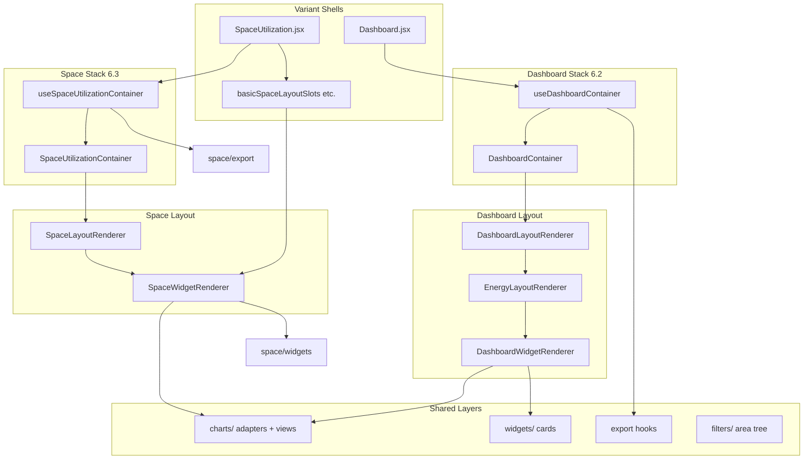

# Phase 6.4A — Post-Extraction Architecture Audit

**Date:** 2026-06-10  
**Status:** Read-only audit (no code changes)  
**Baseline:** Dashboard containerization (6.2) + Space containerization (6.3A–6.3G)  
**Scope:** `src/shared/dashboard/**` and variant dashboard/space shells

---

## 1. Executive Summary

| Metric | Value |
|--------|------:|
| Shared dashboard module LOC (total) | **29,805** |
| Shared dashboard production LOC | **21,035** |
| Shared dashboard test LOC | **8,770** |
| Shared dashboard files | **266** |
| Test suites (`shared/dashboard`) | **63** |
| Tests | **658** |
| Variant `Dashboard.jsx` LOC (3 variants) | **11,297** |
| Variant `SpaceUtilization.jsx` LOC (3 variants) | **7,030** |
| Variant space layout slot helpers | **747** |

**Architecture health:** Container layers are structurally sound and mirror each other without copy-pasting orchestration into variants. Remaining weight sits in **customized monoliths** (custom graphs + DnD grid), **triplicate variant shells** (email dialog, error chrome, ChartLoader), and **near-duplicate space container adapters**.

**No circular barrel exports detected** in `src/shared/dashboard/**`. Several **stale barrel exports** and **unused helpers** are safe cleanup candidates.

---

## 2. LOC Inventory

### 2.1 Shared module areas

| Area | LOC | Role |
|------|----:|------|
| `charts/` | 9,484 | Adapters, views, transforms, shells |
| `container/` (dashboard) | 6,846 | DashboardContainer, hooks, layout, adapters |
| `widgets/` | 4,721 | Energy, overview, peak/min, alerts cards |
| `space/container/` | 2,618 | SpaceUtilizationContainer stack |
| `filters/` | 2,222 | Area tree selection |
| `utils/` | 1,083 | API params, dates, normalizers |
| `space/widgets/` | 1,155 | Peak/min cards, utilization-by-area list |
| `space/export/` | 611 | `useSpaceExports` |
| `export/` | 399 | Energy export helpers |
| `registry/` | 227 | Widget metadata registry |
| `space/transforms/` | 320 | Space peak/min, area rows |

### 2.2 Container sub-areas (production, excl. tests)

| Module | LOC |
|--------|----:|
| `container/` (dashboard, total) | ~5,500 |
| `container/layout/` | 761 |
| `space/container/` | 1,632 |
| `space/container/adapters/` (3 files) | ~500 |

### 2.3 Variant shells (post-6.3G)

| File | LOC | Notes |
|------|----:|-------|
| `customized/Dashboard.jsx` | 4,846 | Largest variant file |
| `customized/SpaceUtilization.jsx` | 4,842 | Inline sortable grid ~700 LOC |
| `basic/Dashboard.jsx` | 3,448 | Area tree + energy runtime |
| `advanced/Dashboard.jsx` | 3,003 | |
| `basic/SpaceUtilization.jsx` | 1,634 | DnD order state ~220 LOC |
| `basicSpaceLayoutSlots.jsx` | 359 | Card chrome + combined chart |
| `customizedSpaceLayoutSlots.jsx` | 199 | |
| `advancedSpaceLayoutSlots.jsx` | 189 | |
| `advanced/SpaceUtilization.jsx` | 554 | Thinnest space shell |
| `customized/Alerts.jsx` | 667 | |

### 2.4 Largest shared production files (>220 LOC)

| LOC | File |
|----:|------|
| 452 | `charts/transforms/spaceOccupancyToRecharts.js` |
| 372 | `widgets/overview/OverviewMetricTileCard.jsx` |
| 340 | `charts/space/instantOccupancyConfig.js` |
| 330 | `filters/areaTreeTraversal.js` |
| 329 | `charts/space/InstantOccupancyChartView.jsx` |
| 321 | `filters/areaTreeBulkActions.js` |
| 309 | `container/dashboardLayoutResolvers.js` |
| 303 | `utils/pieChartNormalizers.js` |
| 301 | `container/hooks/useDashboardVisibility.js` |
| 296 | `container/hooks/widgetPropBuilders.js` |
| 272 | `container/widgetSlotResolvers.js` |
| 269 | `space/container/spaceWidgetSlotResolvers.js` |

---

## 3. Architecture Diagram



---

## 4. Dependency Graph (import chains)

### 4.1 Dashboard path

```
Dashboard.jsx
  → useDashboardContainer(basicDashboardContainerAdapter, runtime)
    → useDashboardVisibility / useDashboardWidgets / useDashboardDates / useDashboardExports
  → DashboardContainer
    → adapter.buildSections()
      → DashboardLayoutRenderer
        → EnergyLayoutRenderer (energy tab)
          → WidgetSlotRenderer / runtime delegates
            → DashboardWidgetRenderer
              → widgetSlotResolvers → widgetRenderMap
              → widgets/* (UnifiedEnergy, SavingsByStrategy, …)
              → charts/* (EnergyLine, ConsumptionPie, SavingsStrategy adapters)
```

### 4.2 Space path

```
SpaceUtilization.jsx
  → useSpaceUtilizationContainer(*SpaceContainerAdapter, runtime)
    → useSpaceExports
    → adapter.buildWidgetContext / buildLayoutContexts
  → SpaceUtilizationContainer
    → adapter.buildSections()
      → SpaceLayoutRenderer
        → runtime.renderWidgetSlot / renderCustomSlot / wrapSlot / renderSortableLayout
          → *SpaceLayoutSlots.jsx (variant card chrome)
            → SpaceWidgetRenderer
              → spaceWidgetSlotResolvers → spaceWidgetRenderMap
              → charts/space/*Adapter → *View
              → space/widgets (SpacePeakMinCards, UtilizationByAreaList)
```

### 4.3 Cross-cutting

| Consumer | Shared dependency |
|----------|-------------------|
| All variants | `filters/`, `utils/buildDashboardApiParams`, `utils/dashboardDateState` |
| Dashboard energy | `charts/transforms/transformDataForCharts`, `charts/energy/` |
| Space widgets | `charts/space/`, `space/transforms/` |
| Both export paths | `export/buildChartApiParams` (energy), `space/export/*` (space) |

**No `src/shared/dashboard/index.js` root barrel** — imports are direct to sub-packages (good: avoids mega-barrel cycles).

---

## 5. Dead Code Candidates

### 5.1 Confirmed unused (production)

| Symbol | Location | Evidence | Risk |
|--------|----------|----------|------|
| `useDashboardAreaTreeOrchestration` import | `container/useDashboardContainer.js:7` | Imported, never called in file | **SAFE REMOVE** |
| `resolveDashboardContainerOrchestrationKey` | `container/dashboardContainerResolvers.js` | Zero imports outside file | **SAFE REMOVE** |
| `dashboardContainerSectionsAreEqual` | `container/dashboardContainerMemoCompare.js` | Zero imports outside file | **SAFE REMOVE** |
| `resolveSpaceContainerLayoutContext` | `space/container/spaceContainerResolvers.js` | Exported from barrel; zero variant/shared consumers | **SAFE REMOVE** (or un-export) |
| `resolveSpaceContainerActiveTab` | `space/container/spaceContainerResolvers.js` | Duplicates `resolveSpaceActiveTab`; only referenced in tests | **SAFE REMOVE** (consolidate to `resolveSpaceActiveTab`) |

### 5.2 Barrel exports with no external consumers

| Export | Barrel | Used outside `space/container/`? |
|--------|--------|----------------------------------|
| `spaceLayoutRendererPropsAreEqual` | `space/container/index.js` | No (internal to `SpaceLayoutRenderer`) |
| `spaceWidgetRendererPropsAreEqual` | `space/container/index.js` | No |
| `spaceUtilizationContainerPropsAreEqual` | `space/container/index.js` | No |
| `BASIC_SPACE_LAYOUT_MODE`, slot registries, section constants | `space/container/index.js` | Only via direct adapter imports in tests |
| `buildSpaceContainerWidgetContext` | `space/container/index.js` | Adapters only (internal) |
| `isSpaceLayoutTabSupported` | `space/container/index.js` | Tests only |

These are **stale public API surface** — not harmful, but add noise to the barrel.

### 5.3 Duplicate constants

| Constant | Locations | Notes |
|----------|-----------|-------|
| Pastel palette `['#FFB3B3', …]` | `basic/SpaceUtilization` `COLORS`, `advanced` `DEFAULT_CHART_COLORS`, `customized` `COLORS` | Same 8-color array ×3 |
| `WIDGET_SECTIONS` | `registry/widgetRegistry.js` + `container/widgetRenderMap.js` | Overlapping keys (`OVERVIEW`, `ENERGY`); space section only in registry |
| Tab ID resolvers | `resolveSpaceActiveTab` vs `resolveSpaceContainerActiveTab` | Functional duplicate |

### 5.4 Orphan / test-only fixtures

| Item | Notes |
|------|-------|
| `registry/widgetRegistry.js` | Metadata registry; **only consumed by its own test** — documentation artifact, not wired to runtime renderers |
| Commented `getWidgetTitle` blocks | `customized/SpaceUtilization.jsx` (~30 LOC commented code) | **SAFE REMOVE** |

### 5.5 Variant-local duplication (not dead, but redundant with container)

| Pattern | Variants | LOC each | Container already provides |
|---------|----------|----------|---------------------------|
| `getWidgetTitle` helper | basic, advanced, customized | ~6 | `createSpaceWidgetTitleResolver` in adapters |
| `ChartLoader` inline component | all 3 SpaceUtilization | ~25 | Passed via `runtime.ChartLoader` — could be shared component |

---

## 6. Barrel Export Audit

### 6.1 Structure

| Barrel | Re-exports | Circular risk |
|--------|------------|---------------|
| `container/index.js` | Container, hooks, adapters, widget renderer, layout subset | **None** — layout imports resolvers, not container index |
| `container/layout/index.js` | Layout renderers, adapters, registries | **None** |
| `container/hooks/index.js` | 4 dashboard hooks + export menu state | **None** |
| `space/container/index.js` | Full 6.3 stack (largest barrel, 74 lines) | **None** — no import back to variants |
| `space/export/index.js` | Hooks + resolvers | **None** |
| `charts/space/index.js` | Adapters, views, configs | **None** |
| `widgets/index.js` | `export *` from energy/peakmin/alerts/overview | **None** — no widget imports container |

### 6.2 Issues found

| Issue | Severity | Recommendation |
|-------|----------|----------------|
| No root `shared/dashboard/index.js` | Low | Intentional; keep direct imports |
| `space/container/index.js` over-exports internal memo comparators | Low | Trim to public API |
| `widgets/index.js` `export *` re-exports | Low | Acceptable; no duplicates detected |
| `registry/` not exported from any parent barrel | Info | Orphan package by design |

**No circular export chains detected.**

---

## 7. Container Architecture — Overlap Matrix

### 7.1 Container components (structural)

| Concern | DashboardContainer | SpaceUtilizationContainer | Overlap |
|---------|-------------------|---------------------------|---------|
| Memo wrapper | ✓ `dashboardContainerPropsAreEqual` | ✓ `spaceUtilizationContainerPropsAreEqual` | **Pattern only** (no shared impl) |
| `buildSections` via adapter | ✓ → `DashboardLayoutRenderer` | ✓ → `SpaceLayoutRenderer` | **Pattern only** |
| Layout adapter reference | `adapter.layoutAdapter` on dashboard adapter | Passed via `runtime.layoutAdapter` | Different wiring |
| Orchestration hook | `useDashboardContainer` | `useSpaceUtilizationContainer` | **Parallel design** |

**Verdict:** Container **components** are thin (~20 LOC each) with **no duplicated orchestration logic** between them.

### 7.2 Orchestration hooks

| Concern | `useDashboardContainer` | `useSpaceUtilizationContainer` | Duplicated? |
|---------|------------------------|-------------------------------|-------------|
| Export hook | `useDashboardExports` | `useSpaceExports` | **Parallel** (different APIs by design) |
| Visibility / order | `useDashboardVisibility` | `adapter.buildVisibility` | Different split |
| Widget context | `useDashboardWidgets` (stateful) | `adapter.buildWidgetContext` (memo) | **No overlap** — energy needs chart loading state |
| Dates / navigation | `useDashboardDates` | — (in variant runtime) | Space dates stay in variant |
| Layout contexts | Built in adapter `buildSections` | `adapter.buildLayoutContexts` | **No overlap** |
| Loading aggregation | Inside widget hooks | `aggregateSpaceLoading` | **Parallel** |

**Verdict:** Hooks are **domain-appropriate splits**, not copy-paste duplicates. Dashboard hook is heavier because energy tab owns date navigation + chart loading lifecycle.

### 7.3 Container adapters (triplicate pattern)

| Method | Dashboard adapters | Space adapters | Structural overlap |
|--------|-------------------|----------------|-------------------|
| `resolve*Options` (×3–4) | visibility, widgets, dates, exports | widget, layout, export | **Pattern** |
| `buildSections` | JSX for 4 dashboard tabs | JSX for `SpaceLayoutRenderer` | **Pattern** |
| Variant-specific delegates | `energyLayoutRuntime`, `renderEnergySection` | `chartsLayoutRuntime`, `renderSortableLayout` | **Pattern** |

**Space adapter triplication:** `basicSpaceContainerAdapter` (171 LOC), `advancedSpaceContainerAdapter` (152 LOC), `customizedSpaceContainerAdapter` (178 LOC) share ~**70%** of `resolveWidgetOptions` + `resolveExportOptions` (~**90 LOC** structural duplicate). Dashboard adapters have similar triplication for export option blocks.

**This is the main remaining container-layer duplication** — not between Dashboard vs Space stacks, but **within each stack's per-variant adapters**.

---

## 8. Shared Widget Inventory

| Widget key | Owner component | Renderer | Layout | Container |
|------------|---------------|----------|--------|-----------|
| `energy` (overview tile) | `OverviewMetricTile` | `DashboardWidgetRenderer` | `DashboardLayoutRenderer` | `DashboardContainer` |
| `alerts` | `AlertsWidget` | `DashboardWidgetRenderer` (null body; section in adapter) | `DashboardLayoutRenderer` | `DashboardContainer` |
| `schedules` | `OverviewMetricTile` | `DashboardWidgetRenderer` | `DashboardLayoutRenderer` | `DashboardContainer` |
| `quick_controls` | `OverviewMetricTile` | `DashboardWidgetRenderer` | `DashboardLayoutRenderer` | `DashboardContainer` |
| `floors` | `OverviewMetricTile` | `DashboardWidgetRenderer` | `DashboardLayoutRenderer` | `DashboardContainer` |
| `space_utilization` (overview) | `OverviewMetricTile` | `DashboardWidgetRenderer` | `DashboardLayoutRenderer` | `DashboardContainer` |
| `consumption` | `UnifiedEnergyWidget` | `DashboardWidgetRenderer` | `EnergyLayoutRenderer` | `DashboardContainer` |
| `savings` | `UnifiedEnergyWidget` | `DashboardWidgetRenderer` | `EnergyLayoutRenderer` | `DashboardContainer` |
| `savings_by_strategy` | `SavingsByStrategyWidget` | `DashboardWidgetRenderer` | `EnergyLayoutRenderer` | `DashboardContainer` |
| `total_consumption_by_group` | `TotalConsumptionByGroupWidget` | `DashboardWidgetRenderer` | `EnergyLayoutRenderer` | `DashboardContainer` |
| `light_power_density` | `LightPowerDensityWidget` | `DashboardWidgetRenderer` | `EnergyLayoutRenderer` | `DashboardContainer` |
| `peak_and_minimum_consumption` | `PeakMinConsumptionWidget` | `DashboardWidgetRenderer` | `EnergyLayoutRenderer` | `DashboardContainer` |
| `utilization` | `SpaceLineChartAdapter` | `SpaceWidgetRenderer` | `SpaceLayoutRenderer` | `SpaceUtilizationContainer` |
| `utilization_by_area_group` | `SpaceStackedBarChartAdapter` | `SpaceWidgetRenderer` | `SpaceLayoutRenderer` | `SpaceUtilizationContainer` |
| `utilization_by_area` | `UtilizationByAreaList` | `SpaceWidgetRenderer` | `SpaceLayoutRenderer` | `SpaceUtilizationContainer` |
| `instant_occupancy_count` | `InstantOccupancyChartAdapter` | `SpaceWidgetRenderer` | `SpaceLayoutRenderer` | `SpaceUtilizationContainer` |
| `peak_and_minimum_utilization` | `SpacePeakMinCards` | `SpaceWidgetRenderer` | `SpaceLayoutRenderer` | `SpaceUtilizationContainer` |
| `instant_utilization_combined` | `SpaceInstantUtilizationCombinedChart` | **Variant** (`renderCustomSlot`) | `SpaceLayoutRenderer` | `SpaceUtilizationContainer` |
| Custom graphs | customized inline JSX | **Variant** (not in render map) | `renderSortableLayout` delegate | `SpaceUtilizationContainer` |

**Card chrome** (headers, export buttons) remains in variant `*SpaceLayoutSlots.jsx`, not in shared widget components.

---

## 9. Shared Chart Inventory

| Chart | Adapter | View | Transform(s) | Widget / Consumer |
|-------|---------|------|--------------|-------------------|
| Energy consumption/savings line | `EnergyLineChartAdapter` | `EnergyLineChartView` | `transformDataForCharts`, `formatEnergyXAxisLabel`, `spaceOccupancyToRecharts` (space reuse) | `UnifiedEnergyWidget` |
| Consumption pie (by group) | `ConsumptionPieChartAdapter` | `ConsumptionPieChartView` | `pieChartNormalizers`, `savingsStrategyToPieRows` | `TotalConsumptionByGroupWidget` |
| Savings by strategy pie | `SavingsStrategyChartAdapter` | `SavingsStrategyChartView` | `savingsStrategyToPieRows` | `SavingsByStrategyWidget` |
| Space utilization line | `SpaceLineChartAdapter` | `SpaceLineChartView` | `spaceOccupancyToRecharts`, `formatSpaceOccupancyXAxisLabel` | `SpaceWidgetRenderer` → utilization |
| Occupancy by group stacked bar | `SpaceStackedBarChartAdapter` | `SpaceStackedBarChartView` | `spaceOccupancyToRecharts` | `SpaceWidgetRenderer` → utilization_by_area_group |
| Instant occupancy | `InstantOccupancyChartAdapter` | `InstantOccupancyChartView` | `instantOccupancyToRecharts`, `formatSpaceInstantOccupancyXAxisLabel` | `SpaceWidgetRenderer` → instant_occupancy_count |
| Peak/min (space) | — | `SpacePeakMinCards` | `resolveSpacePeakMinModel`, `calculatePeakMinFromOccupancyPayload` | `SpaceWidgetRenderer` |
| Peak/min (energy) | — | `PeakMinConsumptionCard` | `calculatePeakMinFromChartData` | `PeakMinConsumptionWidget` |
| Utilization by area list | — | `UtilizationByAreaList` | `processUtilizationByAreaRows` | `SpaceWidgetRenderer` |
| Custom graphs (customized) | **Variant inline** | **Variant inline** | `calculatePeakMinFromOccupancyPayload` (partial) | customized `SpaceUtilization` |

**Shells:** `EnergyChartCardShell`, `PieChartCardShell`, `SpaceChartCardShell` wrap loading/empty states per chart family.

---

## 10. Bundle Audit

From latest `npm run build` (gzip):

| Chunk | Size (gzip) | Likely contents |
|-------|------------:|-----------------|
| `999.*.chunk.js` | **416.94 kB** | Largest async chunk — likely customized dashboard + recharts |
| `508.*.chunk.js` | 173.54 kB | Secondary feature chunk |
| `584.*.chunk.js` | 158.28 kB | |
| `104.*.chunk.js` | 145.92 kB | |
| `819.*.chunk.js` | 98.14 kB | Post–space-container chunk |
| `main.*.js` | 83.43 kB | Entry + router shell |

### 10.1 Largest source modules driving bundle weight

| Rank | Module area | Why |
|------|-------------|-----|
| 1 | `variants/customized/Dashboard.jsx` + `SpaceUtilization.jsx` | ~9,700 LOC combined; recharts, DnD, custom graphs |
| 2 | `charts/transforms/spaceOccupancyToRecharts.js` | 452 LOC; shared by all space line/bar charts |
| 3 | `charts/space/*View.jsx` | Recharts-heavy views |
| 4 | `recharts` (npm) | Transitive via all chart views |
| 5 | `@dnd-kit/*` (npm) | Customized space sortable grid only |

### 10.2 Largest dependency chains

```
customized/SpaceUtilization.jsx
  → @dnd-kit/core, @dnd-kit/sortable
  → SpaceUtilizationContainer → SpaceLayoutRenderer
  → runtime.renderSortableLayout (inline ~700 LOC)
  → SpaceWidgetRenderer → charts/space/* → recharts

basic/Dashboard.jsx
  → useDashboardContainer → useDashboardWidgets
  → DashboardContainer → EnergyLayoutRenderer
  → DashboardWidgetRenderer → widgets/energy → charts/energy → recharts
```

**Code-splitting note:** Space and dashboard shared modules live in variant chunks, not a separate `shared/dashboard` async bundle — expected for CRA route-level splitting.

---

## 11. Remaining Duplication (>25 LOC)

Classified by cleanup risk. LOC are approximate per occurrence × variants.

| ID | Duplication block | LOC (total) | Class | Notes |
|----|-------------------|------------:|-------|-------|
| D1 | `handleEmailDialogOpen` + email config validation | ~45 × 3 SU + dashboards | **YELLOW** | Could become `useEmailExportGate` hook; touches export flow |
| D2 | Error + API error display boxes in `SpaceUtilization` | ~35 × 3 = **105** | **GREEN** | Extract `SpaceUtilizationStatusPanels` presentational component |
| D3 | Snackbar block in `SpaceUtilization` | ~30 × 3 = **90** | **GREEN** | Same shell extraction |
| D4 | `ChartLoader` spinner component | ~25 × 3 = **75** | **GREEN** | Move to `shared/dashboard/charts/shells/ChartLoader.jsx` |
| D5 | Space container adapters (`resolveWidgetOptions` core) | ~90 × 3 adapters | **YELLOW** | Extract `createSpaceContainerAdapterBase(variant, shellDefaults)` |
| D6 | Dashboard container adapters (export options blocks) | ~40 × 3 | **YELLOW** | Same factory pattern as D5 |
| D7 | `getWidgetTitle` in variants despite resolver in container | ~6 × 3 = 18 | — | Below 25 LOC threshold individually |
| D8 | `fetchFloors` / `fetchRenameWidgets` / `fetchProfile` mount effects | ~15 × 3 = **45** | **GREEN** | `useSpaceUtilizationInit(dispatch)` hook |
| D9 | `handlePrevious` / `handleNext` / `getCurrentPeriodText` (basic + customized) | ~180 × 2 | **YELLOW** | Already shared in dashboard dates hook for energy; space basic still local |
| D10 | Customized sortable charts grid JSX | **~700** | **RED** | Phase 6.3I+ scope; DnD + custom graphs |
| D11 | `basicSpaceLayoutSlots` vs `advanced` vs `customized` card chrome | ~150–360 each | **YELLOW** | Partially shared via `SpaceWidgetRenderer`; headers/exports still diverge |
| D12 | `COLORS` / `DEFAULT_CHART_COLORS` constant | 1 × 3 | — | Trivial; centralize in `spacePeakMinTheme` or chart palette |
| D13 | Triplicate `Dashboard.jsx` energy runtime / area tree wiring | **1000+** per variant | **RED** | Out of 6.3 scope; needs dedicated dashboard shell phase |
| D14 | `instant_utilization_combined` render path (basic only) | ~80 in slots + chart component | **RED** | Explicitly deferred from 6.3E–G |
| D15 | Export dropdown JSX (all space variants) | ~60–80 each | **RED** | Explicit stop boundary |

---

## 12. Risk-Ranked Cleanup List

### Tier 1 — SAFE REMOVE (low risk, high clarity)

| Priority | Item | Est. savings | Action |
|----------|------|-------------:|--------|
| 1 | Remove unused import `useDashboardAreaTreeOrchestration` from `useDashboardContainer.js` | 1 line | Delete import |
| 2 | Remove `resolveDashboardContainerOrchestrationKey` | ~5 LOC | Delete export + fn |
| 3 | Remove `dashboardContainerSectionsAreEqual` | ~8 LOC | Delete export + fn |
| 4 | Consolidate `resolveSpaceContainerActiveTab` → `resolveSpaceActiveTab` | ~10 LOC | Merge + update test |
| 5 | Un-export or remove `resolveSpaceContainerLayoutContext` | ~12 LOC | Internalize |
| 6 | Trim `space/container/index.js` memo comparator exports | — | Barrel hygiene |
| 7 | Delete commented `getWidgetTitle` blocks in customized SU | ~30 LOC | Delete comments |

### Tier 2 — GREEN (safe extractions, no behavior change)

| Priority | Item | Est. savings | Action |
|----------|------|-------------:|--------|
| 8 | Shared `ChartLoader` component | ~75 LOC | `charts/shells/` |
| 9 | `SpaceUtilizationStatusPanels` (errors + snackbar) | ~195 LOC | Variant shell component |
| 10 | `useSpaceUtilizationInit` mount effects | ~45 LOC | Shared hook |
| 11 | Centralize pastel `COLORS` constant | ~3 LOC | Shared chart constant |

### Tier 3 — YELLOW (moderate risk, needs tests)

| Priority | Item | Est. savings | Action |
|----------|------|-------------:|--------|
| 12 | Space container adapter factory | ~180 LOC | `createSpaceContainerAdapter` |
| 13 | Dashboard container adapter factory | ~120 LOC | Mirror pattern |
| 14 | Space date navigation reuse from `useDashboardDates` | ~180 LOC | Extend or share period helpers |
| 15 | Collapse variant `getWidgetTitle` to orchestration export | ~18 LOC | Wire ExportDropdown to resolver |
| 16 | `useEmailExportGate` for `handleEmailDialogOpen` | ~135 LOC | Shared across SU + Alerts |

### Tier 4 — RED (deferred / high coupling)

| Priority | Item | Est. savings | Action |
|----------|------|-------------:|--------|
| 17 | Customized sortable grid extraction | ~700 LOC | Phase 6.3I custom graph container |
| 18 | Export dropdown JSX extraction | ~200 LOC | Explicitly out of scope 6.3 |
| 19 | `instant_utilization_combined` to shared slot | ~80+ LOC | Variant-only by design |
| 20 | Dashboard.jsx monolith reduction | **1000+** per variant | Future dashboard shell phase |
| 21 | Custom graph pipeline | **2000+** in customized SU | Phase 6.3I+ |

---

## 13. Test Coverage Snapshot

| Area | Suites | Tests (approx) |
|------|-------:|---------------:|
| `shared/dashboard` total | 63 | 658 |
| `space/container` | 6 | ~57 |
| `container/` (dashboard) | 10+ | ~120 |
| `registry/widgetRegistry` | 1 | metadata only |

**Gap:** No integration test loads full variant `SpaceUtilization.jsx` or `Dashboard.jsx` — parity tests mock layout renderers. Acceptable for unit layer; E2E remains variant-owned.

---

## 14. Conclusions

1. **Containerization goals met:** Variants delegate orchestration to `*Container` + hooks; render stacks are consistent and test-covered.
2. **No critical architectural debt** in shared barrels or circular imports.
3. **Primary remaining weight** is intentional deferrals (custom graphs, export JSX, DnD) plus **variant monoliths** (especially customized).
4. **Quick wins** exist in dead exports/imports (~40 LOC) and GREEN shell extractions (~300 LOC) without touching stop boundaries.
5. **Next high-value phases:** adapter factory (YELLOW), customized sortable layout extraction (RED), dashboard shell thinning (RED).

---

## 15. Rollback Reference

This audit is read-only. No code was modified. Prior phase rollback plans remain valid in:

- `docs/PHASE_6_2C_10_DASHBOARD_CONTAINER_REPORT.md`
- `docs/PHASE_6_3G_SPACE_UTILIZATION_CONTAINER_REPORT.md`
