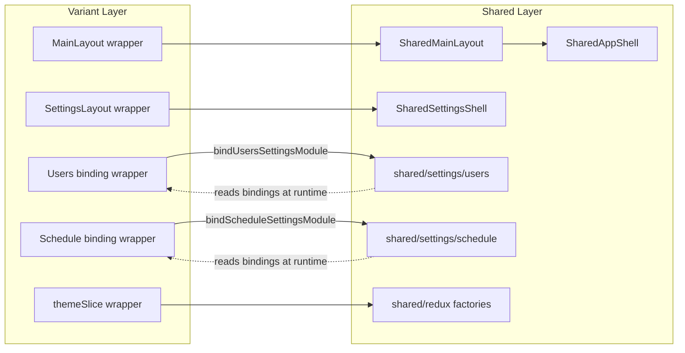

# Wrapper Integrity Audit

Generated: 2026-06-11T05:04:14.744Z

Phases covered: **5.1** (redux/utils/fofp/auth), **5.2** (settings users/schedule, SettingsLayout), **5.3** (MainLayout, SharedSidebar in Topbar).

## Executive Summary

| Metric | Count |
|--------|------:|
| Total wrapper candidates | 113 |
| Broken (errors) | 0 |
| Warnings | 3 |
| Full implementations (not thin wrappers) | 1 |
| Circular dependency cycles | 0 |
| Redundant identical wrapper groups | 28 |

## 1. Wrapper Inventory

### Phase 5.1 (78 files)

| File | Type | Default | Named | Status |
|------|------|:-------:|:-----:|--------|
| `src/variants/advanced/components/ErrorBoundary.jsx` | partial-shared | ✓ | ✓ | ✓ |
| `src/variants/advanced/customhooks/AuthGuard.jsx` | partial-shared | ✓ | — | ✓ |
| `src/variants/advanced/customhooks/UseAuth.jsx` | partial-shared | — | ✓ | ✓ |
| `src/variants/advanced/redux/slice/auth/userlogin.js` | factory-binding | ✓ | ✓ | ✓ |
| `src/variants/advanced/redux/slice/dashboard/alertsSlice.js` | factory-binding | ✓ | ✓ | ✓ |
| `src/variants/advanced/redux/slice/floor/floorSlice.js` | factory-binding | ✓ | ✓ | ✓ |
| `src/variants/advanced/redux/slice/fofp/fofpSlice.js` | factory-binding | ✓ | ✓ | ✓ |
| `src/variants/advanced/redux/slice/home/homeSlice.js` | factory-binding | ✓ | ✓ | ✓ |
| `src/variants/advanced/redux/slice/modules/modulesSlice.js` | factory-binding | ✓ | ✓ | ✓ |
| `src/variants/advanced/redux/slice/quickcontrols/quickControlSlice.js` | factory-binding | ✓ | ✓ | ✓ |
| `src/variants/advanced/redux/slice/sensors/sensorsSlice.js` | factory-binding | ✓ | ✓ | ✓ |
| `src/variants/advanced/redux/slice/settingsslice/heatmap/areaSettingsSlice.js` | factory-binding | ✓ | ✓ | ✓ |
| `src/variants/advanced/redux/slice/theme/themeSlice.js` | factory-binding | ✓ | ✓ | ✓ |
| `src/variants/advanced/screens/settings/fofp/FofpMarkerContextMenu.jsx` | star+default-reexport | ✓ | ✓ | ✓ |
| `src/variants/advanced/screens/settings/fofp/FofpMarkerResizeHandles.jsx` | star+default-reexport | ✓ | ✓ | ✓ |
| `src/variants/advanced/screens/settings/fofp/FofpShapeMenuIcon.jsx` | star+default-reexport | ✓ | ✓ | ✓ |
| `src/variants/advanced/screens/settings/fofp/fofpContextMenuPosition.js` | star-reexport | — | ✓ | ✓ |
| `src/variants/advanced/screens/settings/fofp/fofpIndividualStyle.js` | star-reexport | — | ✓ | ✓ |
| `src/variants/advanced/screens/settings/fofp/fofpMarkerDrag.js` | star-reexport | — | ✓ | ✓ |
| `src/variants/advanced/screens/settings/fofp/fofpMarkerResize.js` | star-reexport | — | ✓ | ✓ |
| `src/variants/advanced/screens/settings/fofp/fofpShapeOptions.js` | star-reexport | — | ✓ | ✓ |
| `src/variants/advanced/screens/settings/fofp/fofpViewAutoFit.js` | star-reexport | — | ✓ | ✓ |
| `src/variants/advanced/screens/settings/fofp/fofpViewportFit.js` | star-reexport | — | ✓ | ✓ |
| `src/variants/advanced/utils/ColorPickerCard.jsx` | default-reexport | ✓ | — | ✓ |
| `src/variants/advanced/utils/PaginatedList.jsx` | default-reexport | ✓ | — | ✓ |
| `src/variants/advanced/utils/floorplanCoordinates.js` | star-reexport | — | ✓ | ✓ |
| `src/variants/basic/components/ErrorBoundary.jsx` | partial-shared | ✓ | ✓ | ✓ |
| `src/variants/basic/customhooks/AuthGuard.jsx` | partial-shared | ✓ | — | ✓ |
| `src/variants/basic/customhooks/UseAuth.jsx` | partial-shared | — | ✓ | ✓ |
| `src/variants/basic/redux/slice/auth/userlogin.js` | factory-binding | ✓ | ✓ | ✓ |
| `src/variants/basic/redux/slice/dashboard/alertsSlice.js` | factory-binding | ✓ | ✓ | ✓ |
| `src/variants/basic/redux/slice/floor/floorSlice.js` | factory-binding | ✓ | ✓ | ✓ |
| `src/variants/basic/redux/slice/fofp/fofpSlice.js` | factory-binding | ✓ | ✓ | ✓ |
| `src/variants/basic/redux/slice/home/homeSlice.js` | factory-binding | ✓ | ✓ | ✓ |
| `src/variants/basic/redux/slice/modules/modulesSlice.js` | factory-binding | ✓ | ✓ | ✓ |
| `src/variants/basic/redux/slice/quickcontrols/quickControlSlice.js` | factory-binding | ✓ | ✓ | ✓ |
| `src/variants/basic/redux/slice/sensors/sensorsSlice.js` | factory-binding | ✓ | ✓ | ✓ |
| `src/variants/basic/redux/slice/settingsslice/heatmap/areaSettingsSlice.js` | factory-binding | ✓ | ✓ | ✓ |
| `src/variants/basic/redux/slice/theme/themeSlice.js` | factory-binding | ✓ | ✓ | ✓ |
| `src/variants/basic/screens/settings/fofp/FofpMarkerContextMenu.jsx` | star+default-reexport | ✓ | ✓ | ✓ |
| `src/variants/basic/screens/settings/fofp/FofpMarkerResizeHandles.jsx` | star+default-reexport | ✓ | ✓ | ✓ |
| `src/variants/basic/screens/settings/fofp/FofpShapeMenuIcon.jsx` | star+default-reexport | ✓ | ✓ | ✓ |
| `src/variants/basic/screens/settings/fofp/fofpContextMenuPosition.js` | star-reexport | — | ✓ | ✓ |
| `src/variants/basic/screens/settings/fofp/fofpIndividualStyle.js` | star-reexport | — | ✓ | ✓ |
| `src/variants/basic/screens/settings/fofp/fofpMarkerDrag.js` | star-reexport | — | ✓ | ✓ |
| `src/variants/basic/screens/settings/fofp/fofpMarkerResize.js` | star-reexport | — | ✓ | ✓ |
| `src/variants/basic/screens/settings/fofp/fofpShapeOptions.js` | star-reexport | — | ✓ | ✓ |
| `src/variants/basic/screens/settings/fofp/fofpViewAutoFit.js` | star-reexport | — | ✓ | ✓ |
| `src/variants/basic/screens/settings/fofp/fofpViewportFit.js` | star-reexport | — | ✓ | ✓ |
| `src/variants/basic/utils/ColorPickerCard.jsx` | default-reexport | ✓ | — | ✓ |
| `src/variants/basic/utils/PaginatedList.jsx` | default-reexport | ✓ | — | ✓ |
| `src/variants/basic/utils/floorplanCoordinates.js` | star-reexport | — | ✓ | ✓ |
| `src/variants/customized/components/ErrorBoundary.jsx` | partial-shared | ✓ | ✓ | ✓ |
| `src/variants/customized/customhooks/AuthGuard.jsx` | partial-shared | ✓ | — | ✓ |
| `src/variants/customized/customhooks/UseAuth.jsx` | partial-shared | — | ✓ | ✓ |
| `src/variants/customized/redux/slice/auth/userlogin.js` | factory-binding | ✓ | ✓ | ✓ |
| `src/variants/customized/redux/slice/dashboard/alertsSlice.js` | factory-binding | ✓ | ✓ | ✓ |
| `src/variants/customized/redux/slice/floor/floorSlice.js` | factory-binding | ✓ | ✓ | ✓ |
| `src/variants/customized/redux/slice/fofp/fofpSlice.js` | factory-binding | ✓ | ✓ | ✓ |
| `src/variants/customized/redux/slice/home/homeSlice.js` | factory-binding | ✓ | ✓ | ✓ |
| `src/variants/customized/redux/slice/modules/modulesSlice.js` | factory-binding | ✓ | ✓ | ✓ |
| `src/variants/customized/redux/slice/quickcontrols/quickControlSlice.js` | factory-binding | ✓ | ✓ | ✓ |
| `src/variants/customized/redux/slice/sensors/sensorsSlice.js` | factory-binding | ✓ | ✓ | ✓ |
| `src/variants/customized/redux/slice/settingsslice/heatmap/areaSettingsSlice.js` | factory-binding | ✓ | ✓ | ✓ |
| `src/variants/customized/redux/slice/theme/themeSlice.js` | factory-binding | ✓ | ✓ | ✓ |
| `src/variants/customized/screens/settings/fofp/FofpMarkerContextMenu.jsx` | star+default-reexport | ✓ | ✓ | ✓ |
| `src/variants/customized/screens/settings/fofp/FofpMarkerResizeHandles.jsx` | star+default-reexport | ✓ | ✓ | ✓ |
| `src/variants/customized/screens/settings/fofp/FofpShapeMenuIcon.jsx` | star+default-reexport | ✓ | ✓ | ✓ |
| `src/variants/customized/screens/settings/fofp/fofpContextMenuPosition.js` | star-reexport | — | ✓ | ✓ |
| `src/variants/customized/screens/settings/fofp/fofpIndividualStyle.js` | star-reexport | — | ✓ | ✓ |
| `src/variants/customized/screens/settings/fofp/fofpMarkerDrag.js` | star-reexport | — | ✓ | ✓ |
| `src/variants/customized/screens/settings/fofp/fofpMarkerResize.js` | star-reexport | — | ✓ | ✓ |
| `src/variants/customized/screens/settings/fofp/fofpShapeOptions.js` | star-reexport | — | ✓ | ✓ |
| `src/variants/customized/screens/settings/fofp/fofpViewAutoFit.js` | star-reexport | — | ✓ | ✓ |
| `src/variants/customized/screens/settings/fofp/fofpViewportFit.js` | star-reexport | — | ✓ | ✓ |
| `src/variants/customized/utils/ColorPickerCard.jsx` | default-reexport | ✓ | — | ✓ |
| `src/variants/customized/utils/PaginatedList.jsx` | default-reexport | ✓ | — | ✓ |
| `src/variants/customized/utils/floorplanCoordinates.js` | star-reexport | — | ✓ | ✓ |

### Phase 5.2 (26 files)

| File | Type | Default | Named | Status |
|------|------|:-------:|:-----:|--------|
| `src/variants/advanced/screens/schedule/AddEvent.jsx` | screen-binding | ✓ | — | ✓ |
| `src/variants/advanced/screens/schedule/ScheduleComponent.jsx` | screen-binding | ✓ | — | ✓ |
| `src/variants/advanced/screens/schedule/ScheduleDetails.jsx` | screen-binding | ✓ | — | ✓ |
| `src/variants/advanced/screens/schedule/ScheduleFormPanel.jsx` | screen-binding | ✓ | — | ✓ |
| `src/variants/advanced/screens/schedule/UpdatePreconfigurdEvent.jsx` | screen-binding | ✓ | — | ✓ |
| `src/variants/advanced/screens/settings/SettingsLayout.jsx` | layout-composition | ✓ | ✓ | ✓ |
| `src/variants/advanced/screens/settings/Users/userUpdatePayload.js` | star-reexport | — | ✓ | ✓ |
| `src/variants/basic/screens/schedule/AddEvent.jsx` | screen-binding | ✓ | — | ✓ |
| `src/variants/basic/screens/schedule/ScheduleComponent.jsx` | screen-binding | ✓ | — | ✓ |
| `src/variants/basic/screens/schedule/ScheduleDetails.jsx` | screen-binding | ✓ | — | ✓ |
| `src/variants/basic/screens/schedule/ScheduleFormPanel.jsx` | screen-binding | ✓ | — | ✓ |
| `src/variants/basic/screens/schedule/UpdatePreconfigurdEvent.jsx` | screen-binding | ✓ | — | ✓ |
| `src/variants/basic/screens/settings/SettingsLayout.jsx` | layout-composition | ✓ | ✓ | ✓ |
| `src/variants/basic/screens/settings/Users/CreateUser.jsx` | screen-binding | ✓ | — | ✓ |
| `src/variants/basic/screens/settings/Users/UpdateUser.jsx` | screen-binding | ✓ | — | ✓ |
| `src/variants/basic/screens/settings/Users/UsersComponent.jsx` | screen-binding | ✓ | — | ✓ |
| `src/variants/basic/screens/settings/Users/userUpdatePayload.js` | star-reexport | — | ✓ | ✓ |
| `src/variants/customized/screens/schedule/AddEvent.jsx` | screen-binding | ✓ | — | ✓ |
| `src/variants/customized/screens/schedule/ScheduleComponent.jsx` | screen-binding | ✓ | — | ✓ |
| `src/variants/customized/screens/schedule/ScheduleDetails.jsx` | screen-binding | ✓ | — | ✓ |
| `src/variants/customized/screens/schedule/ScheduleFormPanel.jsx` | screen-binding | ✓ | — | ✓ |
| `src/variants/customized/screens/schedule/UpdatePreconfigurdEvent.jsx` | screen-binding | ✓ | — | ✓ |
| `src/variants/customized/screens/settings/Users/CreateUser.jsx` | screen-binding | ✓ | — | ✓ |
| `src/variants/customized/screens/settings/Users/UpdateUser.jsx` | screen-binding | ✓ | — | ✓ |
| `src/variants/customized/screens/settings/Users/UsersComponent.jsx` | screen-binding | ✓ | — | ✓ |
| `src/variants/customized/screens/settings/Users/userUpdatePayload.js` | star-reexport | — | ✓ | ✓ |

### Phase 5.3 (3 files)

| File | Type | Default | Named | Status |
|------|------|:-------:|:-----:|--------|
| `src/variants/advanced/layouts/MainLayout.jsx` | factory-binding | ✓ | — | ✓ |
| `src/variants/basic/layouts/MainLayout.jsx` | factory-binding | ✓ | — | ✓ |
| `src/variants/customized/layouts/MainLayout.jsx` | factory-binding | ✓ | — | ✓ |

### Other / adjacent (6 files)

| File | Type | Phase | Status |
|------|------|-------|--------|
| `src/variants/advanced/screens/settings/Users/CreateUser.jsx` | partial-shared | unknown | ✓ |
| `src/variants/advanced/screens/settings/Users/UpdateUser.jsx` | partial-shared | unknown | ✓ |
| `src/variants/advanced/screens/settings/Users/UsersComponent.jsx` | full-implementation | unknown | ✓ |
| `src/variants/advanced/utils/themeOnSurface.js` | star-reexport | unknown | ✓ |
| `src/variants/basic/utils/themeOnSurface.js` | star-reexport | unknown | ✓ |
| `src/variants/customized/utils/themeOnSurface.js` | star-reexport | unknown | ✓ |

### Inventory by category

| Category | Count | Pattern |
|----------|------:|---------|
| Redux factory wrappers | 0 | `create*Module` + named re-exports |
| Utils/FOFP default re-export | 6 | `export { default } from shared/...` |
| FOFP named-only re-export | 30 | `export * from shared/...` |
| FOFP star+default | 9 | both (JSX components) |
| Screen binding (5.2) | 21 | bind + `export { default }` |
| Layout composition (5.2/5.3) | 35 | bind + shared shell |
| Full implementation retained | 1 | advanced Users screens |

## 2. Broken Wrappers

_No broken wrappers detected (all re-export paths resolve; no invalid default re-exports on named-only shared modules)._

### Post-fix status (compile verification)

Production build and shared tests were passing after Phase 5.2 compile-error fixes:
- FOFP `markerContainment` geometry deps copied to shared
- Invalid `export { default }` removed from named-only FOFP .js wrappers
- Schedule `setSelectedFilter` binding collision resolved
- `permissionMap` / `permissionOptions` exported from shared payload

## 3. Redundant Wrappers

### `ErrorBoundary.jsx` (3 variants)

Identical hash: `1f719d1c696e`

- `src/variants/advanced/components/ErrorBoundary.jsx`
- `src/variants/basic/components/ErrorBoundary.jsx`
- `src/variants/customized/components/ErrorBoundary.jsx`

### `userlogin.js` (3 variants)

Identical hash: `b1fbafcfbb28`

- `src/variants/advanced/redux/slice/auth/userlogin.js`
- `src/variants/basic/redux/slice/auth/userlogin.js`
- `src/variants/customized/redux/slice/auth/userlogin.js`

### `alertsSlice.js` (3 variants)

Identical hash: `3708bd99c8e2`

- `src/variants/advanced/redux/slice/dashboard/alertsSlice.js`
- `src/variants/basic/redux/slice/dashboard/alertsSlice.js`
- `src/variants/customized/redux/slice/dashboard/alertsSlice.js`

### `fofpSlice.js` (3 variants)

Identical hash: `0927554903b1`

- `src/variants/advanced/redux/slice/fofp/fofpSlice.js`
- `src/variants/basic/redux/slice/fofp/fofpSlice.js`
- `src/variants/customized/redux/slice/fofp/fofpSlice.js`

### `homeSlice.js` (3 variants)

Identical hash: `2c4f59a892f0`

- `src/variants/advanced/redux/slice/home/homeSlice.js`
- `src/variants/basic/redux/slice/home/homeSlice.js`
- `src/variants/customized/redux/slice/home/homeSlice.js`

### `modulesSlice.js` (3 variants)

Identical hash: `f72e178ca835`

- `src/variants/advanced/redux/slice/modules/modulesSlice.js`
- `src/variants/basic/redux/slice/modules/modulesSlice.js`
- `src/variants/customized/redux/slice/modules/modulesSlice.js`

### `quickControlSlice.js` (3 variants)

Identical hash: `c34664ecda8f`

- `src/variants/advanced/redux/slice/quickcontrols/quickControlSlice.js`
- `src/variants/basic/redux/slice/quickcontrols/quickControlSlice.js`
- `src/variants/customized/redux/slice/quickcontrols/quickControlSlice.js`

### `sensorsSlice.js` (3 variants)

Identical hash: `42199e4ed2ae`

- `src/variants/advanced/redux/slice/sensors/sensorsSlice.js`
- `src/variants/basic/redux/slice/sensors/sensorsSlice.js`
- `src/variants/customized/redux/slice/sensors/sensorsSlice.js`

### `areaSettingsSlice.js` (3 variants)

Identical hash: `bc13e766b7c9`

- `src/variants/advanced/redux/slice/settingsslice/heatmap/areaSettingsSlice.js`
- `src/variants/basic/redux/slice/settingsslice/heatmap/areaSettingsSlice.js`
- `src/variants/customized/redux/slice/settingsslice/heatmap/areaSettingsSlice.js`

### `AddEvent.jsx` (3 variants)

Identical hash: `09152e21b3c4`

- `src/variants/advanced/screens/schedule/AddEvent.jsx`
- `src/variants/basic/screens/schedule/AddEvent.jsx`
- `src/variants/customized/screens/schedule/AddEvent.jsx`

### `ScheduleComponent.jsx` (3 variants)

Identical hash: `c86a6e640407`

- `src/variants/advanced/screens/schedule/ScheduleComponent.jsx`
- `src/variants/basic/screens/schedule/ScheduleComponent.jsx`
- `src/variants/customized/screens/schedule/ScheduleComponent.jsx`

### `ScheduleDetails.jsx` (3 variants)

Identical hash: `432b2172edbc`

- `src/variants/advanced/screens/schedule/ScheduleDetails.jsx`
- `src/variants/basic/screens/schedule/ScheduleDetails.jsx`
- `src/variants/customized/screens/schedule/ScheduleDetails.jsx`

### `ScheduleFormPanel.jsx` (3 variants)

Identical hash: `1d6c16569b2d`

- `src/variants/advanced/screens/schedule/ScheduleFormPanel.jsx`
- `src/variants/basic/screens/schedule/ScheduleFormPanel.jsx`
- `src/variants/customized/screens/schedule/ScheduleFormPanel.jsx`

### `UpdatePreconfigurdEvent.jsx` (3 variants)

Identical hash: `ce7012bca0f4`

- `src/variants/advanced/screens/schedule/UpdatePreconfigurdEvent.jsx`
- `src/variants/basic/screens/schedule/UpdatePreconfigurdEvent.jsx`
- `src/variants/customized/screens/schedule/UpdatePreconfigurdEvent.jsx`

### `userUpdatePayload.js` (3 variants)

Identical hash: `7084d9606d93`

- `src/variants/advanced/screens/settings/Users/userUpdatePayload.js`
- `src/variants/basic/screens/settings/Users/userUpdatePayload.js`
- `src/variants/customized/screens/settings/Users/userUpdatePayload.js`

### `FofpMarkerContextMenu.jsx` (3 variants)

Identical hash: `fe12e089b5e3`

- `src/variants/advanced/screens/settings/fofp/FofpMarkerContextMenu.jsx`
- `src/variants/basic/screens/settings/fofp/FofpMarkerContextMenu.jsx`
- `src/variants/customized/screens/settings/fofp/FofpMarkerContextMenu.jsx`

### `FofpMarkerResizeHandles.jsx` (3 variants)

Identical hash: `746463395302`

- `src/variants/advanced/screens/settings/fofp/FofpMarkerResizeHandles.jsx`
- `src/variants/basic/screens/settings/fofp/FofpMarkerResizeHandles.jsx`
- `src/variants/customized/screens/settings/fofp/FofpMarkerResizeHandles.jsx`

### `FofpShapeMenuIcon.jsx` (3 variants)

Identical hash: `7acca341cf8a`

- `src/variants/advanced/screens/settings/fofp/FofpShapeMenuIcon.jsx`
- `src/variants/basic/screens/settings/fofp/FofpShapeMenuIcon.jsx`
- `src/variants/customized/screens/settings/fofp/FofpShapeMenuIcon.jsx`

### `fofpContextMenuPosition.js` (3 variants)

Identical hash: `cf33405c5a46`

- `src/variants/advanced/screens/settings/fofp/fofpContextMenuPosition.js`
- `src/variants/basic/screens/settings/fofp/fofpContextMenuPosition.js`
- `src/variants/customized/screens/settings/fofp/fofpContextMenuPosition.js`

### `fofpIndividualStyle.js` (3 variants)

Identical hash: `572ff1295968`

- `src/variants/advanced/screens/settings/fofp/fofpIndividualStyle.js`
- `src/variants/basic/screens/settings/fofp/fofpIndividualStyle.js`
- `src/variants/customized/screens/settings/fofp/fofpIndividualStyle.js`

### `fofpMarkerDrag.js` (3 variants)

Identical hash: `df7caeecdb32`

- `src/variants/advanced/screens/settings/fofp/fofpMarkerDrag.js`
- `src/variants/basic/screens/settings/fofp/fofpMarkerDrag.js`
- `src/variants/customized/screens/settings/fofp/fofpMarkerDrag.js`

### `fofpMarkerResize.js` (3 variants)

Identical hash: `d28cfbb4dd9b`

- `src/variants/advanced/screens/settings/fofp/fofpMarkerResize.js`
- `src/variants/basic/screens/settings/fofp/fofpMarkerResize.js`
- `src/variants/customized/screens/settings/fofp/fofpMarkerResize.js`

### `fofpShapeOptions.js` (3 variants)

Identical hash: `a1fb6bb67e8a`

- `src/variants/advanced/screens/settings/fofp/fofpShapeOptions.js`
- `src/variants/basic/screens/settings/fofp/fofpShapeOptions.js`
- `src/variants/customized/screens/settings/fofp/fofpShapeOptions.js`

### `fofpViewAutoFit.js` (3 variants)

Identical hash: `de06aace41ac`

- `src/variants/advanced/screens/settings/fofp/fofpViewAutoFit.js`
- `src/variants/basic/screens/settings/fofp/fofpViewAutoFit.js`
- `src/variants/customized/screens/settings/fofp/fofpViewAutoFit.js`

### `fofpViewportFit.js` (3 variants)

Identical hash: `646b5eea3126`

- `src/variants/advanced/screens/settings/fofp/fofpViewportFit.js`
- `src/variants/basic/screens/settings/fofp/fofpViewportFit.js`
- `src/variants/customized/screens/settings/fofp/fofpViewportFit.js`

### `ColorPickerCard.jsx` (3 variants)

Identical hash: `38ccc91adf18`

- `src/variants/advanced/utils/ColorPickerCard.jsx`
- `src/variants/basic/utils/ColorPickerCard.jsx`
- `src/variants/customized/utils/ColorPickerCard.jsx`

### `PaginatedList.jsx` (3 variants)

Identical hash: `b70f759d287e`

- `src/variants/advanced/utils/PaginatedList.jsx`
- `src/variants/basic/utils/PaginatedList.jsx`
- `src/variants/customized/utils/PaginatedList.jsx`

### `floorplanCoordinates.js` (3 variants)

Identical hash: `b05663f4cbfc`

- `src/variants/advanced/utils/floorplanCoordinates.js`
- `src/variants/basic/utils/floorplanCoordinates.js`
- `src/variants/customized/utils/floorplanCoordinates.js`

### Expected redundancy (by design)

| Pattern | Variants | Reason |
|---------|----------|--------|
| FOFP `export *` / `export { default }` | ×3 each | Webpack requires static per-variant import paths |
| Redux factory wrappers | ×3 each | Variant `BaseUrl`, `getToken` injection |
| Schedule screen bindings | ×3 each | Variant redux/components bound at load time |
| `userUpdatePayload.js` | ×3 | Thin `export *` — byte-identical |

### Non-redundant (variant-specific)

| File | Reason |
|------|--------|
| `advanced/screens/settings/Users/*.jsx` (3) | Full implementation — SettingsLayout vs embedded sidebar |
| `basic/advanced SettingsLayout.jsx` | Adapter + chrome differ from customized |
| `UseAuth.jsx` (×3) | Sidebar RBAC paths differ per variant |
| `themeSlice.js` (×3) | Theme module bindings differ |

## 4. Barrel Export Candidates

These wrapper clusters could collapse to a single `index.js` **per variant directory** (not cross-variant):

| Variant dir | Files | Suggested barrel |
|-------------|------:|------------------|
| `src/variants/basic/screens/settings/fofp` | 10 | `src/variants/basic/screens/settings/fofp/index.js` → shared |
| `src/variants/advanced/screens/settings/fofp` | 10 | `src/variants/advanced/screens/settings/fofp/index.js` → shared |
| `src/variants/customized/screens/settings/fofp` | 10 | `src/variants/customized/screens/settings/fofp/index.js` → shared |
| `src/variants/basic/utils` | 3 | `src/variants/basic/utils/index.js` → shared |
| `src/variants/advanced/utils` | 3 | `src/variants/advanced/utils/index.js` → shared |
| `src/variants/customized/utils` | 3 | `src/variants/customized/utils/index.js` → shared |
| `src/variants/basic/screens/schedule` | 5 | `src/variants/basic/screens/schedule/index.js` → shared |
| `src/variants/advanced/screens/schedule` | 5 | `src/variants/advanced/screens/schedule/index.js` → shared |
| `src/variants/customized/screens/schedule` | 5 | `src/variants/customized/screens/schedule/index.js` → shared |

**Caveat:** Webpack variant loader still requires top-level static entry points in many cases; barrels help intra-folder imports but cannot replace variant-root `App.js` imports without loader changes.

### Existing shared barrels (already present)

- `src/shared/redux/index.js`
- `src/shared/utils/index.js`
- `src/shared/fofp/index.js`
- `src/shared/auth/index.js`
- `src/shared/settings/users/index.js`
- `src/shared/settings/schedule/index.js`
- `src/shared/layout/index.js`
- `src/shared/layout/app/index.js`

Variant wrappers still needed because `variantLoader` resolves `src/variants/{basic|advanced|customized}/...` at build time.

## 5. Circular Dependency Graph

_No circular dependencies detected among wrapper files in the import/re-export graph._

### High-risk adjacency (not cycles, but monitor)

**Binding pattern note:** Screen wrappers call `bind*Module()` then re-export shared default. Shared modules call `get*Bindings()` at render time — **no static import back to variant wrapper**, so no compile-time cycle.

## 6. Per-check Summary

| Check | Result |
|-------|--------|
| Default export preserved | ✓ for all `export { default }` and factory/layout wrappers; advanced Users retain own default |
| Named exports preserved | ✓ redux factories explicitly re-export all slice exports; FOFP `export *` covers named |
| Missing exports | None detected |
| Duplicate exports | See warnings |
| Circular dependencies | None among wrappers |
| Invalid default re-export | None (fixed in compile-error pass) |
| Import paths resolve | All re-export targets resolve |

## 7. Warnings & Info

| File | Code | Message |
|------|------|---------|
| `src/variants/advanced/redux/slice/theme/themeSlice.js` | DUPLICATE_EXPORT_LINE | Duplicate export at lines 1 and 2 |
| `src/variants/basic/redux/slice/theme/themeSlice.js` | DUPLICATE_EXPORT_LINE | Duplicate export at lines 1 and 2 |
| `src/variants/customized/redux/slice/theme/themeSlice.js` | DUPLICATE_EXPORT_LINE | Duplicate export at lines 1 and 2 |

### Not thin wrappers (informational)

- `src/variants/advanced/screens/settings/Users/UsersComponent.jsx` — retains full component implementation

---

_Audit performed by `scripts/wrapper-integrity-audit.js` (read-only). No application code modified._
